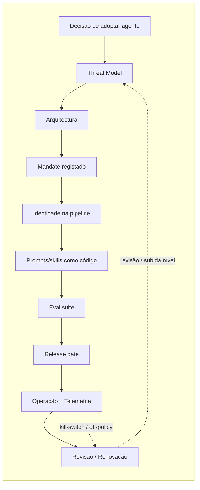

# Exemplo: Agentic SDLC ponta-a-ponta

## Enquadramento

Quando o sistema inclui **agentes AI** com *tool-use* — modelos que executam acções reais (criar PRs, aplicar manifests Kubernetes, contactar APIs externas) — o processo de desenvolvimento seguro ganha **paragens próprias** em cada fase do SDLC. O SbD-ToE distribuiu essas paragens pelos capítulos existentes (não criou capítulo novo), mas a **vista de processo ponta-a-ponta** vive aqui, neste exemplo.

O conteúdo é transversal por desenho: serve **AI Act Art. 9/14/15/26/53/55**, **NIS2 Art. 21** (cadeia de fornecimento + supervisão de risco operacional), **DORA Art. 28–30** (ICT third-party + agente como *principal* não-humano) e **CRA Anexo I** (cybersec by design + vulnerability handling para componentes AI).

O SbD-ToE **prescreve as paragens e a sua substância**; este exemplo demonstra **como as encadear** num caso operacional realista — o caso *baseline* assumido é uma equipa que adopta um agente de auditoria de PR (nível A2) ligando à pipeline.

---

## Visão geral do fluxo

Cada paragem do fluxo tem **substância normativa** num capítulo do SbD-ToE, e — quando aplicável — operacionalização em policy. A tabela seguinte é a tradução directa do fluxo em locais do manual.

---

## Paragens do processo agentic

### Paragem 1 — Decisão de adopção e classificação do nível de autonomia

| Item | Local no SbD-ToE | O que se faz |
|---|---|---|
| **Modelo A0–A4** | [Cap. 02 §A0–A4](/sbd-toe/sbd-manual/requisitos-seguranca/addon/governanca-automatismos#niveis-autonomia) | Classificar o nível de autonomia por agente × contexto (projecto / ambiente / tarefa). Regra prática: começar no nível mais baixo compatível com o trabalho real |
| **Requisitos `REQ-AGN-*`** | [Cap. 02 §REQ-AGN](/sbd-toe/sbd-manual/requisitos-seguranca/addon/governanca-automatismos#req-agn) | `REQ-AGN-001` mandate · `REQ-AGN-002` nível classificado · `REQ-AGN-003` kill-switch exercitado · `REQ-AGN-004` intent declaration |
| **User story de operacionalização** | [Cap. 02 US-15](/sbd-toe/sbd-manual/requisitos-seguranca/aplicacao-lifecycle#us-15) | Classificar e registar o *mandate* do agente |

> 📌 Sem classificação A0–A4 declarada e *mandate* registado, o agente não opera além de A0 (consulta sem efeito real).

---

### Paragem 2 — Threat modeling para o agente

| Item | Local no SbD-ToE | O que se faz |
|---|---|---|
| **Playbook agentic** | [Cap. 03 §playbook-agentic](/sbd-toe/sbd-manual/threat-modeling/addon/metodologias-e-ferramentas#playbook-agentic) | DFD canónico (humano → cliente → modelo → *tool runtime* → sistema externo); threat library com IDs reais MITRE ATLAS + OWASP LLM Top 10 |
| **User story** | [Cap. 03 US-11](/sbd-toe/sbd-manual/threat-modeling/aplicacao-lifecycle#us-11) | Executar o playbook antes da activação e em cada subida de nível |
| **RAG-specific** (se aplicável) | [Cap. 04 §rag-patterns](/sbd-toe/sbd-manual/arquitetura-segura/recomendacoes-avancadas#rag-patterns) | Threats RAG: indirect prompt injection via documento, embedding poisoning, cross-namespace contamination |

> 📌 Em sistemas RAG, a fronteira `inference-time` deixa de ser uma só — o conteúdo recuperado é *user-untrusted* por desenho.

---

### Paragem 3 — Arquitectura: agente como *principal* isolado

| Item | Local no SbD-ToE | O que se faz |
|---|---|---|
| **`ARC-015`** | [Cap. 04 §ARC-015](/sbd-toe/sbd-manual/arquitetura-segura/addon/catalogo-requisitos-arquitetura#arc-015) | Agente como *principal* não-humano isolado; *workload identity* efémera; *scope* mínimo por *tool* |
| **Padrões `agentes-principals`** | [Cap. 04 §agentes-principals](/sbd-toe/sbd-manual/arquitetura-segura/recomendacoes-avancadas#agentes-principals) | Intent declaration; aprovação humana *out-of-band*; kill-switch arquitectónico; audit per *tool invocation* |
| **User story** | [Cap. 04 US-16](/sbd-toe/sbd-manual/arquitetura-segura/aplicacao-lifecycle#us-16) | Revisão de arquitectura para A2+ antes da activação |
| **Self-hosted runtime** (se aplicável) | [Cap. 09 — Inferência Self-Hosted](/sbd-toe/sbd-manual/containers-imagens/addon/self-hosted-inference) | Pesos como activo crítico; GPU isolation; container hardening |

---

### Paragem 4 — Mandate registado e versionado

| Item | Local no SbD-ToE | O que se faz |
|---|---|---|
| **Policy 38 — Mandates** | [Policy 38](/sbd-toe/assets/policies/policy-mandates-agentes) | Conteúdo mínimo do mandate (16 campos); ciclo de vida proposta → aprovação → activação → revisão → revogação |
| **Policy 16 §11** (regras operacionais A2+) | [Policy 16 §11](/sbd-toe/assets/policies/policy-uso-ferramentas-apoio) | Regras por nível, proibições, classes de incidente |

---

### Paragem 5 — Identidade e segredos para o agente na pipeline

| Item | Local no SbD-ToE | O que se faz |
|---|---|---|
| **User story** | [Cap. 07 US-19](/sbd-toe/sbd-manual/cicd-seguro/aplicacao-lifecycle#us-19) | Agente AI como *principal* na pipeline — OIDC, *scope* per-*tool*, TTL ≤ 1h, audit completo |
| **Policy 18 §9** | [Policy 18 §9](/sbd-toe/assets/policies/policy-gestao-segredos) | Identidade dedicada, *scoping* per-*tool*, kill-switch operacional |
| **Policy 18 §10** (PII em prompts) | [Policy 18 §10](/sbd-toe/assets/policies/policy-gestao-segredos) | Bridge para RGPD quando agente vê dados pessoais |

---

### Paragem 6 — Prompts e *skill files* como código

| Item | Local no SbD-ToE | O que se faz |
|---|---|---|
| **Prompts-como-código** | [Cap. 06 §prompts-como-codigo](/sbd-toe/sbd-manual/desenvolvimento-seguro/addon/genia-e-seguranca#prompts-como-codigo) | Versionamento em VCS, code review, secret scanning, drift detection vs fonte canónica |
| **Structured outputs** | [Cap. 06 §structured-outputs](/sbd-toe/sbd-manual/desenvolvimento-seguro/addon/genia-e-seguranca#structured-outputs) | Schema declarado, validação dupla sintáctica + semântica, *fail-open* com *fallback* |
| **Policy 15** | [Policy 15 §2](/sbd-toe/assets/policies/policy-revisao-codigo) | Alcance estendido a prompts/skill files; mudança de `tools_allowlist` tratada como mudança IAM |

---

### Paragem 7 — AI BOM + supply chain de modelos

| Item | Local no SbD-ToE | O que se faz |
|---|---|---|
| **`DEP-011..014`** | [Cap. 05 §DEP-011](/sbd-toe/sbd-manual/dependencias-sbom-sca/addon/catalogo-requisitos-dependencias#dep-011) | Inventário AI + AI BOM (CycloneDX 1.6 *ml-bom*) + *pinning* + *providers* aprovados |
| **User story** | [Cap. 05 US-14](/sbd-toe/sbd-manual/dependencias-sbom-sca/aplicacao-lifecycle#us-14) | Gerar AI BOM por *build*; *provider* aprovado obrigatório |
| **Policy 39** | [Policy 39](/sbd-toe/assets/policies/policy-ai-bom-supply-chain) | Ciclo de vida AI BOM; resposta a incidentes *upstream* por classe (`AML.T0019/T0109/T0110`) |
| **Policy 33 §10** (contratação) | [Policy 33 §10](/sbd-toe/assets/policies/policy-contratacao-segura) | Cláusulas Art. 53/55 declaradas + RGPD Art. 28 |

---

### Paragem 8 — *Eval suite* contínua

| Item | Local no SbD-ToE | O que se faz |
|---|---|---|
| **Cap. 10 §C5** | [Cap. 10 §C5](/sbd-toe/sbd-manual/testes-seguranca/addon/ia-nos-testes#c5-eval-suites) | Regression de prompt/skill, *abuse corpus*, *drift detection*, *A/B testing*, *test telemetry* |
| **Policy 19 §7** | [Policy 19 §7](/sbd-toe/assets/policies/policy-estrategia-testes) | Composição mínima por nível A0–A4 |

> 📌 Subir nível de autonomia sem *eval suite* à medida é proibido — Policy 38 §5.4 bloqueia.

---

### Paragem 9 — Release gates

| Item | Local no SbD-ToE | O que se faz |
|---|---|---|
| **User story** | [Cap. 11 US-18](/sbd-toe/sbd-manual/deploy-seguro/aplicacao-lifecycle#us-18) | *Eval suite* como gate; *model rollback* independente; *canary release* para mudanças de versão maior; *autonomy demotion* automático quando *eval* falha |

---

### Paragem 10 — Operação: telemetria agentic

| Item | Local no SbD-ToE | O que se faz |
|---|---|---|
| **`OPS-011..014`** | [Cap. 12 §OPS-011](/sbd-toe/sbd-manual/monitorizacao-operacoes/addon/catalogo-requisitos-operacoes) | OPS-011 (observabilidade AI/ML), [OPS-012](/sbd-toe/sbd-manual/monitorizacao-operacoes/addon/catalogo-requisitos-operacoes#ops-012) (audit per *tool invocation*), [OPS-013](/sbd-toe/sbd-manual/monitorizacao-operacoes/addon/catalogo-requisitos-operacoes#ops-013) (*token budget*), [OPS-014](/sbd-toe/sbd-manual/monitorizacao-operacoes/addon/catalogo-requisitos-operacoes#ops-014) (*jailbreak* / *off-policy*) |
| **User story** | [Cap. 12 US-13](/sbd-toe/sbd-manual/monitorizacao-operacoes/aplicacao-lifecycle#us-13) | Telemetria agentic em produção; sinais alimentam IR |
| **Policy 30 §9** | [Policy 30 §9](/sbd-toe/assets/policies/policy-monitorizacao-seguranca) | Classes de sinal agentic; cruzamento com IR |

---

### Paragem 11 — Revisão e renovação

| Item | Local no SbD-ToE | O que se faz |
|---|---|---|
| **Ciclo do mandate** | [Policy 38 §5.6](/sbd-toe/assets/policies/policy-mandates-agentes) | Revisão pela `review_cadence` declarada (A2 anual · A3 semestral · A4 trimestral); cruzar *intent events*, *off-policy actions*, *kill-switch* exercitado |
| **Revisão organizacional** | [Policy 38 §6](/sbd-toe/assets/policies/policy-mandates-agentes) | Revisão do **conjunto** de *mandates* activos com cadência por nível de criticidade (L1 anual · L2 semestral · L3 trimestral) |
| **Formação contínua** | [Policy 37 §11](/sbd-toe/assets/policies/policy-formacao-seguranca) | Trilho formativo activo conforme função e cadência |
| **Função composta** | [Cap. 00 — AI Reliability Engineer](/sbd-toe/sbd-manual/fundamentos/roles-responsabilidades/intro) | Quem opera o risco no dia-a-dia: `appsec` + `devops` + `grc` sob mandate do `CISO` |

---

## Cruzamento com regulamento

O processo descrito serve em simultâneo várias obrigações regulatórias. Mapeamento sintético:

| Regulamento | Artigo | Paragem do processo |
|---|---|---|
| **AI Act** | Art. 4 (literacia) | Paragem 11 (formação) |
| **AI Act** | Art. 9 (gestão de risco) | Paragens 1, 2 |
| **AI Act** | Art. 10 (dados / governação) | Paragem 7 (AI BOM) |
| **AI Act** | Art. 11 + Anexo IV (doc técnica) | Paragens 4, 7 |
| **AI Act** | Art. 12 + Art. 19 (logging) | Paragem 10 |
| **AI Act** | Art. 13 (transparência aos *deployers*) | Paragem 4 (mandate como fonte) |
| **AI Act** | **Art. 14 (supervisão humana)** ⚡ | Paragens 1, 3, 4 (camada agentic colmata gap histórico) |
| **AI Act** | Art. 15 (robustez / cybersec) | Paragens 2, 3, 8, 10 |
| **AI Act** | Art. 17 (QMS) | Todo o processo (Policy 38 + Policy 39 dão *ciclos formais*) |
| **AI Act** | Art. 25 (cadeia de fornecimento) | Paragem 7 |
| **AI Act** | Art. 26 (deployer) | Paragem 4 (mandate de deployer) + Paragem 10 |
| **AI Act** | Art. 53 / 55 (GPAI) | Paragens 7, 8, 10 |
| **AI Act** | Art. 72 (pós-mercado) | Paragem 10 |
| **AI Act** | Art. 73 (incidentes graves) | Paragens 10, 11 |
| **NIS2** | Art. 21 (medidas de gestão de risco) | Paragens 1, 2, 3, 10 |
| **NIS2** | Art. 23 (notificação de incidentes) | Paragem 10 + Policy 30 §9.3 |
| **DORA** | Art. 6 (framework de gestão de risco ICT) | Paragens 1, 2 |
| **DORA** | Art. 9 (proteção e prevenção) | Paragens 3, 5, 6 |
| **DORA** | Art. 28–30 (third-party ICT) | Paragem 7 + Cap. 14 US-21 |
| **DORA** | Art. 17 (gestão de incidentes ICT) | Paragens 10, 11 |
| **CRA** | Anexo I Parte I (cybersec by design) | Paragens 3, 5, 6, 8 |
| **CRA** | Anexo I Parte II (vulnerability handling) | Paragem 7 (Policy 39 §7) + Paragens 10, 11 |
| **CRA** | Art. 13 (SBOM) | Paragem 7 (AI BOM cobre + complementa) |
| **RGPD** | Art. 5(1)(c) (minimização) | Policy 18 §10.1 |
| **RGPD** | Art. 6 / 9 (base legal) | Policy 18 §10.2 |
| **RGPD** | Art. 28 (sub-processadores) | Paragem 7 + Policy 33 §10 |
| **RGPD** | Art. 44–49 (transferências) | Policy 33 §10.2 |

---

## Exemplo concreto: agente de auditoria de PR (nível A2)

Cenário ilustrativo, baseado num caso operacional realista — implementável com o servidor MCP SbD-ToE.

| Passo | Acção | Onde aterra |
|---|---|---|
| 1 | Equipa decide adoptar `Claude Code` em modo A2 para auditoria automática de PRs no repo `payments-service` (L2). | Cap. 02 §A0–A4 |
| 2 | `appsec` executa *playbook agentic* de threat modeling, identifica *prompt injection via repo content* como *threat* primária. | Cap. 03 US-11 |
| 3 | Arquitectura confirma `ARC-015`: identidade `claude-code-pr-auditor@payments-prod` via OIDC; *scopes* `gh:pr:read`, `gh:pr:write:comment` (não `merge`). | Cap. 04 US-16 |
| 4 | *Mandate* aprovado por `tech lead` + `appsec`: `autonomy_level: A2`, *tools_allowlist*, *kill-switch* documentado (revogação OIDC ≤ 15 s). | Policy 38 + Cap. 02 US-15 |
| 5 | Pipeline configura agente como *principal* OIDC; `intent_audit_sink` configurado para SIEM. | Cap. 07 US-19 |
| 6 | *Skill file* `.claude/skills/pr-auditor.md` versionado em `audit-tooling/`, code-reviewed, secret scanning activo. | Cap. 06 + Policy 15 |
| 7 | *AI BOM* declara `claude-opus-4-7@sha:...` como dependência *pinned*; `DEP-014` confirma Anthropic na lista aprovada. | Cap. 05 US-14 + Policy 39 |
| 8 | *Eval suite* executa 200 PR-cases (boa-fé + adversariais) antes do *cutover*. | Cap. 10 §C5 |
| 9 | Release através do pipeline normal, com `eval_run_id` arquivado e `mandate_ref` no audit *trail*. | Cap. 11 US-18 |
| 10 | Produção: `OPS-012` regista cada *tool invocation* (comentar PR); `OPS-013` aplica *budget* mensal de tokens; `OPS-014` detecta tentativa de *prompt injection* via descrição de PR. | Cap. 12 US-13 |
| 11 | Revisão anual do *mandate*: *kill-switch* exercitado, 3 *off-policy actions* detectadas (todas mitigadas); manter A2. | Policy 38 §5.6 |

---

## Anti-padrões transversais

- ❌ **Subir nível A1 → A2 sem novo *mandate* aprovado** — viola `REQ-AGN-001`/`REQ-AGN-002` e ignora todas as paragens 1–4.
- ❌ **`tools_allowlist` alargada via *commit* sem revisão** — equivalente a alterar IAM policy sem aprovação; viola Policy 15 §2 + Policy 38 §5.5.
- ❌ ***Kill-switch* documentado mas nunca exercitado** — decorativo. `REQ-AGN-003` exige cadência (anual A2 · trimestral A3 · mensal A4).
- ❌ **Aprovação humana **dentro** do canal do agente** (e.g. *prompt* "*confirmas?*" → utilizador responde *"sim"* no mesmo chat) — *prompt injection* torna trivial a auto-aprovação. Tem de ser *out-of-band*.
- ❌ **Modelo `latest` ou *range* semver** — viola `DEP-013`; expõe a *AI Supply Chain Rug Pull* (`AML.T0109`).
- ❌ ***Eval suite* que nunca falha** — sinal de cobertura insuficiente, não de excelência. Falta *abuse corpus* representativo.
- ❌ ***Audit per tool invocation*** **sem `mandate_ref`** — perde-se a capacidade de auditar o *mandate*, e portanto o cumprimento do Art. 26.
- ❌ ***Off-policy action* a viver apenas em dashboard, sem aterrar em IR** — incidente não é dashboard. `OPS-014` ↔ Cap. 12 US-04.
- ❌ **PII em *prompts* enviada a *provider* fora da lista aprovada** — *shadow AI* com risco RGPD imediato (Policy 18 §10).

---

## Como usar este exemplo

1. **Para uma equipa que está a adoptar agentes pela primeira vez**: percorrer as paragens 1 → 11 antes da primeira activação operacional. Não é necessário implementar tudo em A1; o nível A1 cobre paragens 1–6 + 10 (sem *eval* nem *release gate* obrigatórios).
2. **Para auditoria interna / externa**: usar a tabela de cruzamento com regulamento para reconstruir a árvore de evidência por artigo.
3. **Para revisão pós-incidente**: identificar em que paragem a falha ocorreu e reforçar (paragens 2, 3, 8, 10 são as mais sensíveis em incidentes operacionais; paragens 4, 7 são as mais sensíveis em auditorias regulatórias).
4. **Para evolução do programa**: cada release significativa do manual revisita este fluxo — se uma paragem ganha novo controlo ou novo requisito, este exemplo é o primeiro a actualizar.

---

## Referências cruzadas

- **Mini-site MCP** ([`/sbd-toe/assets/mcp/intro`](/sbd-toe/assets/mcp/intro)) — exemplos práticos de skills/agentes que materializam várias destas paragens
- **AI Act cross-check** ([`/sbd-toe/cross-check-normativo/ai-act/intro`](/sbd-toe/cross-check-normativo/ai-act/intro)) — análise artigo-a-artigo
- **CRA convergence note** ([`/sbd-toe/cross-check-normativo/ai-act/convergencia-cra`](/sbd-toe/cross-check-normativo/ai-act/convergencia-cra)) — uma arquitectura, duas presunções de conformidade
- **Outros exemplos de playbook**: [Toolchain](./exemplo-toolchain-options), [KPIs](./exemplo-kpis-targets), [RACI](./exemplo-raci-governance), [Relatório de incidentes](./exemplo-relatorio-incidentes)
