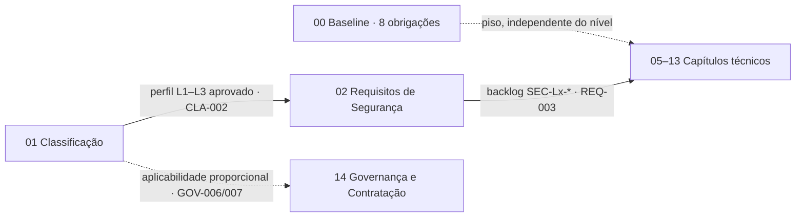
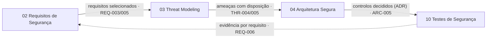
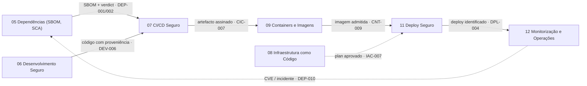
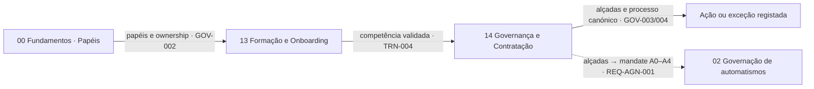
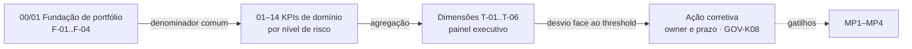

# Os Cinco Macro-processos de Engenharia Segura

Os capítulos 01–14 organizam o Manual por **áreas de capacidade**. Cada um diz *o que* tem de existir e *como* se faz — com catálogo de requisitos, *user stories*, exceções, indicadores e proporcionalidade L1–L3. Uma organização pode ter todos esses mecanismos e, ainda assim, não os ter ligados. A falha sistémica que os macro-processos endereçam está na **ausência de ligação governada** entre mecanismos que existem: a classificação é feita mas não seleciona os requisitos; o *threat model* é aprovado mas os testes não fecham sobre as suas ameaças; o SBOM descreve um *build* que não é o que está em produção; a exceção é aprovada por quem não tem alçada; o indicador mede atividade em vez de estado.

Esta página descreve a outra dimensão do Manual: **o que tem de permanecer ligado** entre capacidades para que operem como um único sistema de engenharia segura. Chama-se a cada uma dessas ligações uma **continuidade**, e ao processo que a preserva um **macro-processo**. Os cinco macro-processos são ortogonais aos capítulos. Cada um é um **percurso** por vários capítulos — uma costura — e nenhum capítulo é dono de um macro-processo. O valor está nas transições: o que sai de um capítulo tem de ser exatamente o que entra no seguinte.

Os macro-processos não são fases do ciclo de vida — o SDLC está coberto na página **Como Fazer** de cada capítulo —, e não são capítulos novos. São **invariantes** no sentido que a [Teoria de Tudo](/sbd-toe/teory-of-everything/intro) já lhes dá: condições que atravessam todo o SDLC, independentes de tecnologia, e cuja violação torna o sistema não auditável, não atribuível ou não defensável. Em conjunto, os cinco constituem a **camada de ligação governada** (*governed linkage layer*) do SbD-ToE. O Manual passa a responder, além de "o que tem de ser feito aqui?", à pergunta: **"o que tem de permanecer ligado antes, durante e depois — e como se sabe que ainda está?"**

Esta página segue o padrão da [matriz transversal de verificação](/sbd-toe/sbd-manual/testes-seguranca/addon/matriz-verificacao-transversal): **não duplica nenhuma prescrição**. Cada atividade citada abaixo vive no seu capítulo, com o requisito que a prescreve. A página é índice e definição de processo; a linguagem normativa só aparece quando repete uma prescrição existente citada.

## Os cinco macro-processos

| Rótulo | Macro-processo | Percurso de capítulos | Continuidade | Invariante | Pergunta que responde |
|---|---|---|---|---|---|
| MP1 | **Classificar → Selecionar** (CLASSIFY → SELECT) | 01 → 02 → 05–13 | Aplicabilidade | Um perfil de segurança registado seleciona requisitos, gates, profundidade de revisão, evidência e formação. | "O que se aplica aqui?" |
| MP2 | **Desenhar → Assegurar** (DESIGN → ASSURE) | 03 → 04 → 10 | Intenção | Ameaças, decisões de arquitetura e testes fecham sobre o mesmo resultado declarado. | "O que foi desenhado e implementado satisfaz a intenção de segurança?" |
| MP3 | **Construir → Executar** (BUILD → RUN) | 05 → 07 → 09 → 11 → 12 | Proveniência / execução | A evidência de dependências, *pipeline*, artefacto, *deployment* e *runtime* descreve a mesma versão lançada. | "O que está a correr ou a agir é o que foi governado, verificado e autorizado?" |
| MP4 | **Autorizar → Agir / Excecionar** (AUTHORISE → ACT / EXCEPT) | 00 → 13 → 14 (ramo automatismos: 02) | Autoridade e agência | Papéis, deveres de fornecedor, automatismos e exceções exigem autoridade explícita e evidência retida. Capacidade não implica autoridade. | "Quem ou o quê pode decidir ou executar isto, em nome de quem, em que âmbito, e quando é obrigatória exceção ou escalada?" |
| MP5 | **Medir → Melhorar** (MEASURE → IMPROVE) | 00–14 (todos) | Asseguramento e aprendizagem | Cada capítulo precisa de população elegível, contrato de evidência, dono e medida de estado resultante. | "O sistema funcionou, e o que tem de mudar?" |

## Como ler um macro-processo

Cada macro-processo é documentado com o mesmo *template*, na forma em que o Manual já documenta processos (precedente: o [processo canónico de exceções](/sbd-toe/sbd-manual/governanca-contratacao/addon/processo-excecoes)). **Finalidade e invariante** enuncia a condição a preservar. **Percurso de capítulos** lista as transições, uma linha por passagem, com o que sai de um capítulo e tem de entrar no seguinte. **Âmbito**, **Gatilhos**, **Entradas**, **Atividades** e **Saídas** descrevem o processo; cada atividade cita o capítulo e pelo menos um requisito ou *user story* que a prescreve — um passo sem âncora não entra. **Papéis** usa apenas os [13 papéis canónicos](/sbd-toe/sbd-manual/fundamentos/roles-responsabilidades/intro). **Pontos de controlo** são os *gates* onde a continuidade pode quebrar, e o que os fecha. **Evidência esperada** reutiliza evidência já exigida. **Indicadores** reutilizam KPIs das páginas **KPIs e Métricas** de cada capítulo, declarados com a estrutura de medição de MP5 (população elegível · contrato de evidência · dono · estado resultante), sem números-alvo novos. **Extensão a sistemas AI/agentic** cita só o que já está prescrito. **Proporcionalidade L1–L3** diz o que muda com o nível.

## MP1 — Classificar → Selecionar {#mp1-classificar-selecionar}

### Finalidade e invariante

Um perfil de segurança registado seleciona requisitos, gates, profundidade de revisão, evidência e formação. A classificação de risco não é um documento: é o ato que torna vinculativas as colunas L1/L2/L3 de todos os catálogos. Se o nível existe mas não seleciona nada, o Manual reduz-se a um catálogo de boas práticas sem aplicabilidade; se cada capítulo decide o seu próprio nível, a proporcionalidade deixa de ser um sistema. MP1 preserva a ligação entre o perfil e tudo o que dele depende.

### Percurso de capítulos

- **Classificação → Requisitos de Segurança (01 → 02).** Sai a classificação E+D+I com nível L1–L3 aprovado pela entidade proporcional ([`CLA-001`](/sbd-toe/sbd-manual/classificacao-aplicacoes/addon/catalogo-requisitos-classificacao), [`CLA-002`](/sbd-toe/sbd-manual/classificacao-aplicacoes/addon/catalogo-requisitos-classificacao)) e a matriz de controlos aplicada ([matriz por nível de risco](/sbd-toe/sbd-manual/classificacao-aplicacoes/addon/matriz-controlos-por-risco)). Entra em Requisitos de Segurança (02) como seleção de requisitos por criticidade ([US-01](/sbd-toe/sbd-manual/requisitos-seguranca/aplicacao-lifecycle#us-01---seleção-de-requisitos-por-criticidade), [`REQ-003`](/sbd-toe/sbd-manual/requisitos-seguranca/addon/lista-requisitos-base)), com *tags* `SEC-Lx-*` no *backlog* ([taxonomia de rastreabilidade](/sbd-toe/sbd-manual/requisitos-seguranca/addon/taxonomia-rastreabilidade)).
- **Requisitos de Segurança → capítulos técnicos (02 → 05–13).** Sai o *backlog* com `SEC-Lx-*` e referências `REQ-XXX` validadas no *pipeline* (Requisitos de Segurança, US-04, US-12). Entra em cada capítulo técnico como aplicabilidade: `CLA-003` estabelece que o nível determina o conjunto de controlos base — *gates* de CI/CD, requisitos de testes, frequência de revisões e obrigações de monitorização — e o **Catálogo de Requisitos** de cada capítulo declara nas colunas L1/L2/L3 o que é obrigatório para esse nível.
- **Piso independente.** As [oito obrigações mínimas transversais](/sbd-toe/sbd-manual/fundamentos/baseline) aplicam-se a todas as aplicações, independentemente do nível; a seleção por nível acrescenta, nunca subtrai.
- **Ramo de aquisição — Governança e Contratação (14).** Fornecedores e terceiros têm aplicabilidade própria, proporcional ao risco: cláusulas ([`GOV-006`](/sbd-toe/sbd-manual/governanca-contratacao/addon/catalogo-requisitos-governanca)) e validação pré-*onboarding* (`GOV-007`, com SBOM, SLA de incidentes e direito de auditoria em L3).

### Âmbito

Aplica-se à **aplicação** (unidade de `CLA-001` e do inventário `CLA-008`), ao **fornecedor** com acesso a dados, código ou *pipelines* (`GOV-007`) e ao **agente AI**, classificado por nível de autonomia A0–A4 por agente e por contexto ([`REQ-AGN-002`](/sbd-toe/sbd-manual/requisitos-seguranca/addon/governanca-automatismos#req-agn)). A **alteração** não é unidade de aplicabilidade própria: entra por via dos gatilhos de reavaliação.

### Gatilhos

- Aplicação nova ou em início de projeto (Classificação, US-01).
- Alteração significativa — nova integração crítica, alteração de exposição, incidente de segurança, alteração regulatória — com reavaliação no prazo máximo de 30 dias (`CLA-006`; critérios documentados em `CLA-004`; lista de *triggers* no [ciclo de vida do risco](/sbd-toe/sbd-manual/classificacao-aplicacoes/addon/ciclo-vida-risco)).
- Ciclo periódico por nível: L1 anual, L2 semestral, L3 trimestral (`CLA-005`).
- Alteração relevante de requisitos, que revê a seleção e pode disparar novo *threat modeling* (Requisitos de Segurança, US-02; `REQ-005`).
- Introdução ou modificação de automação ou apoio à decisão, incluindo IA, quando altere pressupostos de validação, evidência ou reprodutibilidade (ciclo de vida do risco, *triggers*); e a regra de reforço da matriz: baixa detetabilidade, baixa evidenciabilidade, comportamento não determinístico ou elevada delegação com impacto real exigem controlos do nível imediatamente superior, independentemente do nível atribuído.

### Entradas

- Eixos Exposição, Tipo de Dados e Impacto Potencial e limiares L1–L3 ([modelo de classificação](/sbd-toe/sbd-manual/classificacao-aplicacoes/addon/modelo-classificacao-eixos), Classificação).
- Inventário central de aplicações com nível, revisão, *owner* e estado (`CLA-008`, Classificação).
- Matriz de controlos por nível de risco (Classificação).
- Catálogos de requisitos com colunas L1/L2/L3 (capítulos 02–14) e as oito obrigações da *baseline* (Fundamentos).

### Atividades

1. **Classificar** a aplicação pelos três eixos e obter o nível L1–L3 — Classificação, `CLA-001`, US-01.
2. **Aprovar proporcionalmente** e registar no inventário: L1 pelo responsável técnico, L2 por AppSec Engineer, L3 por Gestão Executiva / CISO — Classificação, `CLA-002`, `CLA-008`, US-15.
3. **Aplicar a matriz de controlos** ao nível obtido — Classificação, `CLA-003`, US-02.
4. **Selecionar requisitos** no *backlog* com `SEC-Lx-*` e registar a evidência da decisão — Requisitos de Segurança, `REQ-003`, US-01.
5. **Propagar a aplicabilidade** aos capítulos técnicos: as linhas com ✔ na coluna do nível passam a exigir evidência — a [matriz transversal](/sbd-toe/sbd-manual/testes-seguranca/addon/matriz-verificacao-transversal) formula a regra de *roll-up* ("para um sistema L2, todas as linhas com ✔ na coluna L2 têm de ter evidência") — Classificação, `CLA-003`; Testes de Segurança, [Matriz Transversal de Verificação](/sbd-toe/sbd-manual/testes-seguranca/addon/matriz-verificacao-transversal).
6. **Validar no *pipeline*** a presença e o formato das *tags* e a ligação a `REQ-XXX` — Requisitos de Segurança, US-12.
7. **Reavaliar** por gatilho ou por ciclo, com registo do trigger, do nível anterior e novo e da justificação — Classificação, `CLA-004`, `CLA-005`, `CLA-006`, US-03; Requisitos de Segurança, US-02.
8. **Estender a fornecedores** cláusulas e validação proporcionais ao risco — Governança e Contratação (14), `GOV-006`, `GOV-007`.

### Saídas

- **Perfil de segurança registado**: classificação aprovada + inventário + seleção de requisitos. Consumido por MP2 (o *threat modeling* formal aplica-se a L2+ — `THR-001`), por MP3 (*gates* e profundidade de verificação por nível), por MP4 (alçadas de aprovação por nível — `GOV-003`) e por MP5 (o inventário classificado é o denominador F-02 de todos os KPIs — ver MP5).

### Papéis

- **Dono do processo:** AppSec Engineer — valida o modelo aplicado, ajusta o nível e aplica a matriz (Classificação, "Quem está envolvido").
- **Participantes:** Developer e Scrum Master / Team Lead (propõem a classificação; aprovação L1); Arquitetos de Software (revêem exposição e fluxos); Product Owner (seleciona requisitos no *backlog*; aprova aceitação de risco); Gestão Executiva / CISO (aprovação L3); GRC / Compliance (inventário e rastreabilidade — Classificação, US-15); Quality Assurance (QA) (valida cumprimento por nível antes do *go-live* — Classificação, US-05).

### Pontos de controlo

- **Aprovação da classificação** pela entidade proporcional ao nível (`CLA-002`). Sem aprovação registada, não há perfil.
- **Verificação de *tags* no PR** (Requisitos de Segurança, US-12): um cartão sem `SEC-Lx-*` e sem `REQ-XXX` falha.
- **Validação antes do *go-live*** (Classificação, US-05): checklist de controlos aplicáveis com evidência e nenhuma exceção não aprovada pendente.
- **Prazo de reavaliação** após mudança significativa (`CLA-006`, 30 dias).
- **Completude do denominador**: F-02 tem de ser igual a F-01 — toda a aplicação está classificada ([estrutura de medição transversal](/sbd-toe/sbd-manual/governanca-contratacao/kpis-governanca)).

### Evidência esperada

- Documento de classificação versionado e matriz de controlos aplicada (Classificação, US-01: `classificacao-aplicacao.yaml`, `matriz-controlos-aplicada.md`).
- Inventário central com nível, data de revisão, *owner*, estado de conformidade e autoridade aprovadora (`CLA-008`).
- *Backlog* com *tags* `SEC-Lx-*` e relatórios exportáveis (Requisitos de Segurança, US-04).
- Registo de revisão com trigger, nível anterior e novo, justificação e responsável (Classificação, US-03).

### Indicadores

| Indicador (fonte) | População elegível | Contrato de evidência | Dono de recolha | Estado resultante |
|---|---|---|---|---|
| `CLA-K01` — % aplicações do portfólio com classificação de risco formal documentada e acessível ([Cap. 01](/sbd-toe/sbd-manual/classificacao-aplicacoes/addon/kpis-metricas-classificacao)) | F-01 (inventário total) | Classificação documentada e acessível | AppSec Engineer (T-01) | Portfólio classificado; F-02 = F-01 |
| `CLA-K03` — % aplicações com alteração significativa cuja classificação foi atualizada em ≤ 30 dias (Cap. 01) | F-02, por evento | Registo de revisão datado após o trigger | AppSec Engineer (T-01) | Perfil atual face às alterações |
| `CLA-K04` — % classificações de sistemas L2/L3 validadas por AppSec ou GRC (Cap. 01) | F-02 (L2/L3) | Validação por segundo par de olhos independente do *owner* | AppSec Engineer (T-01) | Nível não é auto-avaliação |
| `RQS-K01` — % aplicações com requisitos de segurança formalmente mapeados ao nível de risco classificado ([Cap. 02](/sbd-toe/sbd-manual/requisitos-seguranca/addon/kpis-metricas-requisitos)) | F-02, por nível | Mapeamento requisitos ↔ nível disponível | AppSec Engineer (T-01) | Seleção efetuada; estabelece F-03 |
| `RQS-K06` — # requisitos obrigatórios para o nível sem implementação e sem exceção formal (Cap. 02) | Requisitos obrigatórios do nível | Implementação evidenciada ou exceção registada | AppSec Engineer (T-01) | Zero lacunas não governadas |

### Extensão a sistemas AI/agentic

A aplicabilidade a agentes segue o mesmo movimento — classificar, depois selecionar —, com um eixo de contexto adicional: o [nível de autonomia A0–A4](/sbd-toe/sbd-manual/requisitos-seguranca/addon/governanca-automatismos#niveis-autonomia), atribuído por agente e por contexto (projeto × ambiente × tarefa), reavaliado a cada mudança de contexto (`REQ-AGN-002`).

- A classificação da aplicação identifica as ferramentas de automação e IA e reflete-as nos eixos E/D/I (Classificação, US-01); a matriz de controlos aplica a regra de reforço a automação com impacto real, com ou sem IA.
- O nível A0–A4 seleciona os requisitos `REQ-AGN-001..004` aplicáveis (a tabela por nível de risco em [Governação do Uso de Automatismos](/sbd-toe/sbd-manual/requisitos-seguranca/addon/governanca-automatismos)) e os requisitos AI dos capítulos técnicos, todos L2+: `DEP-011..014`, `ARC-014`, `THR-008`, `DPL-010`, `OPS-011..014`.
- A formação em uso seguro de IA e *tooling* é selecionada por perfil e nível (Formação e Onboarding, US-19).

### Proporcionalidade L1–L3

Em L1 aplica-se o piso das oito obrigações e a matriz de nível baixo, com aprovação pelo responsável técnico e revisão anual. Em L2 a classificação é validada por AppSec Engineer (`CLA-K04`), a revisão de requisitos por alteração é obrigatória (Requisitos de Segurança, US-02) e a reavaliação é semestral. Em L3 a aprovação é de Gestão Executiva / CISO, a cadência trimestral, e a validação antes do *go-live* é formal com assinatura (Classificação, US-05).

### Referências cruzadas

[Cap. 01 — Classificação](/sbd-toe/sbd-manual/classificacao-aplicacoes/intro) · [catálogo CLA](/sbd-toe/sbd-manual/classificacao-aplicacoes/addon/catalogo-requisitos-classificacao) · [modelo de eixos](/sbd-toe/sbd-manual/classificacao-aplicacoes/addon/modelo-classificacao-eixos) · [ciclo de vida do risco](/sbd-toe/sbd-manual/classificacao-aplicacoes/addon/ciclo-vida-risco) · [matriz de controlos por risco](/sbd-toe/sbd-manual/classificacao-aplicacoes/addon/matriz-controlos-por-risco) · [Cap. 02 — ciclo de vida](/sbd-toe/sbd-manual/requisitos-seguranca/aplicacao-lifecycle) · [lista de requisitos base](/sbd-toe/sbd-manual/requisitos-seguranca/addon/lista-requisitos-base) · [Baseline](/sbd-toe/sbd-manual/fundamentos/baseline) · [catálogo GOV](/sbd-toe/sbd-manual/governanca-contratacao/addon/catalogo-requisitos-governanca) · [governança de automatismos](/sbd-toe/sbd-manual/requisitos-seguranca/addon/governanca-automatismos)

## MP2 — Desenhar → Assegurar {#mp2-desenhar-assegurar}

### Finalidade e invariante

Ameaças, decisões de arquitetura e testes fecham sobre o mesmo resultado declarado. Um *threat model* aprovado, uma arquitetura revista e uma bateria de testes verde podem coexistir sem se referirem ao mesmo objeto: a ameaça mitigada "no papel", a decisão registada sem controlo, o teste que valida outra coisa. MP2 preserva a ligação entre a intenção de segurança e a evidência de que foi satisfeita, por dentro dos capítulos 03, 04 e 10, com o Requisitos de Segurança (02) como espinha de rastreabilidade.

### Percurso de capítulos

- **Requisitos de Segurança → Threat Modeling (02 → 03).** Saem os requisitos selecionados (`REQ-003`) e o gatilho de análise de ameaça após alteração de requisito (`REQ-005`). Entra em Threat Modeling (03) como *threat modeling* formal sobre a arquitetura real ([`THR-001`](/sbd-toe/sbd-manual/threat-modeling/addon/catalogo-requisitos-threat-modeling), `THR-002`).
- **Threat Modeling → Arquitetura Segura (03 → 04).** Sai o *threat model* com disposição explícita e *owner* por ameaça (`THR-004`), DFDs e *trust boundaries* (`THR-002`) e requisitos rastreáveis gerados (`THR-005`). Entra em Arquitetura Segura como *threat modeling* integrado nos fluxos críticos ([`ARC-005`](/sbd-toe/sbd-manual/arquitetura-segura/addon/catalogo-requisitos-arquitetura)), sincronização *threat modeling* ↔ arquitetura (Arquitetura Segura (04), US-09) e decisões registadas em ADR (Arquitetura Segura, US-04).
- **Arquitetura Segura → Testes de Segurança (04 → 10).** Saem os controlos decididos e a ficha de solução (Arquitetura Segura, US-02). Entram em Testes de Segurança (10) como estratégia formal de testes por nível ([`TST-001`](/sbd-toe/sbd-manual/testes-seguranca/addon/catalogo-requisitos-testes)), cobertura mínima por componente crítico (`TST-007`) e regressão de segurança (`TST-006`).
- **Testes de Segurança → Requisitos de Segurança (10 → 02, fecho).** Sai a evidência de testes ligada ao *build* (`TST-004`). Entra de volta em Requisitos de Segurança como validação por requisito (US-09: `REQ-XXX` → evidência) e como rastreabilidade requisito → ameaça → teste ([`REQ-006`](/sbd-toe/sbd-manual/requisitos-seguranca/addon/lista-requisitos-base)); o Threat Modeling fecha o mesmo laço na direção ameaça → requisito → *backlog* → validação (`THR-005`).

O requisito `ARC-015` (agente AI como *principal* isolado com *mandate*) pertence a Arquitetura Segura, mas a continuidade que preserva é de **autoridade**, não de intenção: é tratado em MP4.

### Âmbito

Aplica-se à **aplicação** L2+ (os requisitos `THR-*` e a maior parte dos `TST-*` são L2+), à **alteração arquitetural significativa** (`THR-006`; Arquitetura Segura, US-06, US-11) e ao **componente AI/ML** (`THR-008`, `ARC-014`).

### Gatilhos

- Nova aplicação L2+ antes do *go-live* (`THR-001`, `THR-007`).
- Alteração arquitetural significativa, com atualização do *threat model* no máximo em 30 dias (`THR-006`; Threat Modeling, US-03; Arquitetura Segura, US-11 "arquitetura viva").
- Alteração relevante de requisito (`REQ-005`).
- Vulnerabilidade corrigida, que origina um teste de regressão (`TST-006`).
- Execução do *pipeline* com alteração relevante sem referência a *threat model* atualizado (Threat Modeling, US-05, *gate* de consistência).

### Entradas

- Requisitos selecionados com `SEC-Lx-*` (MP1; Requisitos de Segurança).
- Arquitetura real representada em DFDs com *trust boundaries* (`THR-002`); zonas de confiança documentadas (`ARC-001`).
- Catálogo de ameaças mitigadas por capítulo (`MT-NNN`, [Ameaças Mitigadas](/sbd-toe/sbd-manual/threat-modeling/canon/ameacas-mitigadas)), com força da mitigação rotulada.
- Catálogo de padrões de arquitetura segura (Arquitetura Segura, US-13) e estratégia de testes (`TST-001`).

### Atividades

1. **Modelar ameaças** com metodologia estruturada — STRIDE como *baseline*, LINDDUN quando há dados pessoais, PASTA em alto risco — sobre DFDs atualizados — Threat Modeling, `THR-002`, `THR-003`, US-01.
2. **Dispor cada ameaça** (mitigar, aceitar, transferir, excluir) com *owner*, gerar os requisitos rastreáveis e aprovar formalmente o modelo — Threat Modeling, `THR-004`, `THR-005`, US-09.
3. **Sincronizar com a arquitetura**: integrar o resultado nos fluxos críticos, registar decisões em ADR com racional de segurança, manter a rastreabilidade decisão ↔ ameaça ↔ controlo ↔ requisito — Arquitetura Segura, `ARC-005`, `ARC-001`, US-04, US-09.
4. **Rever independentemente** o *threat model* e a arquitetura antes do *go-live* em L2+ — Threat Modeling, `THR-007`; Arquitetura Segura, US-03.
5. **Definir critérios de validação** por requisito e a estratégia e cobertura de testes por nível — Requisitos de Segurança, US-05; Testes de Segurança, `TST-001`, `TST-007`.
6. **Verificar** com o oráculo adequado a cada atividade: SAST como *gate* ([`DEV-003`](/sbd-toe/sbd-manual/desenvolvimento-seguro/addon/catalogo-requisitos-desenvolvimento), `TST-002`), DAST em *staging* (`TST-005`), regressão (`TST-006`), *pentesting* (`TST-008`) — a matriz transversal indexa todas as atividades e o seu *grounding*.
7. **Fechar sobre o requisito**: validar `REQ-XXX` → evidência e manter a matriz requisito → ameaça → teste — Requisitos de Segurança, US-09, `REQ-006`.
8. **Decidir o *release*** com critérios de aceitação de segurança e aceitação explícita de risco residual; executar o *gate* arquitetural antes do *go-live* — Testes de Segurança, US-07; Arquitetura Segura, US-12, `ARC-012` (L3).
9. **Excecionar** desvios arquiteturais em ADR com aceitação de risco explícita e registo na matriz de rastreabilidade — Arquitetura Segura, [exceções](/sbd-toe/sbd-manual/arquitetura-segura/addon/excecoes); o processo é o canónico (MP4).

### Saídas

- ***Threat model* aprovado e versionado** com decisões — consumido por MP3 (gates de promoção) e por MP4 (risco aceite entra na cadeia de autoridade; `CLA-007` risco residual com *owner* e TTL).
- **Evidência de verificação ligada ao *build*** (`TST-004`) — consumida por MP3 (promoção só com evidência) e por MP5 (`RQS-K03`, `THR-K02`).
- **Matriz requisito → ameaça → teste** (`REQ-006`) — consumida por MP5 e por auditoria.

### Papéis

- **Dono do processo:** AppSec Engineer — facilita *threat modeling* e revisão de arquitetura, aprova formalmente riscos residuais, define a *baseline* de falsos positivos (`TST-002`).
- **Participantes:** Arquitetos de Software (ADR, sincronização, *threat modeling* no desenho inicial L2–L3); Developer (implementação e anotações rastreáveis, `DEV-009` em L3); Quality Assurance (QA) (critérios de validação, validação por requisito); Product Owner (critérios de aceitação de segurança, decisão *go/no-go*); Scrum Master / Team Lead (aprovação do *threat model*, Threat Modeling, US-09); Gestão Executiva / CISO (aprovação de arquitetura para L3 — `ARC-012`); DevOps / SRE (*gate* de consistência no CI/CD, Threat Modeling, US-05).

### Pontos de controlo

- **Aprovação formal do *threat model*** com responsável e evidência mínima (Threat Modeling, US-09).
- ***Gate* de consistência no CI/CD**: alteração relevante sem referência a *threat model* atualizado ou justificação aprovada — não bloqueante com alerta em L2, bloqueante em L3 (Threat Modeling, US-05).
- **Revisão independente por AppSec antes do *go-live*** em L2+ (`THR-007`).
- ***Gate* arquitetural antes do *go-live*** — conformidade ou bloqueio com desvios rastreáveis (Arquitetura Segura, US-12; checklist formal assinada em L3, `ARC-012`).
- **Critérios de *release***: L2 bloqueia *High/Critical*; L3 nenhum crítico sem exceção formal (Testes de Segurança, US-07).

### Evidência esperada

- *Threat model* versionado com decisões e registo de aprovação (Threat Modeling, US-09).
- ADR e ficha de solução alinhadas; registo de atualização (Arquitetura Segura, US-04, US-09).
- Matriz ou ferramenta que demonstra requisito ↔ ameaça ↔ teste (`REQ-006`; `THR-005`).
- Resultado e evidência por `REQ-XXX` (Requisitos de Segurança, US-09).
- Relatórios de testes associados ao *build*, reproduzíveis e retidos (`TST-004`); `checklist-arquitetura.md` preenchida (Arquitetura Segura, US-12).

### Indicadores

| Indicador (fonte) | População elegível | Contrato de evidência | Dono de recolha | Estado resultante |
|---|---|---|---|---|
| `THR-K02` — % ameaças identificadas no threat model com controlo associado ou risco aceite formalmente ([Cap. 03](/sbd-toe/sbd-manual/threat-modeling/addon/kpis-metricas-threat-modeling)) | Ameaças identificadas, por *threat model* | Disposição explícita: controlo com referência ao requisito, mitigação com prazo, ou risco aceite com *owner* e registo | AppSec Engineer (T-01) | Nenhuma ameaça sem disposição |
| `THR-K05` — % ameaças identificadas em threat model mapeadas a requisitos canónicos SbD-ToE (Cap. 03) | Ameaças identificadas | Campo de requisito por ameaça | AppSec Engineer (T-01) | Ameaça ligada ao requisito |
| `ARC-K02` — % decisões de arquitectura de segurança com ADR registado e rastreável a requisito ARC canónico ([Cap. 04](/sbd-toe/sbd-manual/arquitetura-segura/addon/kpis-metricas-arquitetura)) | Decisões de arquitetura de segurança | ADR com responsável e referência ao requisito | AppSec Engineer (T-01) | Decisão rastreável |
| `RQS-K03` — % requisitos aplicados com rastreabilidade completa (requisito → controlo implementado → evidência de teste) ([Cap. 02](/sbd-toe/sbd-manual/requisitos-seguranca/addon/kpis-metricas-requisitos)) | Requisitos aplicados (F-03) | Cadeia completa até evidência de teste | AppSec Engineer (T-01) | Intenção fechada por evidência |
| `RQS-K05` — % requisitos com critério de aceitação verificado (testado ou auditado) vs apenas declarado como aplicado (Cap. 02) | Requisitos aplicados | Verificação, não declaração | AppSec Engineer (T-01) | Verificado, não declarado |
| `TST-K04` — % findings críticos/altos em regressão ([Cap. 10](/sbd-toe/sbd-manual/testes-seguranca/addon/kpis-metricas-testes)) | *Findings* declarados resolvidos | Reaparecimento em 90 dias | AppSec Engineer (T-03) | Correção que se mantém |

### Extensão a sistemas AI/agentic

Componentes AI/ML entram no mesmo laço com um *threat model* estendido (`THR-008`; Threat Modeling, US-11 para agentes com *tool-use*, US-12 para componentes não-agentic) e com padrões arquitetónicos dedicados — *trust boundaries* explícitas entre dados de treino, artefactos de modelo e *endpoints* de inferência (`ARC-014`; Arquitetura Segura, US-18). Do lado da verificação, as *eval suites* contínuas ([Testes de Segurança, §C5](/sbd-toe/sbd-manual/testes-seguranca/addon/ia-nos-testes#c5-eval-suites)) são o oráculo comportamental de agentes; a sua função como *gate* de *release* (`DPL-010`) pertence a MP3.

### Proporcionalidade L1–L3

Em L1 aplicam-se as zonas de confiança (`ARC-001`), o SAST como *gate* (`DEV-003`) e a validação funcional de requisitos (`REQ-001`); o *threat modeling* formal e a rastreabilidade requisito → ameaça → teste começam em L2. Em L2 o *threat model* é obrigatório, revisto por AppSec antes do *go-live*, sincronizado com ADR, e o DAST corre em *staging*. Em L3 acrescem a revisão independente e PASTA em alto risco (Threat Modeling, US-14), a aprovação formal de arquitetura (`ARC-012`), a validação automática de topologia (`ARC-013`), IAST e *fuzzing* (`TST-009`, `TST-010`) e anotações rastreáveis no código (`DEV-009`).

### Referências cruzadas

[Cap. 03 — Threat Modeling](/sbd-toe/sbd-manual/threat-modeling/intro) · [catálogo THR](/sbd-toe/sbd-manual/threat-modeling/addon/catalogo-requisitos-threat-modeling) · [metodologias e ferramentas](/sbd-toe/sbd-manual/threat-modeling/addon/metodologias-e-ferramentas) · [ameaças mitigadas](/sbd-toe/sbd-manual/threat-modeling/canon/ameacas-mitigadas) · [Cap. 04 — Arquitetura](/sbd-toe/sbd-manual/arquitetura-segura/intro) · [catálogo ARC](/sbd-toe/sbd-manual/arquitetura-segura/addon/catalogo-requisitos-arquitetura) · [exceções arquiteturais](/sbd-toe/sbd-manual/arquitetura-segura/addon/excecoes) · [Cap. 10 — Testes](/sbd-toe/sbd-manual/testes-seguranca/intro) · [catálogo TST](/sbd-toe/sbd-manual/testes-seguranca/addon/catalogo-requisitos-testes) · [matriz transversal de verificação](/sbd-toe/sbd-manual/testes-seguranca/addon/matriz-verificacao-transversal) · [Cap. 02 — lista de requisitos base](/sbd-toe/sbd-manual/requisitos-seguranca/addon/lista-requisitos-base)

## MP3 — Construir → Executar {#mp3-construir-executar}

### Finalidade e invariante

A evidência de dependências, *pipeline*, artefacto, *deployment* e *runtime* descreve a mesma versão lançada. Um SBOM correto de um *build* que não é o que foi promovido, uma assinatura verificada num artefacto diferente do que está a correr, ou um *deploy* sem ligação ao *commit* de origem, são cada um uma quebra de proveniência. MP3 preserva a identidade do que executa desde a dependência até ao sinal de *runtime*, e é o percurso que permite responder, num incidente, "o que está a correr é o que foi governado, verificado e autorizado?".

### Percurso de capítulos

- **Dependências → CI/CD Seguro (05 → 07).** Saem o SBOM por *build* ([`DEP-001`](/sbd-toe/sbd-manual/dependencias-sbom-sca/addon/catalogo-requisitos-dependencias)), o *verdict* SCA com bloqueio por severidade (`DEP-002`) e as versões fixas com integridade por *hash* (`DEP-003`). Entram em CI/CD Seguro como *gates* de segurança bloqueantes antes de promoção ([`CIC-004`](/sbd-toe/sbd-manual/cicd-seguro/addon/catalogo-requisitos-cicd)) e cobertura de SBOM no *pipeline* (CI/CD Seguro (07), US-08).
- **Desenvolvimento Seguro → CI/CD Seguro (06 → 07).** Saem o código com proveniência identificada (`DEV-006`) e o SAST como *gate* de integração (`DEV-003`). Entram como condição de promoção no *pipeline* (`CIC-004`).
- **CI/CD Seguro → Containers e Imagens (07 → 09).** Sai o artefacto assinado ou com *hash*, com proveniência (*commit* SHA, *run ID*, ambiente de *build*) verificável antes de promoção (`CIC-007`; execução identificável por ID único, `CIC-005`). Entra em Containers e Imagens (09) como imagem a partir de base aprovada ([`CNT-001`](/sbd-toe/sbd-manual/containers-imagens/addon/catalogo-requisitos-containers)), assinada (`CNT-007`), com SBOM por imagem (`CNT-008`).
- **Infraestrutura como Código (08).** A infraestrutura declarada em código segue a mesma disciplina: módulos com versão imutável ([`IAC-004`](/sbd-toe/sbd-manual/iac-infraestrutura/addon/catalogo-requisitos-iac)), *plan* aprovado antes de *apply* (`IAC-007`), *drift* detetado entre IaC e estado real (`IAC-012`).
- **Containers e Imagens → Deploy Seguro (09 → 11).** Sai a imagem verificada por *admission control* (`CNT-009`). Entra em Deploy Seguro (11) como promoção apenas de artefactos com proveniência verificada ([`DPL-002`](/sbd-toe/sbd-manual/deploy-seguro/addon/catalogo-requisitos-deploy)), *gates* automáticos (`DPL-003`) e aprovação formal (`DPL-001`), com rastreabilidade *end-to-end* do *deploy* (`DPL-004`).
- **Deploy Seguro → Monitorização e Operações (11 → 12).** Sai o *deploy* identificado (quem aprovou, artefacto + *commit* SHA, quando, ambiente, *gates* executados — `DPL-004`). Entra em Monitorização e Operações (12) como monitorização durante e após o *deploy* (`DPL-008`), *logging* estruturado e persistente ([`OPS-001`](/sbd-toe/sbd-manual/monitorizacao-operacoes/addon/catalogo-requisitos-operacoes)), catálogo de eventos críticos (`OPS-002`) e sinal contínuo de saúde (`OPS-015`).
- **Monitorização e Operações → Dependências (12 → 05, laço).** Uma CVE detetada em produção volta a Dependências (05) pela rastreabilidade SBOM → vulnerabilidade → correção (`DEP-010`) e pelo SLA por severidade (`DEP-007`); um incidente volta ao *commit* de origem por `DPL-004` e, se necessário, ao *rollback* testado (`DPL-005`).

### Âmbito

Aplica-se à **versão lançada** (*build* → artefacto → imagem → *deploy* → processo em *runtime*), ao ***pipeline*** enquanto código (`CIC-001`), à **infraestrutura declarada** (Infraestrutura como Código, 08) e ao **agente AI em operação** (ver extensão).

### Gatilhos

- Cada *build* (`DEP-001`), cada PR (`DEV-003`) e cada promoção entre ambientes (`CIC-004`, `DPL-003`).
- CVE nova em dependência ou imagem, com SLA por severidade (`DEP-007`, `TST-003`); atualização da imagem base (`CNT-010`).
- *Drift* entre IaC e estado real (`IAC-012`) ou *drift* operacional pós-*deploy* (Deploy Seguro, US-14).
- Incidente em produção, que exige reconstituir o caminho até ao *commit* (`DPL-004`; CI/CD Seguro, US-09).
- Mudança de versão de modelo, *skill files* ou *system prompts* em sistemas com agentes (`DPL-010`, `DPL-011`).

### Entradas

- Código revisto com checklist de segurança em componentes críticos (`DEV-004`) e guidelines por *stack* (`DEV-001`).
- Dependências de registries controlados e aprovadas (`DEP-005`, `DEP-006`); imagens base de origem aprovada (`CNT-001`); IaC versionado com histórico intacto (`IAC-005`).
- *Gates* e profundidade de verificação por nível (MP1); *threat model* e evidência de testes (MP2); aprovação de *deploy* por papel autorizado (MP4).

### Atividades

1. **Inventariar e verificar dependências** por *build*: SBOM, SCA com bloqueio, versões fixas, proibição de cópia manual — Dependências, `DEP-001..004`.
2. **Construir com *gates* de integração**: *linters* e *rulesets* (`DEV-002`), SAST (`DEV-003`), *secrets scanning* (`CIC-003`, `IAC-011`) — Desenvolvimento Seguro, CI/CD Seguro, Infraestrutura como Código.
3. **Executar o *pipeline* como código**, com *triggers* restritos a fontes autorizadas e *runners* isolados — CI/CD Seguro, `CIC-001`, `CIC-002`, `CIC-006`.
4. **Assinar e registar proveniência** do artefacto e da imagem: *commit* SHA, *run ID*, assinatura verificada antes de promoção — CI/CD Seguro, `CIC-007`; Containers e Imagens, `CNT-007`, `CNT-008`.
5. **Aplicar *policy-as-code* e *admission control***: IaC validado antes de *apply* (`IAC-003`, `IAC-007`), *containers* admitidos só por política (`CNT-009`) — Infraestrutura como Código, Containers e Imagens.
6. **Promover só com proveniência verificada, *gates* passados e aprovação humana** — Deploy Seguro, `DPL-002`, `DPL-003`, `DPL-001`; a separação entre sinal automático e decisão de promoção é explícita (CI/CD Seguro, US-15; Deploy Seguro, US-16).
7. **Registar o *deploy*** com rastreabilidade *end-to-end* e evidência (Deploy Seguro, `DPL-004`, US-17) e validar em *staging* antes de produção (`DPL-007`).
8. **Observar em *runtime***: *logging* estruturado e centralizado, eventos críticos, alertas, sinais de saúde, deteção de *drift* — Monitorização e Operações, `OPS-001`, `OPS-002`, `OPS-004`, `OPS-005`, `OPS-015`; Infraestrutura como Código, `IAC-012`.
9. **Fechar o laço** de vulnerabilidade e de incidente: SBOM → CVE → correção (`DEP-010`); *rollback* testado com SLA (`DPL-005`); reprodutibilidade de incidentes em *runtime* (Deploy Seguro, US-15).

### Saídas

- ***Release* rastreável** (ID de *pipeline*, *hash* de artefacto, *commit*, aprovador, *gates*) — consumido por MP5 (`DPL-K06`) e por auditoria e resposta a incidentes.
- **Telemetria de *runtime*** — consumida por MP5 (`OPS-010`, MTTD/MTTR) e por MP2 (uma vulnerabilidade corrigida origina teste de regressão, `TST-006`).
- ***Findings* e desvios** — consumidos por MP4 quando exigem exceção (páginas de exceções dos capítulos 05–12).

### Papéis

- **Dono do processo:** DevOps / SRE — integra verificações no *pipeline*, automatiza *gates*, garante execução segura e mantém a monitorização.
- **Participantes:** Developer (código, dependências, imagens); AppSec Engineer (política de severidade, *baseline* de SAST, revisão de *gates*); Operações (Ops) (*runtime*, deteção e resposta); Product Owner (aprovação de *deploy* e rastreabilidade *commit* → *deploy*, Deploy Seguro, US-05); GRC / Compliance (rastreabilidade *commit* → *pipeline* → *release* para auditoria, CI/CD Seguro, US-09); Gestão Executiva / CISO (notificação obrigatória em *emergency deploy*, Deploy Seguro, [exceções de deploy](/sbd-toe/sbd-manual/deploy-seguro/addon/excecoes-deploy)).

### Pontos de controlo

- ***Gate* SCA** com bloqueio por severidade (`DEP-002`) e ***gates* de *pipeline*** bloqueantes antes de promoção (`CIC-004`).
- **Verificação de assinatura e proveniência** antes de promoção (`CIC-007`, `CNT-007`, `DPL-002`): artefacto sem proveniência verificável é rejeitado.
- ***Admission control*** (`CNT-009`) e ***plan* aprovado antes de *apply*** (`IAC-007`).
- **Aprovação humana de *deploy*** para ações irreversíveis (`DPL-001`; `CIC-004`), sem *bypass* automatizado; *bypass* de *gate* só com aprovação formal registada (`CIC-K02`).
- **Janela de observação pós-*deploy*** (`DPL-008`) e **deteção de falha de ingestão de logs** (`OPS-004`): a monitorização que deixa de receber é sinal, não silêncio.

### Evidência esperada

- SBOM ligado ao *build* que o gerou (`DEP-001`); relatório SCA por execução (`DEP-002`); rastreabilidade SBOM → CVE → ação (`DEP-010`).
- Execução de *pipeline* identificável com *inputs*, resultado e aprovador (`CIC-005`); artefacto com *commit* SHA e *run ID* (`CIC-007`).
- SBOM e assinatura por imagem no *registry* (`CNT-007`, `CNT-008`); logs de admissão e rejeição (`CNT-009`).
- Registo de *deploy* com ID, aprovador, artefacto, ambiente e *gates* (`DPL-004`).
- Logs estruturados persistidos fora da instância e retidos conforme política (`OPS-001`, `OPS-003`).

### Indicadores

| Indicador (fonte) | População elegível | Contrato de evidência | Dono de recolha | Estado resultante |
|---|---|---|---|---|
| `DEP-K01` — % aplicações com SBOM gerado automaticamente e actualizado a cada release ([Cap. 05](/sbd-toe/sbd-manual/dependencias-sbom-sca/addon/kpis-metricas-dependencias)) | F-02, por *release* | SBOM ligado ao *build* | AppSec Engineer (T-01, T-05) | Inventário da versão lançada |
| `CIC-K03` — % artefactos de build assinados digitalmente e com verificação de assinatura antes de deploy ([Cap. 07](/sbd-toe/sbd-manual/cicd-seguro/addon/kpis-metricas-cicd)) | Artefactos de *build*, por *release* | Assinatura e verificação registadas | AppSec Engineer (T-01) | Artefacto com proveniência |
| `CNT-K03` — % imagens de produção assinadas digitalmente e com verificação de assinatura antes de deploy ([Cap. 09](/sbd-toe/sbd-manual/containers-imagens/addon/kpis-metricas-containers)) | Imagens em produção | Assinatura verificada por *admission* | AppSec Engineer (T-01, T-05) | Imagem é a que foi construída |
| `DPL-K06` — % releases com artefacto de evidência de deploy rastreável (ID de pipeline, hash de artefacto, timestamp) ([Cap. 11](/sbd-toe/sbd-manual/deploy-seguro/addon/kpis-metricas-deploy)) | *Releases* | Evidência de *deploy* com os três identificadores | AppSec Engineer (T-01) | *Deploy* liga-se ao *build* |
| `DEP-K02` — % CVEs críticos (CVSS ≥ 9.0) em dependências directas mitigados dentro de SLA (Cap. 05) | CVEs críticos detetados | Mitigação registada dentro do SLA do nível | AppSec Engineer (T-03) | Versão lançada sem crítico fora de SLA |
| `IAC-K02` — # recursos de infraestrutura com drift detectado e não resolvido em mais de 7 dias ([Cap. 08](/sbd-toe/sbd-manual/iac-infraestrutura/addon/kpis-metricas-iac)) | Recursos geridos por IaC | Relatório de *drift* e resolução | AppSec Engineer (T-01) | Estado real = estado declarado |

### Extensão a sistemas AI/agentic

Num sistema com agentes, a identidade do que executa inclui o modelo e a sua versão, os *prompts* e *skill files*, a configuração de *tools* e servidores MCP e o *mandate* sob o qual opera. O Manual já prescreve cada um destes elementos ao longo do mesmo percurso:

- **Dependências** — inventário e proveniência de dependências AI/ML (`DEP-011`), AI BOM por *build* em CycloneDX `ml-bom` com modelos, *datasets*, servidores MCP/*tools* e *prompts* embebidos (`DEP-012`; Dependências, [US-14](/sbd-toe/sbd-manual/dependencias-sbom-sca/aplicacao-lifecycle#us-14)), versão fixa de modelos e *providers* sem `latest` nem *ranges* (`DEP-013`), lista de *providers* aprovados (`DEP-014`).
- **Desenvolvimento Seguro** — *prompts*, *skill files*, *agent files* e *rules* geridos como código, com *code review*, *secret scanning* e *drift detection*; *structured outputs* validados lado-servidor contra *schema* versionado (Desenvolvimento Seguro, US-15; [prompts como código](/sbd-toe/sbd-manual/desenvolvimento-seguro/addon/genia-e-seguranca#prompts-como-codigo)).
- **CI/CD Seguro** — agentes como *principals* do *pipeline* com identidade *workload* efémera, *scopes* por *tool*, TTL ≤ 1h e *audit event* por *tool invocation* com `mandate_ref` (CI/CD Seguro, [US-19](/sbd-toe/sbd-manual/cicd-seguro/aplicacao-lifecycle#us-19)).
- **Containers e Imagens** — pesos de modelo *self-hosted* como ativo crítico, com *hash* SHA-256 declarado no AI BOM e validado no arranque do *runtime* ([inferência self-hosted](/sbd-toe/sbd-manual/containers-imagens/addon/self-hosted-inference)).
- **Deploy Seguro** — *eval suite* como *gate* obrigatório quando a promoção altera modelo, *skill files* ou *system prompts*, com *rollback* de modelo independente do aplicacional (`DPL-010`); *canary* de versão maior de modelo e demoção automática de nível de autonomia em falha (`DPL-011`; Deploy Seguro, [US-18](/sbd-toe/sbd-manual/deploy-seguro/aplicacao-lifecycle#us-18)).
- **Monitorização e Operações** — telemetria dedicada (`OPS-011`), *audit* completo por *tool invocation* (`OPS-012`), *budget* e deteção de *runaway* (`OPS-013`), deteção de *jailbreak* e *off-policy actions* contra o *scope* do *mandate* (`OPS-014`; Monitorização e Operações, [US-13](/sbd-toe/sbd-manual/monitorizacao-operacoes/aplicacao-lifecycle#us-13)).

O *mandate* que define o que o agente pode fazer é matéria de MP4; MP3 garante que o que corre é o que o *mandate* referencia.

### Proporcionalidade L1–L3

Em L1 são obrigatórios SBOM, SCA com bloqueio, versões fixas, *gates* de *pipeline*, aprovação formal de *deploy*, *rollback* testado e *logging* estruturado (colunas L1 dos catálogos). Em L2 acrescem assinatura e proveniência de artefactos e imagens (`CIC-007`, `CNT-007`), *runners* isolados (`CIC-006`), validação em *staging* (`DPL-007`), SIEM (`OPS-004`) e os requisitos AI (`DEP-011..014`, `DPL-010`, `OPS-011..013`). Em L3 acrescem proteção contra execução não autorizada em *runners* (`CIC-010`), *policy-as-code* em IaC (`IAC-009`), políticas de rede por *namespace* (`CNT-012`), *deploy* progressivo (`DPL-009`), *canary* de modelo (`DPL-011`), correlação e deteção comportamental (`OPS-008`, `OPS-009`) e deteção de *jailbreak* (`OPS-014`).

### Referências cruzadas

[Cap. 05 — Dependências](/sbd-toe/sbd-manual/dependencias-sbom-sca/intro) · [catálogo DEP](/sbd-toe/sbd-manual/dependencias-sbom-sca/addon/catalogo-requisitos-dependencias) · [Cap. 06 — Desenvolvimento](/sbd-toe/sbd-manual/desenvolvimento-seguro/intro) · [catálogo DEV](/sbd-toe/sbd-manual/desenvolvimento-seguro/addon/catalogo-requisitos-desenvolvimento) · [Cap. 07 — CI/CD](/sbd-toe/sbd-manual/cicd-seguro/intro) · [catálogo CIC](/sbd-toe/sbd-manual/cicd-seguro/addon/catalogo-requisitos-cicd) · [Cap. 08 — IaC](/sbd-toe/sbd-manual/iac-infraestrutura/intro) · [catálogo IAC](/sbd-toe/sbd-manual/iac-infraestrutura/addon/catalogo-requisitos-iac) · [Cap. 09 — Containers](/sbd-toe/sbd-manual/containers-imagens/intro) · [catálogo CNT](/sbd-toe/sbd-manual/containers-imagens/addon/catalogo-requisitos-containers) · [Cap. 11 — Deploy](/sbd-toe/sbd-manual/deploy-seguro/intro) · [catálogo DPL](/sbd-toe/sbd-manual/deploy-seguro/addon/catalogo-requisitos-deploy) · [Cap. 12 — Monitorização](/sbd-toe/sbd-manual/monitorizacao-operacoes/intro) · [catálogo OPS](/sbd-toe/sbd-manual/monitorizacao-operacoes/addon/catalogo-requisitos-operacoes)

## MP4 — Autorizar → Agir / Excecionar {#mp4-autorizar-agir-excecionar}

### Finalidade e invariante

Papéis, deveres de fornecedor, automatismos e exceções exigem autoridade explícita e evidência retida. Capacidade não implica autoridade: ter acesso a um repositório, uma credencial de *deploy* ou um agente com *tools* não é o mesmo que ter o direito de decidir ou executar. MP4 preserva a ligação entre quem (ou o quê) age e a autoridade sob a qual age — nascida nos papéis (Fundamentos · Papéis, 00), habilitada pela competência (Formação e Onboarding, 13), exercida ou excecionada sob governação e contratação (Governança e Contratação, 14) — e estende-a aos agentes AI como caso especial de "quem age" (Requisitos de Segurança, 02).

### Percurso de capítulos

- **Fundamentos · Papéis → Formação e Onboarding (00 → 13).** Saem os [13 papéis canónicos](/sbd-toe/sbd-manual/fundamentos/roles-responsabilidades/intro) e o *ownership* de segurança por aplicação ([`GOV-002`](/sbd-toe/sbd-manual/governanca-contratacao/addon/catalogo-requisitos-governanca)). Entram em Formação e Onboarding como pré-condição de competência: *onboarding* obrigatório antes de trabalho autónomo ([`TRN-002`](/sbd-toe/sbd-manual/formacao-onboarding/addon/catalogo-requisitos-formacao)), validado com critério objetivo (`TRN-003`), e acesso a ambientes L2+ condicionado a *onboarding* válido (`TRN-004`).
- **Formação e Onboarding → Governança e Contratação (13 → 14).** Sai a competência validada e mantida (`TRN-005`, formação contínua L2/L3). Entra em Governança e Contratação como exercício de autoridade dentro de alçadas conhecidas por nível (`GOV-003`), gestão de exceções (`GOV-004`, `GOV-005`) e deveres de terceiros: *onboarding* técnico pré-acesso (`GOV-013`), revisão periódica de acesso (`GOV-014`), cláusulas e validação (`GOV-006`, `GOV-007`).
- **Governança e Contratação → Governação de automatismos (14 → 02, ramo automatismos).** Sai o modelo de governação com alçadas. Entra em Requisitos de Segurança como *mandate* registado e versionado por agente ([`REQ-AGN-001`](/sbd-toe/sbd-manual/requisitos-seguranca/addon/governanca-automatismos#req-agn)), nível de autonomia por contexto (`REQ-AGN-002`), *kill-switch* (`REQ-AGN-003`) e *intent declaration* antes de ação destrutiva (`REQ-AGN-004`); o agente opera como *principal* isolado com *mandate* e *least privilege* ([`ARC-015`](/sbd-toe/sbd-manual/arquitetura-segura/addon/catalogo-requisitos-arquitetura)); o *mandate* é instrumentado pela [Policy 38](/sbd-toe/assets/policies/policy-mandates-agentes).

A espinha dorsal do ramo "Excecionar" é o [processo canónico de exceções](/sbd-toe/sbd-manual/governanca-contratacao/addon/processo-excecoes) de Governança e Contratação: o processo, as alçadas e o ciclo de vida são invariantes e definidos aí; cada capítulo de domínio acrescenta *triggers* e campos próprios, sem substituição.

### Âmbito

Aplica-se à **pessoa num papel** (colaborador, *owner* de segurança, aprovador), ao **terceiro** com acesso a código, *pipelines* ou dados (`TRN-007`, `GOV-013`), ao **agente AI** em uso operacional (A1+, `REQ-AGN-001`) e a toda a **decisão de risco ou exceção** — qualquer não-aplicação total de um requisito ou controlo prescrito ativa o processo canónico.

### Gatilhos

- Entrada de colaborador ou mudança de função (Formação e Onboarding, US-01; `TRN-002`); designação ou rotação de *owner* de segurança (Governança e Contratação, US-09).
- *Onboarding* de fornecedor ou *contractor* (`GOV-007`, `GOV-013`); revisão periódica de acesso — semestral em L1, trimestral em L2/L3 (`GOV-014`); *offboarding* (Governança e Contratação, US-17).
- Pedido de exceção (processo canónico, passo 1); expiração — prazo máximo por defeito de 90 dias — ou *trigger* fora de prazo: incidente relacionado com o controlo em falta, alteração de arquitetura, risco ou classificação, mudança de fornecedor, dependência ou ambiente (`GOV-005`; processo canónico, "Validade, renovação e expiração").
- Novo agente, ou mudança de nível de autonomia, *scope* ou *allowlist* de *tools*, que reabre o ciclo proposta → aprovação (Requisitos de Segurança, [US-15](/sbd-toe/sbd-manual/requisitos-seguranca/aplicacao-lifecycle#us-15)).
- *Emergency deploy* — o único cenário com aprovação *post-facto*, no prazo máximo de 24h e com notificação a Gestão Executiva / CISO antes ou durante ([exceções de deploy](/sbd-toe/sbd-manual/deploy-seguro/addon/excecoes-deploy)).

### Entradas

- Modelo formal de governação com papéis, responsabilidades e ciclo de decisão (`GOV-001`); os 13 papéis (Fundamentos).
- Classificação por nível (MP1), que fixa as alçadas (`GOV-003`).
- Trilhos de formação por perfil e nível (`TRN-001`); contratos com cláusulas de segurança (`GOV-006`).
- Esquema mínimo de *mandate* (Policy 38; Requisitos de Segurança, US-15).

### Atividades

1. **Definir papéis e atribuir *ownership*** por aplicação, com competência e autoridade para decidir no âmbito do projeto — Governança e Contratação, `GOV-001`, `GOV-002`, US-09 (o *owner* L2/L3 completa a formação de Formação e Onboarding).
2. **Condicionar a autoridade à competência**: *onboarding* validado antes de trabalho autónomo e de acesso a L2+; formação contínua semestral (L2) ou trimestral (L3); *onboarding* equivalente para terceiros — Formação e Onboarding, `TRN-002`, `TRN-003`, `TRN-004`, `TRN-005`, `TRN-007`.
3. **Exercer a autoridade dentro das alçadas**: L1 responsável técnico; L2 AppSec + responsável técnico; L3 AppSec + GRC/CISO com medida compensatória obrigatória — Governança e Contratação, `GOV-003`; processo canónico, "Alçadas de aprovação". Decisões fora de alçada escalam de forma definida e rastreável.
4. **Excecionar pelo processo canónico** em seis passos — identificação, justificação técnica, avaliação de impacto, medidas compensatórias, aprovação formal, registo e ativação da monitorização — com os campos obrigatórios, a cadeia de autoridade (quem pediu, quem avaliou, quem aprovou) e prazo máximo de 90 dias; aprovações tácitas são inválidas; exceção expirada sem renovação é não conformidade — Governança e Contratação, `GOV-004`, `GOV-005`, processo canónico; Requisitos de Segurança, US-03.
5. **Aplicar as especificidades por domínio**, sem substituir o processo: identificação pelo ID canónico do catálogo ([Requisitos de Segurança](/sbd-toe/sbd-manual/requisitos-seguranca/addon/gestao-excecoes)); ADR com aceitação de risco e registo na matriz de rastreabilidade ([Arquitetura Segura](/sbd-toe/sbd-manual/arquitetura-segura/addon/excecoes)); registo YAML com aprovador e validade verificado no *pipeline* ([Dependências (SBOM, SCA) (05)](/sbd-toe/sbd-manual/dependencias-sbom-sca/addon/excecoes-e-aceitacao-risco)); marcações SAST não substituem a aprovação formal ([Desenvolvimento Seguro (06)](/sbd-toe/sbd-manual/desenvolvimento-seguro/addon/excecoes-e-justificacoes)); exceção ativa visível nos logs e metadados do *pipeline* ([CI/CD Seguro (07)](/sbd-toe/sbd-manual/cicd-seguro/addon/controle-excecoes-visibilidade)); exceção expirada bloqueia automaticamente o *pipeline* ([Infraestrutura como Código (08)](/sbd-toe/sbd-manual/iac-infraestrutura/addon/gestao-excecoes)); desativação global de uma *policy* é sempre não conforme ([Containers e Imagens (09)](/sbd-toe/sbd-manual/containers-imagens/addon/excecoes-containers)); *break-glass* com aprovação *post-facto* em 24h ([Deploy Seguro (11)](/sbd-toe/sbd-manual/deploy-seguro/addon/excecoes-deploy)); silenciamento com data de fim obrigatória e retenção de logs com prazo ditado pelo risco regulatório ([Monitorização e Operações (12)](/sbd-toe/sbd-manual/monitorizacao-operacoes/addon/excecoes-operacoes)).
6. **Mandatar automatismos e agentes**: *mandate* em VCS com identidade, nível, *scope*, *tools*, ambientes, *owner*, *approver*, *kill-switch* e janela de validade; aprovação por nível — A1 Scrum Master / Team Lead; A2 + AppSec Engineer; A3 + GRC / Compliance; A4 Gestão Executiva / CISO em assinatura formal; *kill-switch* exercitado antes da ativação e periodicamente; mudança de nível reabre o ciclo — Requisitos de Segurança, `REQ-AGN-001..004`, US-15; Arquitetura Segura, `ARC-015`. Revisão humana e validação técnica independente não são desativáveis por "confiança na ferramenta" (Requisitos de Segurança, regras mínimas de governação).
7. **Governar terceiros**: validação e cláusulas proporcionais antes do *onboarding*; preparação técnica e formação pré-acesso com acesso real concedido só depois; revisão periódica de acesso com remoção no próprio dia do que não é necessário; *offboarding* — Governança e Contratação, `GOV-006`, `GOV-007`, `GOV-013`, `GOV-014`, US-15, US-16, US-19, US-17.
8. **Reter a evidência da decisão**: artefactos referenciáveis e cadeia de autoridade verificável (`GOV-009`); registo consolidado por aplicação que liga risco → requisitos → exceções → fornecedores → *owner* (`GOV-008`) — Governança e Contratação.

### Saídas

- **Registo de exceções ativo**, com validade e cadeia de autoridade — consumido por MP5 (`GOV-K02..K04`) e por MP1/MP2 (risco residual aceite com *owner* e TTL, `CLA-007`).
- ***Mandate* referenciável** (`mandate_ref`) — consumido por MP3 (*audit events* `OPS-012`; identidade de *pipeline*, CI/CD Seguro, US-19).
- **Aprovação de *deploy*** por papel autorizado — consumida por MP3 (`DPL-001`).
- **Acesso concedido, revisto ou revogado** com evidência — consumido por MP5 (`TRN-K03`, `GOV-K01`).

### Papéis

- **Dono do processo:** GRC / Compliance — garante que exceções são registadas, aprovadas e temporárias, e que a cadeia de autoridade é verificável; consolida o registo organizacional.
- **Participantes:** Gestão Executiva / CISO (responsabilidade final pela governação; aprovação L3; *mandate* A4); AppSec Engineer (avaliação de risco na cadeia de autoridade; aprovação técnica; *approver* A2+); Scrum Master / Team Lead (responsável técnico em L1; *approver* A1); Product Owner (aceitação de risco; autoriza *releases* só com critérios cumpridos); Security Champion (*owner* de segurança por aplicação; em função de RH, preparação de terceiros pré-acesso); Developer (proponente de exceção); Fornecedores / Terceiros (cumprem cláusulas, entregam evidência, submetem-se a validação); Auditores Internos e Externos (verificam a cadeia de autoridade retida).

### Pontos de controlo

- **Acesso bloqueado até *onboarding* validado** (`TRN-004`; Formação e Onboarding, US-01: bloqueio automático em Git e *pipelines*).
- **Aprovação formal explícita, nominal e registada** — o processo canónico invalida aprovações tácitas e cadeias com passos em falta.
- **Expiração** — 90 dias por defeito; a não renovação converte a exceção em não conformidade ativa (`GOV-005`).
- **Revisão periódica de acesso de terceiros** com remoção no próprio dia (`GOV-014`; Governança e Contratação, US-19).
- **Reabertura do ciclo do *mandate*** a cada mudança de nível, *scope* ou *allowlist* — *amendments* informais são proibidos (Requisitos de Segurança, US-15); ***kill-switch* exercitado** (`REQ-AGN-003`).
- **Separação entre sinal automático e decisão** de promoção, de bloqueio e de ação irreversível (CI/CD Seguro, US-15; Testes de Segurança, US-16; Deploy Seguro, US-16): a ferramenta sinaliza, o papel com autoridade decide.

### Evidência esperada

- Registo de exceção com todos os campos obrigatórios e cadeia de autoridade (processo canónico, "Campos obrigatórios").
- Certificados e registos de conclusão no LMS; registos de bloqueio de acesso (Formação e Onboarding, US-01); registo "ready for access" de terceiros (Governança e Contratação, US-15).
- *Mandate* versionado em VCS com `mandate_ref` (`REQ-AGN-001`); *audit events* com `mandate_ref` e `autonomy_level` (`OPS-012`).
- Checklist de revisão de acesso assinada e relatório consolidado (Governança e Contratação, US-19); documento de designação de *owner* (Governança e Contratação, US-09).
- Artefactos de decisão referenciáveis — *ticket*, nota, registo GRC, ADR (`GOV-009`).

### Indicadores

| Indicador (fonte) | População elegível | Contrato de evidência | Dono de recolha | Estado resultante |
|---|---|---|---|---|
| `GOV-K02` — % excepções activas com cadeia de autoridade completa (quem pediu, quem avaliou, quem aprovou) ([Cap. 14](/sbd-toe/sbd-manual/governanca-contratacao/addon/kpis-dominio-governacao)) | Exceções ativas | Nome e função do requerente, avaliador e aprovador com alçada | GRC / Compliance com AppSec Engineer (T-02) | Nenhuma exceção sem autoridade |
| `GOV-K03` — % excepções activas com prazo de expiração definido e data de reavaliação agendada (Cap. 14) | Exceções ativas | Data de expiração e reavaliação registadas | GRC / Compliance com AppSec Engineer (T-02) | Nenhuma exceção permanente |
| `GOV-K04` — # excepções expiradas sem renovação formal (Cap. 14) | Exceções com data de expiração | Renovação formal até ao dia seguinte à expiração | GRC / Compliance com AppSec Engineer (T-02) | Zero não conformidades ativas por expiração |
| `GOV-K01` — % aplicações com owner de segurança formalmente designado, registado e com formação válida (Cap. 14) | F-02 | Designação registada **e** formação válida — *owner* sem formação conta para o denominador, não para o numerador | GRC / Compliance (T-04) | Autoridade habilitada por competência |
| `TRN-K02` — % owners de segurança e aprovadores de excepções com formação SbD válida (≤ 12 meses) ([Cap. 13](/sbd-toe/sbd-manual/formacao-onboarding/addon/kpis-metricas-formacao)) | *Owners* e aprovadores | Registo de conclusão datado | GRC / Compliance (T-04) | Quem aprova está formado |
| `TRN-K03` — % fornecedores com acesso a código, pipeline ou dados de sistemas L2/L3 com formação ou questionário de segurança concluído antes de onboarding (Cap. 13) | Fornecedores com acesso a L2/L3 | Conclusão anterior ao *onboarding* | GRC / Compliance (T-04) | Terceiro habilitado antes de agir |
| `CIC-K02` — % bypasses de security gate com aprovação formal registada e rastreável ([Cap. 07](/sbd-toe/sbd-manual/cicd-seguro/addon/kpis-metricas-cicd)) | *Bypasses* de *gate* | Responsável, justificação, referência à exceção e *timestamp* | GRC / Compliance com AppSec Engineer (T-02) | Nenhum *bypass* sem autoridade |

### Extensão a sistemas AI/agentic

O agente AI é o caso em que a distância entre capacidade e autoridade é maior: um agente com credenciais e *tools* **pode** fazer muito; o que **está autorizado** a fazer é apenas o que o *mandate* declara. O Manual fixa o modelo A0–A4 por contexto (`REQ-AGN-002`; A4 só com *mandate* assinado por Gestão Executiva / CISO e auditoria calendarizada), o *mandate* versionado (`REQ-AGN-001`), o *kill-switch* (`REQ-AGN-003`), a declaração de intenção antes de ação destrutiva (`REQ-AGN-004`) e o agente como *principal* não-humano distinto (`ARC-015`). A escada de aprovação por nível de autonomia (Requisitos de Segurança, US-15) é a alçada do ramo automatismos. Do lado humano, a formação em uso seguro de IA e *tooling* (Formação e Onboarding, US-19; [conteúdos por perfil](/sbd-toe/sbd-manual/formacao-onboarding/addon/formacao-uso-seguro-ia-tooling)) é pré-condição de uso autónomo de *tooling* de IA; do lado contratual, os *providers* de modelos entram em contrato com cláusulas mínimas e classificação de risco (Governança e Contratação, [US-21](/sbd-toe/sbd-manual/governanca-contratacao/aplicacao-lifecycle#us-21); `DEP-014`).

### Proporcionalidade L1–L3

Em L1 a exceção é aprovada pelo responsável técnico, o *onboarding* é básico mas obrigatório antes de trabalho autónomo, e o *onboarding* técnico de terceiros é recomendado (`GOV-013`). Em L2 a aprovação exige AppSec Engineer mais responsável técnico, as alçadas estão documentadas (`GOV-003`), a formação contínua é semestral e a revisão de acesso de terceiros trimestral. Em L3 a aprovação exige AppSec Engineer e GRC / Compliance ou Gestão Executiva / CISO com compensação obrigatória, a formação é trimestral, e um agente A4 nunca opera sem *mandate* assinado por Gestão Executiva / CISO.

### Referências cruzadas

[Papéis e responsabilidades](/sbd-toe/sbd-manual/fundamentos/roles-responsabilidades/intro) · [Cap. 13 — Formação](/sbd-toe/sbd-manual/formacao-onboarding/intro) · [catálogo TRN](/sbd-toe/sbd-manual/formacao-onboarding/addon/catalogo-requisitos-formacao) · [Cap. 14 — Governança](/sbd-toe/sbd-manual/governanca-contratacao/intro) · [catálogo GOV](/sbd-toe/sbd-manual/governanca-contratacao/addon/catalogo-requisitos-governanca) · [processo canónico de exceções](/sbd-toe/sbd-manual/governanca-contratacao/addon/processo-excecoes) · [governança de automatismos](/sbd-toe/sbd-manual/requisitos-seguranca/addon/governanca-automatismos) · [Policy 38 — mandates de agentes](/sbd-toe/assets/policies/policy-mandates-agentes) · [catálogo ARC](/sbd-toe/sbd-manual/arquitetura-segura/addon/catalogo-requisitos-arquitetura)

## MP5 — Medir → Melhorar {#mp5-medir-melhorar}

### Finalidade e invariante

Cada capítulo precisa de população elegível, contrato de evidência, dono e medida de estado resultante. Medir atividade ("sessões de formação realizadas", "scans executados") não diz se o sistema funcionou; medir estado ("% aplicações L2/L3 com *threat model* atualizado", "# exceções expiradas sem renovação") diz. MP5 preserva a ligação entre o que cada capítulo prescreve e a forma como se sabe, com evidência, se o estado prescrito foi produzido — e o que tem de mudar quando não foi.

### Percurso de capítulos

MP5 atravessa os catorze capítulos com a **mesma estrutura de medição**, que o Manual já define na [estrutura de medição transversal](/sbd-toe/sbd-manual/governanca-contratacao/kpis-governanca) de Governança e Contratação (14) em três camadas — fundação de portfólio, indicadores de domínio, dimensões transversais — e num painel executivo:

- **Fundamentos e Classificação → todos os capítulos (00/01 → todos).** Sai a fundação de portfólio: F-01 (total de aplicações) e F-02 (aplicações com classificação formal, por nível), estabelecida por `CLA-K01` e pelo inventário `CLA-008`. Entra em cada capítulo como o **denominador comum** de todas as percentagens: "% aplicações com X" é sempre relativa a F-02 segmentado pelo nível relevante. F-03 (requisitos mapeados, `RQS-K01`) e F-04 (controlos validados com evidência) completam o funil.
- **Cada capítulo → dimensões transversais.** Saem os indicadores de domínio das catorze páginas **KPIs e Métricas**, cada um com tipo, *thresholds* por nível, dimensão e período. Entram nas seis dimensões transversais T-01 (cobertura de controlos) a T-06 (maturidade SbD-ToE), cada uma com *owner* de recolha.
- **Dimensões → decisão.** Sai o painel executivo. Entra na ação corretiva atribuída a *owner* com prazo (`GOV-K08`; `GOV-010`) e nos gatilhos dos outros macro-processos: reclassificação (MP1, `CLA-004`), regressão de segurança (MP2, `TST-006`), atualização de conteúdos formativos (MP4, `TRN-006`), renovação de exceções (MP4, `GOV-005`).

### A estrutura de medição

Os quatro elementos da invariante têm cada um uma casa nos indicadores existentes:

| Elemento | Onde está no Manual | O que responde |
|---|---|---|
| **População elegível** | Fundação de portfólio F-01..F-04; "Denominador e fundação de portfólio" em cada página de KPIs | *De que conjunto se fala?* Sem F-02 completo, a percentagem não tem base interpretável. |
| **Contrato de evidência** | "Definições complementares" e "Recolha e instrumentação" (fonte primária) em cada página de KPIs; "evidência obrigatória" | *O que conta como prova?* Um indicador sem evidência é uma declaração. |
| **Dono** | "Recolha e responsabilidades" por dimensão transversal (T-01/T-03 AppSec Engineer; T-02 GRC / Compliance com AppSec Engineer; T-04 GRC / Compliance; T-05 AppSec Engineer com GRC / Compliance (Procurement); T-06 Gestão Executiva / CISO com GRC / Compliance) | *Quem responde pelo número?* |
| **Medida de estado resultante** | O próprio indicador — nomeado como estado ("% aplicações com…", "# … sem…"), não como atividade | *O estado que a atividade devia produzir existe?* |

O dono está definido por dimensão transversal, não por indicador; e as aplicações que entram no denominador mas não no numerador (por exemplo, *owner* designado sem formação válida, em `GOV-K01`) são precisamente o que a estrutura torna visível.

### Âmbito

Aplica-se às **práticas, controlos e conhecimento da organização**, medidos sobre o portfólio classificado. A evolução do próprio Manual é processo do programa de investigação e não entra aqui.

### Gatilhos

- Período de cada indicador (semanal a anual, conforme o catálogo); ciclo de validação contínua por tipo de ativo — L3 trimestral, L2 semestral, fornecedores críticos anual (`GOV-010`).
- Avaliação estruturada anual de maturidade por domínio, com comparação obrigatória ao ciclo anterior (T-06; `GOV-012` em L3).
- Desvio face ao *threshold* do nível, que gera ação corretiva (`GOV-011`; Formação e Onboarding, US-18).
- Incidente, que exige medir MTTD/MTTR (`OPS-006`, `OPS-010`) e verificar se a causa raiz é lacuna de formação (`TRN-K05`).

### Entradas

- Inventário classificado (F-01, F-02; `CLA-008`) e requisitos mapeados (F-03).
- Os catorze catálogos de indicadores de domínio e o catálogo de governação ([Governança e Contratação](/sbd-toe/sbd-manual/governanca-contratacao/addon/kpis-dominio-governacao)).
- Evidência produzida pelos outros macro-processos: registo de exceções (MP4), *releases* rastreáveis e telemetria (MP3), matrizes de rastreabilidade e relatórios de teste (MP2).
- Método de validação de *claims* por evidência ([Metodologia de Validação de Claims](/sbd-toe/sbd-manual/fundamentos/canon/metodologia-validacao-claims)): distinguir presença explícita, semântica, parcial e ausência real; não promover presença fraca a cobertura completa.

### Atividades

1. **Estabelecer a fundação**: inventário completo e classificado — F-02 igual a F-01 — antes de reportar qualquer percentagem de domínio — Classificação (01), `CLA-008`, `CLA-K01`; Governança e Contratação, estrutura de medição transversal.
2. **Recolher os indicadores de domínio** com a fonte primária declarada e a evidência obrigatória — as catorze páginas **KPIs e Métricas**; prescrito em `TRN-009` (formação), `GOV-011` (governação), `OPS-010` (monitorização).
3. **Agregar nas dimensões transversais** T-01..T-06 e reportar no painel executivo — Governança e Contratação, estrutura de medição transversal; Governança e Contratação, US-05, US-11.
4. **Validar por evidência, não por plausibilidade**: cada *claim* de cobertura tem *backtrace* para artefacto concreto; evidência insuficiente não permite considerar o risco residual baixo — [Metodologia de Validação de Claims](/sbd-toe/sbd-manual/fundamentos/canon/metodologia-validacao-claims); Classificação, [risco residual](/sbd-toe/sbd-manual/classificacao-aplicacoes/addon/risco-residual).
5. **Priorizar com contexto de ameaça**: EPSS e KEV como camada sobre o CVSS, que antecipa a remediação e nunca a adia para além do SLA da severidade — Monitorização e Operações (12), [EPSS/KEV](/sbd-toe/sbd-manual/monitorizacao-operacoes/addon/epss-kev-priorizacao); MTTD e MTTR medidos e comparados com ciclos anteriores — `OPS-006`, `OPS-010`.
6. **Agir sobre desvios**: ação corretiva atribuída a *owner* com prazo; indicadores de contagem inversa com alvo zero (`RQS-K06`, `GOV-K04`, `TRN-K05`) tratados com o SLA de um *finding* crítico — Governança e Contratação, `GOV-K08`, `GOV-010`; Requisitos de Segurança (02) e Governança e Contratação (definições dos indicadores); Formação e Onboarding, US-18.
7. **Avaliar maturidade** por domínio na escala 1–3 de T-06, com plano de evolução; domínio no mesmo nível durante dois ciclos sem plano ativo é estagnação — Governança e Contratação, T-06, `GOV-012`; a página **Achievable Maturity** de cada capítulo alinha com SAMM v2.1 e DSOMM e regista que alinhamento regulatório não é *score* de maturidade.
8. **Realimentar os outros macro-processos**: vulnerabilidade corrigida → teste de regressão (`TST-006`); alteração de catálogo ou *threat model* → conteúdos formativos atualizados (`TRN-006`, `TRN-K04`); mudança significativa → reclassificação (`CLA-004`, `CLA-006`); sinais de *jailbreak* em produção → *eval suite* (Monitorização e Operações, US-13).

### Saídas

- **Painel executivo e relatórios por período** — consumidos por Gestão Executiva / CISO e GRC / Compliance.
- **Ações corretivas com *owner* e prazo** — consumidas por MP1–MP4 nos seus gatilhos.
- **Avaliação de maturidade anual por domínio** (T-06) — consumida pelo plano de evolução; é a base sobre a qual uma medição de maturidade SbD futura pode assentar, sem que esta página a defina.

### Papéis

- **Dono do processo:** GRC / Compliance — consolida KPIs de governação e maturidade (Governança e Contratação, US-05, US-11) e de capacitação (Formação e Onboarding, US-14, US-18), *owner* de recolha de T-04 e co-*owner* de T-02 e T-06.
- **Participantes:** AppSec Engineer (*owner* de recolha de T-01, T-03, T-05); Gestão Executiva / CISO (T-06; decide sobre o painel); Operações (Ops) (MTTD/MTTR, cobertura de deteção); Product Owner e Scrum Master / Team Lead (ação corretiva no âmbito da aplicação); Security Champion (*owner* de segurança por aplicação, destinatário da ação corretiva); Auditores Internos e Externos (verificam evidência dos indicadores).

### Pontos de controlo

- **F-02 = F-01** antes de qualquer percentagem: aplicações sem classificação invalidam o denominador.
- ***Thresholds* cumulativos por nível** (L3 inclui as obrigações de L1 e L2) e indicadores inversos com alvo zero.
- **Evidência obrigatória por indicador**: um valor sem fonte primária não é reportado como cobertura.
- **Comparação obrigatória com o ciclo anterior** em T-06 e em `OPS-010`.
- **Desvio sem ação corretiva atribuída** (`GOV-K08` abaixo do *threshold*) é falha do próprio processo de medição.

### Evidência esperada

- Registos de indicadores por período com fonte primária (secção "Recolha e instrumentação" de cada catálogo).
- Painel executivo com F-01..F-04 e T-01..T-06 (Governança e Contratação, estrutura de medição transversal).
- Avaliação estruturada anual de maturidade com evidência por domínio (T-06; `GOV-012`).
- Registo de ações corretivas com *owner*, prazo e fecho (`GOV-010`).

### Indicadores

A tabela seguinte ilustra a estrutura de medição com três capítulos, preenchida a partir dos catálogos existentes. É exemplo de leitura, não catálogo novo.

| Capítulo | Indicador | População elegível | Contrato de evidência | Dono de recolha | Estado resultante |
|---|---|---|---|---|---|
| [Cap. 03](/sbd-toe/sbd-manual/threat-modeling/addon/kpis-metricas-threat-modeling) | `THR-K02` — % ameaças identificadas no threat model com controlo associado ou risco aceite formalmente (L2 ≥ 90%, L3 100%) | Ameaças identificadas, por *threat model*, em aplicações de F-02 (L2/L3) | *Threat model* com coluna de disposição por ameaça: controlo com referência ao requisito, mitigação com prazo, ou risco aceite com *owner* e registo | AppSec Engineer (T-01) | Nenhuma ameaça sem disposição — "ameaças sem disposição são lacunas de processo, não posições de risco consciente" |
| [Cap. 07](/sbd-toe/sbd-manual/cicd-seguro/addon/kpis-metricas-cicd) | `CIC-K02` — % bypasses de security gate com aprovação formal registada e rastreável (L1 ≥ 80%, L2/L3 100%) | *Bypasses* de *gate* ativo, por evento | Logs de *pipeline* e registo de aprovação com responsável, justificação técnica, referência ao *ticket* ou exceção e *timestamp*; aprovações genéricas não são válidas | GRC / Compliance com AppSec Engineer (T-02) | Nenhum *bypass* sem autoridade |
| [Cap. 14](/sbd-toe/sbd-manual/governanca-contratacao/addon/kpis-dominio-governacao) | `GOV-K04` — # excepções expiradas sem renovação formal (= 0 em todos os níveis) | Exceções com data de expiração, semanal | Sistema de gestão de exceções com verificação automática de datas; expirada no dia seguinte à data sem renovação formal | GRC / Compliance com AppSec Engineer (T-02) | Zero não conformidades ativas por expiração — tratadas com o SLA de um *finding* crítico |

Os indicadores de fundação e de segunda ordem que MP5 acompanha diretamente são F-01..F-04, `CLA-K01`, `GOV-K07` (% aplicações com rastreabilidade organizacional completa e actualizada), `GOV-K08` (% desvios com acção correctiva atribuída a owner com prazo) e T-06.

### Extensão a sistemas AI/agentic

As fontes de medição prescritas para agentes são a telemetria dedicada (`OPS-011`), o *audit* por *tool invocation* (`OPS-012`), o *budget* de consumo (`OPS-013`) e a deteção de *jailbreak* e *off-policy actions* (`OPS-014`), em conjunto com as *eval suites* contínuas ([Testes de Segurança, §C5](/sbd-toe/sbd-manual/testes-seguranca/addon/ia-nos-testes#c5-eval-suites)) e os KPIs de formação em uso seguro de IA (Formação e Onboarding, US-19). A realimentação está prescrita: divergência entre *intent event* e ação real abre incidente (`OPS-014`), e sinais de produção alimentam a *eval suite* offline (Monitorização e Operações, US-13). A agregação destas fontes segue a mesma estrutura de medição — população (agentes A1+ com *mandate*), evidência (*audit events* com `mandate_ref`), dono (T-03), estado (agente dentro do *mandate*).

### Proporcionalidade L1–L3

Os *thresholds* de cada indicador são definidos por nível nos catálogos e são cumulativos. Em L1 os indicadores são recolhidos com os *thresholds* de base e T-06 espera nível 1. Em L2 os *thresholds* apertam, a validação contínua é semestral e T-06 espera nível 2. Em L3 a maior parte dos indicadores exige 100%, o modelo de maturidade é ativo com evolução medida e planeada (`GOV-012`), a validação é trimestral e T-06 espera nível 3.

### Referências cruzadas

[Estrutura de medição transversal — Cap. 14](/sbd-toe/sbd-manual/governanca-contratacao/kpis-governanca) · [KPIs de domínio — Governação](/sbd-toe/sbd-manual/governanca-contratacao/addon/kpis-dominio-governacao) · [KPIs de classificação — Cap. 01](/sbd-toe/sbd-manual/classificacao-aplicacoes/addon/kpis-metricas-classificacao) · [risco residual](/sbd-toe/sbd-manual/classificacao-aplicacoes/addon/risco-residual) · [métricas e indicadores — Cap. 12](/sbd-toe/sbd-manual/monitorizacao-operacoes/addon/metricas-indicadores) · [KPIs de operações — Cap. 12](/sbd-toe/sbd-manual/monitorizacao-operacoes/addon/kpis-metricas-operacoes) · [EPSS/KEV](/sbd-toe/sbd-manual/monitorizacao-operacoes/addon/epss-kev-priorizacao) · [metodologia de validação de claims](/sbd-toe/sbd-manual/fundamentos/canon/metodologia-validacao-claims) · [matriz transversal de verificação](/sbd-toe/sbd-manual/testes-seguranca/addon/matriz-verificacao-transversal)

## Matriz-resumo

| Macro-processo | Percurso de capítulos | IDs-âncora principais | Página de exceções | Página de KPIs |
|---|---|---|---|---|
| MP1 Classificar → Selecionar | [Cap. 01](/sbd-toe/sbd-manual/classificacao-aplicacoes/intro) → [Cap. 02](/sbd-toe/sbd-manual/requisitos-seguranca/intro) → Caps. 05–13; [Baseline](/sbd-toe/sbd-manual/fundamentos/baseline); [Cap. 14](/sbd-toe/sbd-manual/governanca-contratacao/intro) (aquisição e fornecedores) | [`CLA-001`](/sbd-toe/sbd-manual/classificacao-aplicacoes/addon/catalogo-requisitos-classificacao)–`CLA-008`; [`REQ-003`](/sbd-toe/sbd-manual/requisitos-seguranca/addon/lista-requisitos-base); [US-01](/sbd-toe/sbd-manual/requisitos-seguranca/aplicacao-lifecycle#us-01---seleção-de-requisitos-por-criticidade), US-02, US-12 (Cap. 02); [`GOV-006`](/sbd-toe/sbd-manual/governanca-contratacao/addon/catalogo-requisitos-governanca), `GOV-007`; [níveis A0–A4](/sbd-toe/sbd-manual/requisitos-seguranca/addon/governanca-automatismos#niveis-autonomia) | [Cap. 02](/sbd-toe/sbd-manual/requisitos-seguranca/addon/gestao-excecoes) | [Cap. 01](/sbd-toe/sbd-manual/classificacao-aplicacoes/addon/kpis-metricas-classificacao) · [Cap. 02](/sbd-toe/sbd-manual/requisitos-seguranca/addon/kpis-metricas-requisitos) |
| MP2 Desenhar → Assegurar | [Cap. 03](/sbd-toe/sbd-manual/threat-modeling/intro) → [Cap. 04](/sbd-toe/sbd-manual/arquitetura-segura/intro) → [Cap. 10](/sbd-toe/sbd-manual/testes-seguranca/intro); [Cap. 02](/sbd-toe/sbd-manual/requisitos-seguranca/intro) (requisitos e rastreabilidade) | [`THR-001`](/sbd-toe/sbd-manual/threat-modeling/addon/catalogo-requisitos-threat-modeling)–`THR-008`; `MT-NNN` ([ameaças mitigadas](/sbd-toe/sbd-manual/threat-modeling/canon/ameacas-mitigadas)); [`ARC-001`](/sbd-toe/sbd-manual/arquitetura-segura/addon/catalogo-requisitos-arquitetura)–`ARC-014`; [`REQ-005`](/sbd-toe/sbd-manual/requisitos-seguranca/addon/lista-requisitos-base), `REQ-006`; [`TST-001`](/sbd-toe/sbd-manual/testes-seguranca/addon/catalogo-requisitos-testes)–`TST-010`; [matriz transversal de verificação](/sbd-toe/sbd-manual/testes-seguranca/addon/matriz-verificacao-transversal) | [Cap. 04](/sbd-toe/sbd-manual/arquitetura-segura/addon/excecoes) · [Cap. 02](/sbd-toe/sbd-manual/requisitos-seguranca/addon/gestao-excecoes) | [Cap. 03](/sbd-toe/sbd-manual/threat-modeling/addon/kpis-metricas-threat-modeling) · [Cap. 04](/sbd-toe/sbd-manual/arquitetura-segura/addon/kpis-metricas-arquitetura) · [Cap. 10](/sbd-toe/sbd-manual/testes-seguranca/addon/kpis-metricas-testes) |
| MP3 Construir → Executar | [Cap. 05](/sbd-toe/sbd-manual/dependencias-sbom-sca/intro) → [Cap. 07](/sbd-toe/sbd-manual/cicd-seguro/intro) → [Cap. 09](/sbd-toe/sbd-manual/containers-imagens/intro) → [Cap. 11](/sbd-toe/sbd-manual/deploy-seguro/intro) → [Cap. 12](/sbd-toe/sbd-manual/monitorizacao-operacoes/intro); [Cap. 06](/sbd-toe/sbd-manual/desenvolvimento-seguro/intro) e [Cap. 08](/sbd-toe/sbd-manual/iac-infraestrutura/intro) (artefactos construídos) | [`DEP-001`](/sbd-toe/sbd-manual/dependencias-sbom-sca/addon/catalogo-requisitos-dependencias), [`DEP-011`](/sbd-toe/sbd-manual/dependencias-sbom-sca/addon/catalogo-requisitos-dependencias)–`DEP-014`; [`DEV-001`](/sbd-toe/sbd-manual/desenvolvimento-seguro/addon/catalogo-requisitos-desenvolvimento); [`CIC-001`](/sbd-toe/sbd-manual/cicd-seguro/addon/catalogo-requisitos-cicd); [US-19](/sbd-toe/sbd-manual/cicd-seguro/aplicacao-lifecycle#us-19) (Cap. 07); [`IAC-001`](/sbd-toe/sbd-manual/iac-infraestrutura/addon/catalogo-requisitos-iac); [`CNT-001`](/sbd-toe/sbd-manual/containers-imagens/addon/catalogo-requisitos-containers); [`DPL-001`](/sbd-toe/sbd-manual/deploy-seguro/addon/catalogo-requisitos-deploy), [`DPL-010`](/sbd-toe/sbd-manual/deploy-seguro/addon/catalogo-requisitos-deploy), `DPL-011`; [`OPS-001`](/sbd-toe/sbd-manual/monitorizacao-operacoes/addon/catalogo-requisitos-operacoes), [`OPS-015`](/sbd-toe/sbd-manual/monitorizacao-operacoes/addon/catalogo-requisitos-operacoes) | [Cap. 05](/sbd-toe/sbd-manual/dependencias-sbom-sca/addon/excecoes-e-aceitacao-risco) · [Cap. 06](/sbd-toe/sbd-manual/desenvolvimento-seguro/addon/excecoes-e-justificacoes) · [Cap. 07](/sbd-toe/sbd-manual/cicd-seguro/addon/controle-excecoes-visibilidade) · [Cap. 08](/sbd-toe/sbd-manual/iac-infraestrutura/addon/gestao-excecoes) · [Cap. 09](/sbd-toe/sbd-manual/containers-imagens/addon/excecoes-containers) · [Cap. 11](/sbd-toe/sbd-manual/deploy-seguro/addon/excecoes-deploy) · [Cap. 12](/sbd-toe/sbd-manual/monitorizacao-operacoes/addon/excecoes-operacoes) | [Cap. 05](/sbd-toe/sbd-manual/dependencias-sbom-sca/addon/kpis-metricas-dependencias) · [Cap. 06](/sbd-toe/sbd-manual/desenvolvimento-seguro/addon/kpis-metricas-desenvolvimento) · [Cap. 07](/sbd-toe/sbd-manual/cicd-seguro/addon/kpis-metricas-cicd) · [Cap. 08](/sbd-toe/sbd-manual/iac-infraestrutura/addon/kpis-metricas-iac) · [Cap. 09](/sbd-toe/sbd-manual/containers-imagens/addon/kpis-metricas-containers) · [Cap. 11](/sbd-toe/sbd-manual/deploy-seguro/addon/kpis-metricas-deploy) · [Cap. 12](/sbd-toe/sbd-manual/monitorizacao-operacoes/addon/kpis-metricas-operacoes) |
| MP4 Autorizar → Agir / Excecionar | [Cap. 00](/sbd-toe/sbd-manual/fundamentos/roles-responsabilidades/intro) → [Cap. 13](/sbd-toe/sbd-manual/formacao-onboarding/intro) → [Cap. 14](/sbd-toe/sbd-manual/governanca-contratacao/intro); ramo automatismos: [Cap. 02](/sbd-toe/sbd-manual/requisitos-seguranca/addon/governanca-automatismos) | 13 papéis canónicos; [`TRN-002`](/sbd-toe/sbd-manual/formacao-onboarding/addon/catalogo-requisitos-formacao), `TRN-004`, `TRN-005`; [`GOV-001`](/sbd-toe/sbd-manual/governanca-contratacao/addon/catalogo-requisitos-governanca)–`GOV-005`, [`GOV-013`](/sbd-toe/sbd-manual/governanca-contratacao/addon/catalogo-requisitos-governanca), `GOV-014`; [`REQ-AGN-001`](/sbd-toe/sbd-manual/requisitos-seguranca/addon/governanca-automatismos#req-agn)–`REQ-AGN-004`; [`ARC-015`](/sbd-toe/sbd-manual/arquitetura-segura/addon/catalogo-requisitos-arquitetura); [US-03](/sbd-toe/sbd-manual/requisitos-seguranca/aplicacao-lifecycle#us-03---gestão-de-exceções-com-ttl-e-revalidação-obrigatória), [US-15](/sbd-toe/sbd-manual/requisitos-seguranca/aplicacao-lifecycle#us-15) (Cap. 02); [Policy 38](/sbd-toe/assets/policies/policy-mandates-agentes) | [Cap. 14](/sbd-toe/sbd-manual/governanca-contratacao/addon/processo-excecoes) (processo canónico) + especificidades por domínio nos Caps. 02, 04, 05, 06, 07, 08, 09, 11, 12 | [Cap. 13](/sbd-toe/sbd-manual/formacao-onboarding/addon/kpis-metricas-formacao) · [Cap. 14](/sbd-toe/sbd-manual/governanca-contratacao/addon/kpis-dominio-governacao) · [Cap. 02](/sbd-toe/sbd-manual/requisitos-seguranca/addon/kpis-metricas-requisitos) |
| MP5 Medir → Melhorar | Caps. 00–14 (todos); [estrutura de medição transversal](/sbd-toe/sbd-manual/governanca-contratacao/kpis-governanca) (Cap. 14); [Cap. 12](/sbd-toe/sbd-manual/monitorizacao-operacoes/intro) (métricas e priorização) | F-01..F-04, T-01..T-06; 14 páginas de KPIs; `CLA-K01`, `GOV-K07`, `GOV-K08`, `GOV-012`; [risco residual](/sbd-toe/sbd-manual/classificacao-aplicacoes/addon/risco-residual) (Cap. 01); [métricas e indicadores](/sbd-toe/sbd-manual/monitorizacao-operacoes/addon/metricas-indicadores), [EPSS/KEV](/sbd-toe/sbd-manual/monitorizacao-operacoes/addon/epss-kev-priorizacao) (Cap. 12); [matriz transversal de verificação](/sbd-toe/sbd-manual/testes-seguranca/addon/matriz-verificacao-transversal) (Cap. 10); [metodologia de validação de claims](/sbd-toe/sbd-manual/fundamentos/canon/metodologia-validacao-claims) (Cap. 00) | — | Todas: Caps. [01](/sbd-toe/sbd-manual/classificacao-aplicacoes/addon/kpis-metricas-classificacao) · [02](/sbd-toe/sbd-manual/requisitos-seguranca/addon/kpis-metricas-requisitos) · [03](/sbd-toe/sbd-manual/threat-modeling/addon/kpis-metricas-threat-modeling) · [04](/sbd-toe/sbd-manual/arquitetura-segura/addon/kpis-metricas-arquitetura) · [05](/sbd-toe/sbd-manual/dependencias-sbom-sca/addon/kpis-metricas-dependencias) · [06](/sbd-toe/sbd-manual/desenvolvimento-seguro/addon/kpis-metricas-desenvolvimento) · [07](/sbd-toe/sbd-manual/cicd-seguro/addon/kpis-metricas-cicd) · [08](/sbd-toe/sbd-manual/iac-infraestrutura/addon/kpis-metricas-iac) · [09](/sbd-toe/sbd-manual/containers-imagens/addon/kpis-metricas-containers) · [10](/sbd-toe/sbd-manual/testes-seguranca/addon/kpis-metricas-testes) · [11](/sbd-toe/sbd-manual/deploy-seguro/addon/kpis-metricas-deploy) · [12](/sbd-toe/sbd-manual/monitorizacao-operacoes/addon/kpis-metricas-operacoes) · [13](/sbd-toe/sbd-manual/formacao-onboarding/addon/kpis-metricas-formacao) · [14](/sbd-toe/sbd-manual/governanca-contratacao/addon/kpis-dominio-governacao) |

## Fronteiras

- **Maturidade.** Os indicadores de cada macro-processo estão declarados com a estrutura de medição de MP5 para que possam, no futuro, servir de base a uma medição de maturidade SbD. Esta página não define esse modelo. A dimensão T-06 de Governança e Contratação e o requisito `GOV-012` já medem maturidade por domínio numa escala 1–3, e a página **Achievable Maturity** de cada capítulo alinha com SAMM e DSOMM; os macro-processos limitam-se a nomear, sobre esses instrumentos, o que tem de permanecer ligado.
- ***Operating model*.** RACI, *decision rights* e cadências definem *quem* e *quando*, e vivem noutra superfície do programa. Os macro-processos definem *o que tem de permanecer ligado*; os papéis nomeados aqui são os que os capítulos já atribuem.
- **Ontologia e grafo de conhecimento.** Os rótulos MP1–MP5 são editoriais. Não são entidades, não são IDs de requisito e não devem ser lidos como tal por quem indexe o Manual.

## Referências cruzadas

| Documento | Relação |
|---|---|
| [Teoria de Tudo — invariantes](/sbd-toe/teory-of-everything/intro) | Define invariante; os macro-processos são a sua forma processual |
| [Como usar o manual](/sbd-toe/sbd-manual/fundamentos/como-usar) | Estrutura por capítulo e proporcionalidade L1–L3 |
| [Papéis e responsabilidades](/sbd-toe/sbd-manual/fundamentos/roles-responsabilidades/intro) | Os 13 papéis canónicos usados nesta página |
| [Baseline](/sbd-toe/sbd-manual/fundamentos/baseline) | Piso independente do nível (MP1) |
| [Matriz transversal de verificação](/sbd-toe/sbd-manual/testes-seguranca/addon/matriz-verificacao-transversal) | Precedente de índice sem duplicação; oráculos (MP2) |
| [Processo canónico de exceções](/sbd-toe/sbd-manual/governanca-contratacao/addon/processo-excecoes) | Precedente de documentação de processo; espinha de MP4 |
| [Estrutura de medição transversal](/sbd-toe/sbd-manual/governanca-contratacao/kpis-governanca) | Fundação F-01..F-04, dimensões T-01..T-06 (MP5) |
| [Governança de automatismos](/sbd-toe/sbd-manual/requisitos-seguranca/addon/governanca-automatismos) | Níveis A0–A4 e `REQ-AGN-*` (extensões AI de MP1, MP3, MP4) |
| [Metodologia de validação de claims](/sbd-toe/sbd-manual/fundamentos/canon/metodologia-validacao-claims) | Evidência sobre plausibilidade (MP5) |
| **Catálogo de Requisitos** de cada capítulo (01–14) | Fonte de todos os IDs citados |
| **KPIs e Métricas** de cada capítulo (01–14; em Governança e Contratação, *KPIs de Domínio*) | Fonte de todos os indicadores citados |
