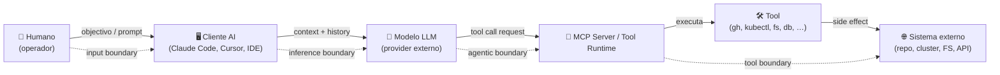

# Metodologias e Ferramentas de Threat Modeling

## 🌟 Objetivo

Fornecer uma visão comparativa e orientada à decisão sobre as principais **metodologias e ferramentas** de Threat Modeling, ajudando equipas a:

- Selecionar o modelo adequado com base no tipo de sistema e criticidade;
- Avaliar ferramentas disponíveis por maturidade e contexto;
- Estruturar e versionar os artefactos de Threat Modeling de forma reutilizável.

---

## 🧠 Modelos existentes e quando aplicar

### ✅ Comparação de metodologias

| Modelo          | Foco Principal              | Quando usar                                      | Complexidade | Output típico                          |
| --------------- | --------------------------- | ------------------------------------------------ | ------------ | -------------------------------------- |
| **STRIDE**      | Ameaças técnicas            | Qualquer aplicação exposta ou com lógica crítica | Média        | Lista de ameaças por componente        |
| **LINDDUN**     | Ameaças à privacidade       | Sistemas com dados pessoais, RGPD, consentimento | Média        | Avaliação de privacidade por fluxo     |
| **PASTA**       | Modelação baseada em risco  | Sistemas regulados, críticos, exigência formal   | Alta         | Ameaças mapeadas para risco e controlo |
| **MITRE ATLAS** | Ameaças adversariais a AI/ML | Sistemas com componentes ML/LLM/agentic         | Média        | Mapping tactics/techniques específicas AI |

> 💡 STRIDE é versátil e o mais amplamente usado. LINDDUN complementa com foco em privacidade. PASTA é adequado para equipas maduras ou contextos regulatórios. MITRE ATLAS é mandatório como complemento (não substituto) em sistemas com componentes AI/ML — ver [§AI/ML](#ai-ml).

---

### ♻️ Aplicação recomendada

- **STRIDE**: ideal como base para qualquer aplicação com interface exposta ou lógica sensível.
- **LINDDUN**: aplicar quando há dados pessoais, preocupações de privacidade ou requisitos legais (ex: RGPD).
- **PASTA**: usar em sistemas com requisitos regulatórios (ex: PCI-DSS, NIS2), ou onde se exige rastreio formal entre risco, ameaça e controlo.
- **MITRE ATLAS**: aplicar como complemento (não substituto) quando o sistema integra componentes AI/ML — modelos preditivos, LLMs em interface conversacional, sistemas de retrieval-augmented generation (RAG), agentes autónomos com tool invocation. Introduz tactics/techniques específicas de ataque a AI systems que STRIDE não cobre nativamente.

---

### 🧮 Recomendação por tipo de sistema

| Tipo de sistema                | Modelo recomendado | Justificação técnica                                                               |
| ------------------------------ | ------------------ | ---------------------------------------------------------------------------------- |
| API crítica exposta            | STRIDE             | Foco técnico em spoofing, tampering, DoS; cobertura simples por componente         |
| Serviço com dados pessoais     | STRIDE + LINDDUN   | Cobertura técnica (STRIDE) e avaliação de privacidade (LINDDUN)                    |
| Aplicação regulada (PCI, NIS2) | PASTA (+ STRIDE)   | Exige rastreio formal ameaça → risco → controlo, mas STRIDE ajuda na identificação |
| Plataforma interna (privada)   | STRIDE ou LINDDUN  | Dependendo da criticidade e tipo de dados tratados                                 |
| Sistema legado em avaliação    | STRIDE             | Abordagem leve, compatível com falta de documentação ou diagramas completos        |

---

## 🛠️ Ferramentas disponíveis

### ✅ Comparação prática

| Ferramenta          | Modelos Suportados | Colaboração | Características chave                          | Recomendado para…                    |
| ------------------- | ------------------ | ----------- | ---------------------------------------------- | ------------------------------------ |
| Microsoft TMT       | STRIDE             | ❌           | Modelo fixo, integração com diagramas Visio    | Arquitectos, equipas Microsoft       |
| OWASP Threat Dragon | STRIDE             | ✅           | Open source, online/offline, exporta diagramas | Equipas DevSecOps, equipas ágeis     |
| IriusRisk           | STRIDE / Custom    | ✅ (premium) | Gestão de risco, API, integração com Jira/Git  | Organizações com budget e GRC formal |
| Draw.io / Miro      | Todos (visuais)    | ✅           | Diagrama livre, plugins, exportação            | Visualização colaborativa            |
| Markdown + Mermaid  | Todos              | ✅           | Versionável, leve, integrável com GitHub       | Equipas técnicas e pipelines CI/CD   |

---

### 🧩 Recomendações por nível de maturidade

| Maturidade da equipa | Abordagem recomendada                           |
| -------------------- | ----------------------------------------------- |
| Baixa / início       | STRIDE com Threat Dragon ou diagramas simples   |
| Média / DevSecOps    | STRIDE com templates, Mermaid, ou Draw.io       |
| Alta / regulatória   | PASTA ou STRIDE + IriusRisk, com integração GRC |

---

## 📁 Organização de artefactos e templates

Sugestão de estrutura para manter os modelos reutilizáveis e versionados:

```
📁 threat-model/
├── README.md            # Resumo do modelo, âmbito e metodologia usada
├── dfd-diagram.drawio   # Diagrama de fluxo de dados
├── threats.csv          # Matriz de ameaças por componente (STRIDE)
├── mitigations.md       # Mitigações propostas e estado (em progresso, validado, etc.)
└── decisions.md         # Decisões tomadas e justificações (aceitação de risco, exceções)
```

Sempre que possível, os requisitos derivados das ameaças devem ser rastreáveis ao catálogo definido no Capítulo 2 - Requisitos de Segurança.

---

## 🤖 Threat modeling para sistemas AI/ML {#ai-ml}

Sistemas que incorporam componentes de inteligência artificial — modelos preditivos, LLMs em interface conversacional, sistemas de retrieval-augmented generation (RAG), agentes autónomos com tool invocation — introduzem **superfícies de ataque qualitativamente distintas** das aplicações tradicionais. As ameaças adversariais a estes componentes não se reduzem ao STRIDE clássico: alvos como training data, model weights e prompt context, e mecanismos como adversarial examples, prompt injection (directa e indirecta) ou data poisoning, exigem framing dedicado.

### Catálogos de referência

| Catálogo | Foco | Quando consultar |
|---|---|---|
| **MITRE ATLAS** (Adversarial Threat Landscape for AI Systems) | Tactics/techniques específicas de ataque a AI systems, em formato análogo a MITRE ATT&CK | Identificação inicial e cobertura sistemática de ameaças adversariais |
| **NIST AI 100-2 e2025** — Adversarial Machine Learning Taxonomy | Taxonomia formal: model poisoning, evasion, availability, integrity, privacy attacks por capacidade do atacante | Classificação rigorosa de attack vectors; mapping para risk register |
| **NIST AI RMF 1.0** | Risk Management Framework para AI: GOVERN / MAP / MEASURE / MANAGE | Estruturação de risco AI ao nível organizacional |
| **OWASP LLM Top 10 (2025)** | Top-10 vulnerabilidades em aplicações LLM (prompt injection, sensitive information disclosure, supply chain, etc.) | Triagem rápida em aplicações com LLMs |
| **OWASP ML Top 10 (2023)** | Top-10 vulnerabilidades em aplicações ML (input manipulation, model theft, model poisoning, etc.) | Triagem rápida em aplicações com modelos preditivos |
| **OWASP MCP Top 10 (2025)** | Top-10 vulnerabilidades específicas a *MCP servers* (Model Context Protocol) — prompt injection em contexto MCP, tool poisoning, excessive permissions, autenticação/autorização inadequadas, transporte inseguro, validação de input, output handling, monitorização insuficiente, defaults inseguros | Triagem rápida quando se **expõe** ou **opera** um MCP server (distinto de consumir um — ver [mini-site MCP §troubleshooting](/sbd-toe/assets/mcp/troubleshooting-faq) para a distinção) |

### Adversarial threats catalog primer (MITRE ATLAS)

MITRE ATLAS organiza ameaças adversariais a AI systems em **tactics** (objectivos do atacante: Reconnaissance, Resource Development, Initial Access, AI Model Access, Execution, Persistence, Privilege Escalation, Defense Evasion, Credential Access, Discovery, Collection, AI Attack Staging, Command & Control, Exfiltration, Impact) e **techniques** (procedimentos concretos para cumprir cada tactic). Exemplos relevantes para threat modeling de aplicações:

- **Prompt Injection** (`AML.T0051.001` Indirect / `AML.T0093` via Public-Facing App) — adversário injecta prompts via canais de dados ingeridos pelo LLM (websites, databases, ficheiros) para manipular comportamento do modelo
- **AI Model Manipulation** (`AML.T0018` Manipulate AI Model / `AML.T0018.000` Poison AI Model) — modificação directa de pesos ou arquitectura do modelo
- **Training Data Poisoning** (`AML.T0019` Publish Poisoned Datasets / `AML.T0020` Poison Training Data) — corromper dados de treino para induzir comportamento malicioso ou degradar precisão
- **AI Supply Chain Compromise** (`AML.T0109` AI Supply Chain Rug Pull / `AML.T0110` AI Agent Tool Poisoning) — distribuir artefactos AI maliciosos via canais legítimos (model registries, MCP tools)
- **Exfiltration via AI Agent Tool Invocation** (`AML.T0086`) — usar capacidades de write do agente AI para exfiltrar dados

Os IDs ATLAS (`AML.*`) referenciados acima são identificadores canónicos navegáveis para análise técnica; cada um corresponde a um item rastreável no [Capítulo 25 — Rastreabilidade](../canon/25-rastreabilidade) deste capítulo.

### Boas práticas para threat modeling AI/ML

- **Aplicar STRIDE ou LINDDUN como baseline**; adicionar análise ATLAS-driven para componentes AI/ML específicos — não substituir, complementar.
- **Identificar trust boundaries adicionais**: training data → modelo (training-time boundary), prompt input → modelo (inference-time boundary), modelo → tool invocations (agentic boundary), modelo → output rendering (output boundary).
- **Mapear adversary capabilities** via NIST AI 100-2 (model access: black-box / grey-box / white-box; query access; training data control) antes de seleccionar mitigações.
- **Documentar dependências AI específicas** no SBOM (modelo base, datasets, MCP tools, embedded prompts) — ver [Cap. 5 — Dependências e SBOM](../../05-dependencias-sbom-sca/intro) para framing supply chain AI.

> A extensão MITRE ATLAS não substitui a análise STRIDE — alguns adversários combinam técnicas AI-specific com ataques clássicos (e.g., exfiltração tradicional via prompt injection-induced behavior). O threat model deve cobrir ambas as superfícies coerentemente.

### Playbook concreto para agentes com tool-use {#playbook-agentic}

A subsecção anterior cobre threat modeling de **componentes AI/ML em geral**. Quando o sistema em análise inclui **agentes autónomos** — ou seja, modelos que invocam *tools* reais (criar PRs, ler segredos, deploy, escrever em sistemas externos, contactar APIs) — adiciona-se um passo dedicado, porque o que define a superfície de ataque deixa de ser apenas o modelo e passa a incluir **o conjunto fechado de *tools* que o agente pode invocar e as fronteiras entre o agente e os recursos externos**.

#### DFD canónico para um flow agentic

Em qualquer arquitectura com agente + tool-use, identifica-se pelo menos cinco participantes distintos e quatro fronteiras de confiança. O modelo abaixo é deliberadamente minimalista — adiciona-se detalhe consoante o caso, sem nunca remover destas peças.



| Fronteira | Adversários típicos | O que controlar nesta fronteira |
|---|---|---|
| **Input** (humano → cliente) | Operador legítimo enganado por terceiro; prompt injection via canais de chat ou ficheiros abertos no IDE | Validação de intent; consciência operacional ("o agente vai fazer X — confirmas?") |
| **Inference** (cliente → modelo) | Provider comprometido; sequestro do canal; *side-channels* de prompt | TLS, atestação, separação canónica `system`/`user`/`assistant`, redação de PII |
| **Agentic** (modelo → tool runtime) | Tool poisoning; *function call* manipulada; *meta prompt extraction* | Validação de schema das *tool calls*, allowlist de *tools*, scoping; rate-limits |
| **Tool** (runtime → sistema externo) | Credentials abusivos; *agent excessive agency*; exfiltração via tool destrutivo | Workload identity efémera (OIDC), least privilege por *tool*, audit completo por invocação |

> A "agentic boundary" já estava marcada na cobertura de Cap. 04 (ARC-014). Aqui especializamo-la com a separação **modelo → tool runtime → sistema externo**, que é onde o efeito concreto se materializa.

#### Threat library agentic — IDs reais

Trabalhamos com IDs MITRE ATLAS (`AML.*`) e OWASP LLM Top 10 2025 (`LLM*-2025`); não inventamos códigos paralelos. As ameaças abaixo são as que costumamos encontrar em flows com agentes + tool-use; cada uma vem com fronteira-alvo e mitigações que apontam para capítulos do manual.

| Threat | ID canónico | Fronteira-alvo | Mitigações primárias (cross-chapter) |
|---|---|---|---|
| Indirect prompt injection via repo content / RAG | `AML.T0051.001` · LLM01-2025 | Input · Inference | Cap. 04 — *boundary controls for prompt injection*; tratar conteúdo retrieval como user-untrusted |
| Tool poisoning (servidor MCP malicioso ou comprometido) | `AML.T0110` | Agentic | Cap. 04 — validação de MCP servers como dependência; Cap. 05 — supply chain de *tools* |
| AI agent excessive agency | LLM06-2025 | Agentic · Tool | Cap. 02 — [`REQ-AGN-002`](/sbd-toe/sbd-manual/requisitos-seguranca/addon/governanca-automatismos#req-agn) (nível classificado); Cap. 04 — [`ARC-015`](/sbd-toe/sbd-manual/arquitetura-segura/addon/catalogo-requisitos-arquitetura#arc-015) (least privilege per-tool) |
| Exfiltration via AI agent tool invocation | `AML.T0086` | Tool | Cap. 04 — [`ARC-015`](/sbd-toe/sbd-manual/arquitetura-segura/addon/catalogo-requisitos-arquitetura#arc-015) (audit completo por tool call); Cap. 12 — telemetria agentic |
| Data destruction via AI agent | `AML.T0101` | Tool | Cap. 02 — [`REQ-AGN-003`](/sbd-toe/sbd-manual/requisitos-seguranca/addon/governanca-automatismos#req-agn) (kill-switch) e [`REQ-AGN-004`](/sbd-toe/sbd-manual/requisitos-seguranca/addon/governanca-automatismos#req-agn) (intent declaration); Cap. 04 — aprovação out-of-band em A2+ |
| LLM meta-prompt extraction | `AML.T0061` · LLM07-2025 | Inference | Cap. 04 — output filtering anti-exfiltração de system prompt; assumir system prompt como público |
| LLM jailbreak (multi-turn social) | `AML.T0054` | Inference | Cap. 10 — eval suites de regressão; red-team contínuo |
| AI supply chain "rug pull" (modelo/tool muda silenciosamente) | `AML.T0109` | Agentic · (Tool) | Cap. 05 — provider pinning + AI BOM; Cap. 12 — drift detection |

> 💡 Quando o agente é parte do produto que enviamos para o cliente (e não apenas operador interno), aplicam-se adicionalmente os requisitos do AI Act — ver [cross-check AI Act](/sbd-toe/cross-check-normativo/ai-act/intro) e a [convergência com o CRA](/sbd-toe/cross-check-normativo/ai-act/convergencia-cra).

#### Passos do exercício de threat modeling agentic

1. **Inventário do agente**: qual o cliente AI, qual o modelo, qual o nível A0–A4 declarado no *mandate* (`REQ-AGN-001/002`), que *tools* estão na allowlist.
2. **Desenhar o DFD agentic**: marcar os cinco participantes e as quatro fronteiras; identificar onde está cada *tool* e o sistema externo associado.
3. **Marcar acções destrutivas**: que *tool calls* podem apagar, escrever externo, rotacionar segredos, *deploy*. Estas são as que pedem [`REQ-AGN-004`](/sbd-toe/sbd-manual/requisitos-seguranca/addon/governanca-automatismos#req-agn) (intent declaration) e aprovação out-of-band.
4. **Aplicar threat library**: para cada fronteira, percorrer a tabela acima; eliminar as não aplicáveis com justificação curta.
5. **Mapear para controlos**: cada *threat* não eliminada gera uma entrada de controlo a aterrar em Cap. 04 (arquitetura), Cap. 07 (CI/CD), Cap. 10 (testes) ou Cap. 12 (monitorização).
6. **Acoplar ao registo organizacional**: cruzar com o *mandate* do agente (Policy 38) — se uma mitigação não estiver implementada, o agente não opera nesse nível até estar.

> 🧭 Repetimos o exercício sempre que o nível A muda, sempre que uma *tool* é adicionada à allowlist, e sempre que o provider de modelo muda de versão maior (ver `REQ-DEP-AI-002` quando v1.7.0 entrar em vigor).

---

## ✅ Boas práticas

- Escolher o modelo de análise com base na sensibilidade do sistema;
- Usar diagramas e artefactos versionáveis, legíveis e acessíveis à equipa;
- Garantir rastreabilidade entre ameaças, requisitos e controlos aplicados;
- Repetir o exercício em pontos de mudança: nova arquitetura, novas features ou incidentes.

---

## 📎 Referências cruzadas

| Documento                    | Relação com este ficheiro                         |
|------------------------------|---------------------------------------------------|
| `01-metodologia-base.md`     | Abordagem geral e objetivos do threat modeling    |
| `03-diagramas-ameacas.md`    | Apoio à criação de DFDs e representação visual    |
| `07-validacao-ameacas.md`    | Validação e cobertura dos modelos utilizados      |

---

## 🔗 Recursos úteis

- [OWASP Threat Modeling Cheat Sheet](https://cheatsheetseries.owasp.org/cheatsheets/Threat_Modeling_Cheat_Sheet.html)
- [OWASP Threat Dragon](https://owasp.org/www-project-threat-dragon/)
- [Microsoft Threat Modeling Tool](https://learn.microsoft.com/en-us/azure/security/develop/threat-modeling-tool)
- [IriusRisk](https://www.iriusrisk.com/)
- [STRIDE Method - Microsoft SDL](https://learn.microsoft.com/en-us/security/engineering/stride-overview)
