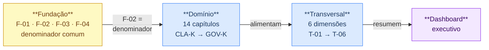
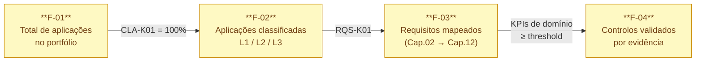

<!--template: sbdtoe-addon -->

# Arquitectura KPI - Visão Geral

Para definições, thresholds e catálogo completo de indicadores, ver [`kpis-governanca`](./kpis-governanca).

---

## D1 - Cascata de camadas

---

## D2 - Mapeamento capítulo → dimensão transversal

| Capítulo | T-01 Cobertura | T-02 Excepções | T-03 Velocidade | T-04 Ownership | T-05 Cadeia | T-06 Maturidade |
|----------|:--------------:|:--------------:|:---------------:|:--------------:|:-----------:|:---------------:|
| Cap.01 · CLA-K | ✔ | - | - | - | - | ✔ |
| Cap.02 · RQS-K | ✔ | - | - | - | - | ✔ |
| Cap.03 · THR-K | ✔ | - | - | - | - | ✔ |
| Cap.04 · ARC-K | ✔ | - | - | ✔ | - | ✔ |
| Cap.05 · DEP-K | ✔ | - | ✔ | - | ✔ | - |
| Cap.06 · DEV-K | ✔ | ✔ | ✔ | - | - | - |
| Cap.07 · CIC-K | ✔ | ✔ | ✔ | - | - | - |
| Cap.08 · IAC-K | ✔ | ✔ | - | - | - | - |
| Cap.09 · CNT-K | ✔ | - | ✔ | - | ✔ | - |
| Cap.10 · TST-K | ✔ | - | ✔ | - | - | - |
| Cap.11 · DPL-K | ✔ | ✔ | - | - | - | - |
| Cap.12 · OPS-K | - | - | ✔ | - | - | - |
| Cap.13 · TRN-K | - | - | - | ✔ | - | - |
| Cap.14 · GOV-K | - | ✔ | - | ✔ | ✔ | - |
| **Contribuintes** | **12** | **5** | **7** | **3** | **3** | **4** |

**Leitura:** T-01 (Cobertura) é a dimensão mais transversal - presente em 12 dos 14 capítulos. T-04 (Ownership) e T-05 (Cadeia de fornecimento) têm cobertura concentrada, o que é esperado: apenas os capítulos com responsabilidade directa sobre supply chain e ownership contribuem.

---

## D3 - Funil de adoptabilidade

| Gap observado | Diagnóstico | Acção prioritária |
|---------------|-------------|-------------------|
| F-01 desconhecido | Inventário incompleto - todo o programa de medição é inválido | Completar inventário antes de qualquer outra métrica |
| F-02 ≪ F-01 | Classificação em atraso | Activar CLA-K01; sem classificação não há denominador válido |
| F-03 ≪ F-02 | Requisitos não mapeados - controlos sem base formal | Activar RQS-K01 |
| F-04 ≪ F-03 | Controlos declarados mas não validados | Activar processo de evidência |
| F-04 ≈ F-03 | Programa maduro | Focar em T-03, T-02 e T-06 |
