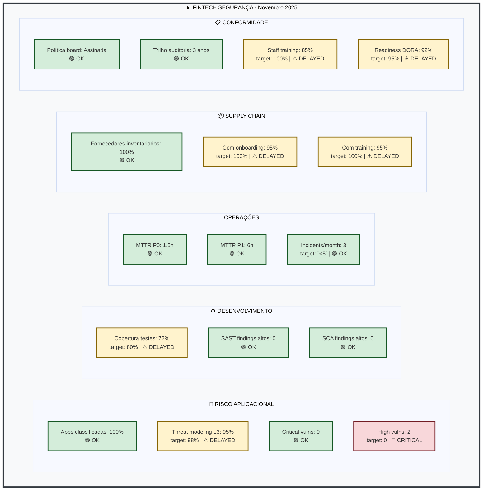
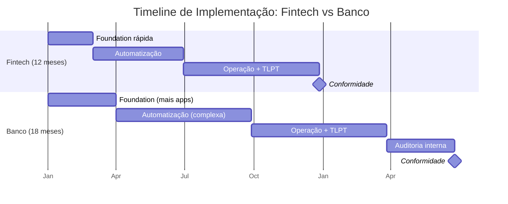
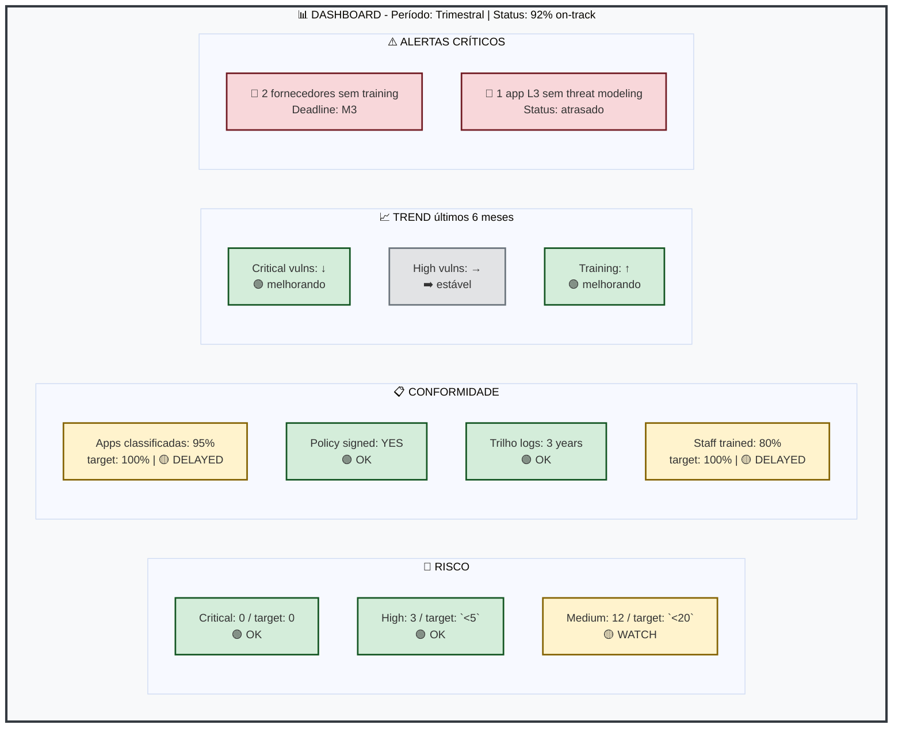

# Example: KPIs and Targets

## Context {#enquadramento}

SbD-ToE prescribes ([Ch. 12](/sbd-toe/sbd-manual/monitorizacao-operacoes/intro)):
- ✓ Security metrics
- ✓ Continuous monitoring
- ✓ Data-driven improvement

SbD-ToE **does NOT prescribe** specific targets because contexts vary. This document presents **examples for different types of organisation**.

---

## KPI Dimensions (All Organisations) {#dimensões-de-kpis-todas-as-organizações}

The manual defines these dimensions ([Ch. 12](/sbd-toe/sbd-manual/monitorizacao-operacoes/intro)):

1. **Application Risk** - Threat coverage
2. **Development** - Code quality
3. **Operations** - Response time
4. **Supply Chain** - Supplier management
5. **Compliance** - Audit evidence

For each dimension, example targets are presented.

---

## Scenario 1: Payments Fintech (Startup, `<`50 devs) {#cenário-1-fintech-de-pagamentos-startup-50-devs}

### Context {#contexto}
- Critical service: Payment processing
- DORA deadline: January 2025 (short)
- Budget: Limited
- Risk appetite: Low (payments = PCI-DSS + DORA)

### KPIs and Targets {#kpis-e-targets}

| Category | Metric | Target | Period | Rationale |
|-----------|---------|--------|---------|---------------|
| **Application Risk** | % apps classified | 100% | M1 | Urgent: DORA requires classification |
| | Threat modelling (L3) | 100% | M3 | Before TLPT |
| | Unremediated critical vulns | 0 | Permanent | Payments: zero tolerance |
| | Unremediated high vulns | 0 (or `<`48h SLA) | Permanent | Direct PCI impact |
| **Development** | Test coverage | ≥80% | M6 | Progressive: start with critical functions |
| | High SAST findings | 0 | Permanent | CI/CD gate |
| | High SCA findings | 0 | Permanent | CI/CD gate |
| **Operations** | MTTR P0 (Critical) | `<`2h | Permanent | Payments: direct impact |
| | MTTR P1 (High) | `<`8h | Permanent | Business impact |
| | Incidents detected/month | `<`5 | M12 | Reduce with maturity |
| **Supply Chain** | Suppliers in the inventory | 100% | M2 | Required by DORA Art. 26 |
| | % with complete onboarding | 100% | M3 | Before access |
| | % with security training | 100% | M3 | Mandatory before access |
| **Compliance** | Policy signed by the board | ✓ | M1 | DORA Art. 5 |
| | Audit trail (logs) | 3 years | M0 | Prior requirement |
| | Staff SbD training | 100% devs | M4 | Rapid ramp-up |
| | Inspection readiness | 95% | M12 | Before the supervisor's inspection |

### Dashboard (Visual example) {#dashboard-exemplo-visual}

---

## Scenario 2: Traditional Bank (Regional, `>`200 devs) {#cenário-2-banco-tradicional-regional-200-devs}

### Context {#contexto-1}
- Critical apps: `>`30 (multiple business lines)
- DORA deadline: January 2025
- Budget: Adequate
- Risk appetite: Very low (historical compliance)
- Additional compliance: GDPR, NIS2, local regulation

### KPIs and Targets {#kpis-e-targets-1}

| Category | Metric | Target | Period | Rationale |
|-----------|---------|--------|---------|---------------|
| **Application Risk** | % apps classified | 100% | M1 | Mandatory under DORA |
| | Threat modelling (L3) | 100% | M4 | More apps = time |
| | Threat modelling (L2) | 80% | M6 | Progressive |
| | Unremediated critical vulns | 0 | Permanent | DORA + GDPR |
| | High vulns (remediation SLA) | `<`30 days | Permanent | As per [Ch. 05](/sbd-toe/sbd-manual/dependencias-sbom-sca/intro) |
| | Medium vulns (remediation SLA) | `<`90 days | Permanent | As per [Ch. 05](/sbd-toe/sbd-manual/dependencias-sbom-sca/intro) |
| **Development** | Test coverage | ≥85% | M12 | More rigorous: bank |
| | High SAST findings | 0 | Permanent | Zero tolerance |
| | High SCA findings | 0 | Permanent | Zero tolerance |
| | Code review rate | 100% | Permanent | Segregation of duties |
| **Operations** | MTTR P0 (Critical) | `<`1h | Permanent | Systemic impact |
| | MTTR P1 (High) | `<`4h | Permanent | Operational impact |
| | Core app availability | ≥99.95% | Permanent | Regulatory SLA |
| | P0 incidents resolved `<`24h | 100% | Permanent | Mandatory DORA reporting |
| **Supply Chain** | Suppliers in the inventory | 100% | M1 | DORA Art. 26 |
| | % audited (risk assessment) | 100% | M3 | Required by DORA |
| | % with an updated contract | 100% | M6 | Technical clauses |
| | % with access revoked `<`24h | 100% | Permanent | Rigorous offboarding |
| **Compliance** | Board policy + GDPR officer | ✓ | M0 | Prior requirement |
| | Audit trail (logs) | 5 years | M0 | GDPR + DORA |
| | Staff SbD training | 100% devs | M6 | Larger volume |
| | Staff GRC training | 100% architecture | M3 | Understand the regulations |
| | TLPT (L3 apps) | 100% | M12 | DORA Art. 19 |
| | TLPT attestation | ✓ | M13 | Board evidence |
| | Supervisory inspection readiness | 100% | M18 | Full preparation |

### New: A Different Timeline {#novidade-timeline-diferente}

**Key differences:**
- **Fintech:** 12 months, fast foundation (M0-M2), focus on speed
- **Bank:** 18 months, longer foundation (M0-M3), more apps and complexity

---

## Scenario 3: Digital Insurer (SME, 20-50 devs) {#cenário-3-segurador-digital-pme-20-50-devs}

### Context {#contexto-2}
- Apps: Critical subsystems (10-15 L3)
- DORA deadline: January 2025
- Budget: Moderate
- Risk appetite: Low (insurance = sensitive data + GDPR)
- Additional compliance: GDPR, local insurance regulation

### KPIs and Targets {#kpis-e-targets-2}

| Category | Metric | Target | Period | Rationale |
|-----------|---------|--------|---------|---------------|
| **Application Risk** | % apps classified | 100% | M1 | Mandatory under DORA |
| | Threat modelling (L3) | 100% | M3 | Fewer apps = fast |
| | Unremediated critical vulns | 0 | Permanent | GDPR + data |
| | High vulns (SLA) | `<`15 days | Permanent | Sensitive data |
| **Development** | Test coverage | ≥75% | M6 | Pragmatic for an SME |
| | High SAST findings | 0 | Permanent | CI/CD gate |
| | High SCA findings | 0 | Permanent | CI/CD gate |
| **Operations** | MTTR P0 | `<`4h | Permanent | Insurance: operational impact |
| | MTTR P1 | `<`24h | Permanent | Less critical than a bank |
| | Availability | ≥99.5% | Permanent | Commercial SLA |
| **Supply Chain** | Suppliers in the inventory | 100% | M2 | Required by DORA |
| | % with onboarding | 100% | M3 | Before access |
| | % with training | 100% | M3 | Mandatory |
| **Compliance** | Board policy | ✓ | M1 | DORA Art. 5 |
| | Audit trail | 3 years (GDPR) | M0 | |
| | Staff training | 100% | M4 | SME: everyone is aware |
| | TLPT readiness | Critical L3 pilot | M10 | Fewer apps = feasible |
| | Inspection readiness | 90% | M12 | Before the DORA deadline |

---

## Scenario 4: Outsourcing/Financial Services Company {#cenário-4-empresa-de-outsourcingserviços-financeiros}

### Context {#contexto-3}
- Apps: Multiple SaaS/On-prem solutions
- Clients: Different risk profiles
- DORA deadline: Depends on the client
- Budget: Variable (per client)
- Challenge: Different maturity levels per client

### Approach: Targets per Tier {#approach-targets-por-tier}

| Tier | Client | RTO | High Vulns SLA | TLPT | Training |
|------|---------|-----|-----------------|------|----------|
| **Essential** | Small bank | `<`4h | `<`30d | Yes | 100% |
| **Standard** | Financial SME | `<`8h | `<`45d | Yes | 80% |
| **Basic** | Fintech startup | `<`24h | `<`60d | Pilot | 60% |

### Client Management {#gestão-de-clientes}

**👤 Each client has:**
- App classification (L1-L3)
- Its own policy (signed)
- Customised SLA
- Specific DORA timeline
- KPIs tracked on a dashboard
- Quarterly report

**📊 Internal consolidation:**
- Aggregate KPI: % compliant clients
- Aggregate risk: Clients at risk
- Training: Coverage per region/client
- Alerts: Clients that will miss the deadline

---

## Components of Any Dashboard {#componentes-de-qualquer-dashboard}

Regardless of the scenario, the dashboard must have:

### 📊 Unified Dashboard {#-dashboard-unificado}

---

## Review Cadence {#cadência-de-revisão}

### Monthly (Quick-check) {#mensal-quick-check}
- Critical/High vulns
- Open incidents
- Suppliers without onboarding

### Quarterly (Formal Review) {#trimestral-formal-review}
- KPIs against targets
- Trends over the last 3 months
- Target adjustments if needed
- Board reporting

### Annual (Strategic) {#anual-strategic}
- Review of targets in line with DORA's evolution
- Lessons learned vs. targets
- Projection for the next year

---

## Target-Setting Process (To Do) {#processo-de-definição-de-targets-por-fazer}

1. **Baseline:** Audit the current state
2. **Benchmarking:** Compare with the industry (caution: contexts vary)
3. **Risk Assessment:** Define the risk appetite
4. **Proposal:** Present to management
5. **Approval:** Board sign-off
6. **Communication:** Publish targets, communicate the timeline
7. **Monitoring:** Track progress
8. **Review:** Quarterly + annual

---

## Important {#importante}

**There are no "right targets"** - each organisation must:

- Start conservatively (better to exceed than to fail)
- Iterate according to capacity
- Align with DORA requirements
- Communicate trade-offs
- Document decisions

Targets serve a **practical purpose**, not a theoretical one - they exist to guide action, not to look good in an audit.

---

**Version:** 1.0  
**Date:** November 2025  
**Review:** Quarterly in line with DORA's evolution
