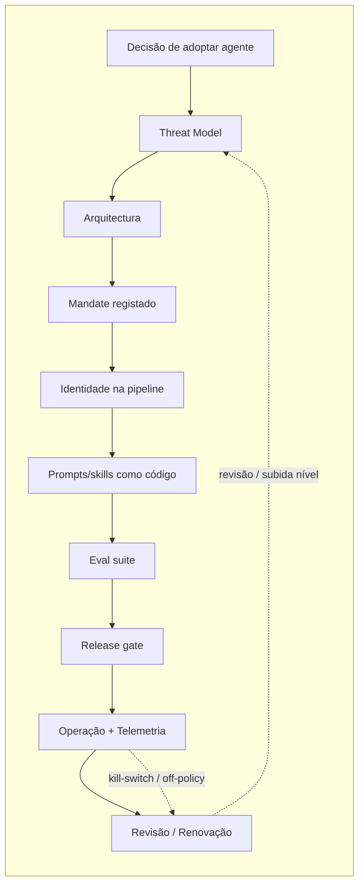

# Example: End-to-end Agentic SDLC

## Context {#enquadramento}

When the system includes **AI agents** with *tool-use* — models that perform real actions (creating PRs, applying Kubernetes manifests, calling external APIs) — the secure development process gains **its own stops** in each phase of the SDLC. SbD-ToE distributed those stops across the existing chapters (it did not create a new chapter), but the **end-to-end process view** lives here, in this example.

The content is cross-cutting by design: it serves **AI Act Art. 9/14/15/26/53/55**, **NIS2 Art. 21** (supply chain + operational risk oversight), **DORA Art. 28–30** (ICT third-party risk + the agent as a non-human *principal*) and **CRA Annex I** (cybersec by design + vulnerability handling for AI components).

SbD-ToE **prescribes the stops and their substance**; this example shows **how to chain them** in a realistic operational case — the assumed *baseline* case is a team adopting a PR audit agent (level A2) connected to the pipeline.

---

## Overview of the flow {#visão-geral-do-fluxo}

Each stop in the flow has **normative substance** in a SbD-ToE chapter and — where applicable — operationalisation in a policy. The following table is the direct translation of the flow into locations in the manual.

---

## Stops in the agentic process {#paragens-do-processo-agentic}

### Stop 1 — Adoption decision and classification of the autonomy level {#paragem-1--decisão-de-adopção-e-classificação-do-nível-de-autonomia}

| Item | Location in SbD-ToE | What is done |
|---|---|---|
| **A0–A4 model** | [Ch. 02 §A0–A4](/sbd-toe/sbd-manual/requisitos-seguranca/addon/governanca-automatismos#niveis-autonomia) | Classify the autonomy level per agent × context (project / environment / task). Rule of thumb: start at the lowest level compatible with the real work |
| **`REQ-AGN-*` requirements** | [Ch. 02 §REQ-AGN](/sbd-toe/sbd-manual/requisitos-seguranca/addon/governanca-automatismos#req-agn) | `REQ-AGN-001` mandate · `REQ-AGN-002` classified level · `REQ-AGN-003` kill-switch exercised · `REQ-AGN-004` intent declaration |
| **Operationalisation user story** | [Ch. 02 US-15](/sbd-toe/sbd-manual/requisitos-seguranca/aplicacao-lifecycle#us-15) | Classify and register the agent's *mandate* |

> 📌 Without a declared A0–A4 classification and a registered *mandate*, the agent does not operate beyond A0 (consultation with no real effect).

---

### Stop 2 — Threat modelling for the agent {#paragem-2--threat-modeling-para-o-agente}

| Item | Location in SbD-ToE | What is done |
|---|---|---|
| **Agentic playbook** | [Ch. 03 §playbook-agentic](/sbd-toe/sbd-manual/threat-modeling/addon/metodologias-e-ferramentas#playbook-agentic) | Canonical DFD (human → client → model → *tool runtime* → external system); threat library with real MITRE ATLAS + OWASP LLM Top 10 IDs |
| **User story** | [Ch. 03 US-11](/sbd-toe/sbd-manual/threat-modeling/aplicacao-lifecycle#us-11) | Run the playbook before activation and at each level increase |
| **RAG-specific** (if applicable) | [Ch. 04 §rag-patterns](/sbd-toe/sbd-manual/arquitetura-segura/recomendacoes-avancadas#rag-patterns) | RAG threats: indirect prompt injection via a document, embedding poisoning, cross-namespace contamination |

> 📌 In RAG systems, the `inference-time` boundary is no longer a single one — retrieved content is *user-untrusted* by design.

---

### Stop 3 — Architecture: the agent as an isolated *principal* {#paragem-3--arquitectura-agente-como-principal-isolado}

| Item | Location in SbD-ToE | What is done |
|---|---|---|
| **`ARC-015`** | [Ch. 04 §ARC-015](/sbd-toe/sbd-manual/arquitetura-segura/addon/catalogo-requisitos-arquitetura#arc-015) | Agent as an isolated non-human *principal*; ephemeral *workload identity*; minimum *scope* per *tool* |
| **`agentes-principals` patterns** | [Ch. 04 §agentes-principals](/sbd-toe/sbd-manual/arquitetura-segura/recomendacoes-avancadas#agentes-principals) | Intent declaration; *out-of-band* human approval; architectural kill-switch; audit per *tool invocation* |
| **User story** | [Ch. 04 US-16](/sbd-toe/sbd-manual/arquitetura-segura/aplicacao-lifecycle#us-16) | Architecture review for A2+ before activation |
| **Self-hosted runtime** (if applicable) | [Ch. 09 — Self-Hosted Inference](/sbd-toe/sbd-manual/containers-imagens/addon/self-hosted-inference) | Weights as a critical asset; GPU isolation; container hardening |

---

### Stop 4 — Mandate registered and versioned {#paragem-4--mandate-registado-e-versionado}

| Item | Location in SbD-ToE | What is done |
|---|---|---|
| **Policy 38 — Mandates** | [Policy 38](/sbd-toe/assets/policies/policy-mandates-agentes) | Minimum content of the mandate (16 fields); lifecycle proposal → approval → activation → review → revocation |
| **Policy 16 §11** (A2+ operational rules) | [Policy 16 §11](/sbd-toe/assets/policies/policy-uso-ferramentas-apoio) | Rules per level, prohibitions, incident classes |

---

### Stop 5 — Identity and secrets for the agent in the pipeline {#paragem-5--identidade-e-segredos-para-o-agente-na-pipeline}

| Item | Location in SbD-ToE | What is done |
|---|---|---|
| **User story** | [Ch. 07 US-19](/sbd-toe/sbd-manual/cicd-seguro/aplicacao-lifecycle#us-19) | AI agent as a *principal* in the pipeline — OIDC, per-*tool* *scope*, TTL ≤ 1h, complete audit |
| **Policy 18 §9** | [Policy 18 §9](/sbd-toe/assets/policies/policy-gestao-segredos) | Dedicated identity, per-*tool* *scoping*, operational kill-switch |
| **Policy 18 §10** (PII in prompts) | [Policy 18 §10](/sbd-toe/assets/policies/policy-gestao-segredos) | Bridge to the GDPR when the agent sees personal data |

---

### Stop 6 — Prompts and *skill files* as code {#paragem-6--prompts-e-skill-files-como-código}

| Item | Location in SbD-ToE | What is done |
|---|---|---|
| **Prompts-as-code** | [Ch. 06 §prompts-como-codigo](/sbd-toe/sbd-manual/desenvolvimento-seguro/addon/genia-e-seguranca#prompts-como-codigo) | Versioning in VCS, code review, secret scanning, drift detection vs the canonical source |
| **Structured outputs** | [Ch. 06 §structured-outputs](/sbd-toe/sbd-manual/desenvolvimento-seguro/addon/genia-e-seguranca#structured-outputs) | Declared schema, dual syntactic + semantic validation, *fail-closed* with *fallback* |
| **Policy 15** | [Policy 15 §2](/sbd-toe/assets/policies/policy-revisao-codigo) | Scope extended to prompts/skill files; a change to `tools_allowlist` is treated as an IAM change |

---

### Stop 7 — AI BOM + model supply chain {#paragem-7--ai-bom--supply-chain-de-modelos}

| Item | Location in SbD-ToE | What is done |
|---|---|---|
| **`DEP-011..014`** | [Ch. 05 §DEP-011](/sbd-toe/sbd-manual/dependencias-sbom-sca/addon/catalogo-requisitos-dependencias#dep-011) | AI inventory + AI BOM (CycloneDX 1.6 *ml-bom*) + *pinning* + approved *providers* |
| **User story** | [Ch. 05 US-14](/sbd-toe/sbd-manual/dependencias-sbom-sca/aplicacao-lifecycle#us-14) | Generate an AI BOM per *build*; an approved *provider* is mandatory |
| **Policy 39** | [Policy 39](/sbd-toe/assets/policies/policy-ai-bom-supply-chain) | AI BOM lifecycle; response to *upstream* incidents per class (`AML.T0019/T0109/T0110`) |
| **Policy 33 §10** (contracting) | [Policy 33 §10](/sbd-toe/assets/policies/policy-contratacao-segura) | Art. 53/55 clauses declared + GDPR Art. 28 |

---

### Stop 8 — Continuous *eval suite* {#paragem-8--eval-suite-contínua}

| Item | Location in SbD-ToE | What is done |
|---|---|---|
| **Ch. 10 §C5** | [Ch. 10 §C5](/sbd-toe/sbd-manual/testes-seguranca/addon/ia-nos-testes#c5-eval-suites) | Prompt/skill regression, *abuse corpus*, *drift detection*, *A/B testing*, *test telemetry* |
| **Policy 19 §7** | [Policy 19 §7](/sbd-toe/assets/policies/policy-estrategia-testes) | Minimum composition per level A0–A4 |

> 📌 Raising the autonomy level without a tailored *eval suite* is prohibited — Policy 38 §5.4 blocks it.

---

### Stop 9 — Release gates {#paragem-9--release-gates}

| Item | Location in SbD-ToE | What is done |
|---|---|---|
| **User story** | [Ch. 11 US-18](/sbd-toe/sbd-manual/deploy-seguro/aplicacao-lifecycle#us-18) | *Eval suite* as a gate; independent *model rollback*; *canary release* for major version changes; automatic *autonomy demotion* when the *eval* fails |

---

### Stop 10 — Operation: agentic telemetry {#paragem-10--operação-telemetria-agentic}

| Item | Location in SbD-ToE | What is done |
|---|---|---|
| **`OPS-011..014`** | [Ch. 12 §OPS-011](/sbd-toe/sbd-manual/monitorizacao-operacoes/addon/catalogo-requisitos-operacoes) | OPS-011 (AI/ML observability), [OPS-012](/sbd-toe/sbd-manual/monitorizacao-operacoes/addon/catalogo-requisitos-operacoes#ops-012) (audit per *tool invocation*), [OPS-013](/sbd-toe/sbd-manual/monitorizacao-operacoes/addon/catalogo-requisitos-operacoes#ops-013) (*token budget*), [OPS-014](/sbd-toe/sbd-manual/monitorizacao-operacoes/addon/catalogo-requisitos-operacoes#ops-014) (*jailbreak* / *off-policy*) |
| **User story** | [Ch. 12 US-13](/sbd-toe/sbd-manual/monitorizacao-operacoes/aplicacao-lifecycle#us-13) | Agentic telemetry in production; signals feed IR |
| **Policy 30 §9** | [Policy 30 §9](/sbd-toe/assets/policies/policy-monitorizacao-seguranca) | Agentic signal classes; cross-reference with IR |

---

### Stop 11 — Review and renewal {#paragem-11--revisão-e-renovação}

| Item | Location in SbD-ToE | What is done |
|---|---|---|
| **Mandate cycle** | [Policy 38 §5.6](/sbd-toe/assets/policies/policy-mandates-agentes) | Review at the declared `review_cadence` (A2 annual · A3 half-yearly · A4 quarterly); cross-check *intent events*, *off-policy actions*, *kill-switch* exercised |
| **Organisational review** | [Policy 38 §6](/sbd-toe/assets/policies/policy-mandates-agentes) | Review of the **set** of active *mandates* with a cadence per criticality level (L1 annual · L2 half-yearly · L3 quarterly) |
| **Continuous training** | [Policy 37 §11](/sbd-toe/assets/policies/policy-formacao-seguranca) | Active training track according to function and cadence |
| **Composite function** | [Ch. 00 — AI Reliability Engineer](/sbd-toe/sbd-manual/fundamentos/roles-responsabilidades/intro) | Who operates the risk day to day: `appsec` + `devops` + `grc` under the mandate of the `CISO` |

---

## Cross-reference with regulation {#cruzamento-com-regulamento}

The process described serves several regulatory obligations at the same time. Summary mapping:

| Regulation | Article | Process stop |
|---|---|---|
| **AI Act** | Art. 4 (literacy) | Stop 11 (training) |
| **AI Act** | Art. 9 (risk management) | Stops 1, 2 |
| **AI Act** | Art. 10 (data / data governance) | Stop 7 (AI BOM) |
| **AI Act** | Art. 11 + Annex IV (technical documentation) | Stops 4, 7 |
| **AI Act** | Art. 12 + Art. 19 (logging) | Stop 10 |
| **AI Act** | Art. 13 (transparency and provision of information to deployers) | Stop 4 (mandate as a source) |
| **AI Act** | **Art. 14 (human oversight)** ⚡ | Stops 1, 3, 4 (the agentic layer closes a historical gap) |
| **AI Act** | Art. 15 (accuracy, robustness and cybersecurity) | Stops 2, 3, 8, 10 |
| **AI Act** | Art. 17 (QMS) | The whole process (Policy 38 + Policy 39 provide *formal cycles*) |
| **AI Act** | Art. 25 (responsibilities along the AI value chain) | Stop 7 |
| **AI Act** | Art. 26 (deployers) | Stop 4 (deployer mandate) + Stop 10 |
| **AI Act** | Art. 53 / 55 (GPAI) | Stops 7, 8, 10 |
| **AI Act** | Art. 72 (post-market monitoring) | Stop 10 |
| **AI Act** | Art. 73 (serious incidents) | Stops 10, 11 |
| **NIS2** | Art. 21 (cybersecurity risk-management measures) | Stops 1, 2, 3, 10 |
| **NIS2** | Art. 23 (incident notification) | Stop 10 + Policy 30 §9.3 |
| **DORA** | Art. 6 (ICT risk management framework) | Stops 1, 2 |
| **DORA** | Art. 9 (protection and prevention) | Stops 3, 5, 6 |
| **DORA** | Art. 28–30 (ICT third-party risk) | Stop 7 + Ch. 14 US-21 |
| **DORA** | Art. 17 (ICT-related incident management) | Stops 10, 11 |
| **CRA** | Annex I Part I (cybersec by design) | Stops 3, 5, 6, 8 |
| **CRA** | Annex I Part II (vulnerability handling) | Stop 7 (Policy 39 §7) + Stops 10, 11 |
| **CRA** | Annex I, Part II, point (1) (SBOM) | Stop 7 (the AI BOM covers + complements) |
| **GDPR** | Art. 5(1)(c) (data minimisation) | Policy 18 §10.1 |
| **GDPR** | Art. 6 / 9 (legal basis) | Policy 18 §10.2 |
| **GDPR** | Art. 28 (processors) | Stop 7 + Policy 33 §10 |
| **GDPR** | Art. 44–49 (transfers) | Policy 33 §10.2 |

---

## Concrete example: PR audit agent (level A2) {#exemplo-concreto-agente-de-auditoria-de-pr-nível-a2}

Illustrative scenario, based on a realistic operational case — implementable with the MCP SbD-ToE server.

| Step | Action | Where it lands |
|---|---|---|
| 1 | The team decides to adopt `Claude Code` in A2 mode for automatic auditing of PRs in the `payments-service` repo (L2). | Ch. 02 §A0–A4 |
| 2 | `appsec` runs the threat modelling *agentic playbook* and identifies *prompt injection via repo content* as the primary *threat*. | Ch. 03 US-11 |
| 3 | Architecture confirms `ARC-015`: identity `claude-code-pr-auditor@payments-prod` via OIDC; *scopes* `gh:pr:read`, `gh:pr:write:comment` (not `merge`). | Ch. 04 US-16 |
| 4 | *Mandate* approved by `tech lead` + `appsec`: `autonomy_level: A2`, *tools_allowlist*, documented *kill-switch* (OIDC revocation ≤ 15 s). | Policy 38 + Ch. 02 US-15 |
| 5 | The pipeline configures the agent as an OIDC *principal*; `intent_audit_sink` configured to the SIEM. | Ch. 07 US-19 |
| 6 | *Skill file* `.claude/skills/pr-auditor.md` versioned in `audit-tooling/`, code-reviewed, secret scanning active. | Ch. 06 + Policy 15 |
| 7 | The *AI BOM* declares `claude-opus-4-7@sha:...` as a *pinned* dependency; `DEP-014` confirms Anthropic is on the approved list. | Ch. 05 US-14 + Policy 39 |
| 8 | The *eval suite* runs 200 PR cases (good-faith + adversarial) before the *cutover*. | Ch. 10 §C5 |
| 9 | Release through the normal pipeline, with `eval_run_id` archived and `mandate_ref` in the audit *trail*. | Ch. 11 US-18 |
| 10 | Production: `OPS-012` records each *tool invocation* (commenting on the PR); `OPS-013` applies a monthly token *budget*; `OPS-014` detects a *prompt injection* attempt via the PR description. | Ch. 12 US-13 |
| 11 | Annual *mandate* review: *kill-switch* exercised, 3 *off-policy actions* detected (all mitigated); keep A2. | Policy 38 §5.6 |

---

## Cross-cutting anti-patterns {#anti-padrões-transversais}

- ❌ **Raising the level from A1 → A2 without a new approved *mandate*** — violates `REQ-AGN-001`/`REQ-AGN-002` and ignores all of stops 1–4.
- ❌ **`tools_allowlist` widened via a *commit* without review** — equivalent to changing an IAM policy without approval; violates Policy 15 §2 + Policy 38 §5.5.
- ❌ ***Kill-switch* documented but never exercised** — decorative. `REQ-AGN-003` requires a cadence (annual A2 · quarterly A3 · monthly A4).
- ❌ **Human approval **inside** the agent's channel** (e.g. *prompt* "*confirm?*" → the user answers *"yes"* in the same chat) — *prompt injection* makes self-approval trivial. It has to be *out-of-band*.
- ❌ **`latest` model or semver *range*** — violates `DEP-013`; exposes to the *AI Supply Chain Rug Pull* (`AML.T0109`).
- ❌ ***Eval suite* that never fails** — a sign of insufficient coverage, not of excellence. A representative *abuse corpus* is missing.
- ❌ ***Audit per tool invocation*** **without `mandate_ref`** — the ability to audit the *mandate* is lost, and therefore compliance with Art. 26.
- ❌ ***Off-policy action* living only on a dashboard, without landing in IR** — an incident is not a dashboard. `OPS-014` ↔ Ch. 12 US-04.
- ❌ **PII in *prompts* sent to a *provider* outside the approved list** — *shadow AI* with immediate GDPR risk (Policy 18 §10).

---

## How to use this example {#como-usar-este-exemplo}

1. **For a team adopting agents for the first time**: go through stops 1 → 11 before the first operational activation. It is not necessary to implement everything at A1; level A1 covers stops 1–6 + 10 (with no mandatory *eval* or *release gate*).
2. **For internal / external audit**: use the regulation cross-reference table to reconstruct the evidence tree per article.
3. **For post-incident review**: identify at which stop the failure occurred and reinforce it (stops 2, 3, 8, 10 are the most sensitive in operational incidents; stops 4, 7 are the most sensitive in regulatory audits).
4. **For the evolution of the programme**: each significant release of the manual revisits this flow — if a stop gains a new control or a new requirement, this example is the first to be updated.

---

## Cross-references {#referências-cruzadas}

- **MCP mini-site** ([`/sbd-toe/assets/mcp/intro`](/sbd-toe/assets/mcp/intro)) — practical examples of skills/agents that materialise several of these stops
- **AI Act cross-check** ([`/sbd-toe/cross-check-normativo/ai-act/intro`](/sbd-toe/cross-check-normativo/ai-act/intro)) — article-by-article analysis
- — one technical architecture; a single presumption of conformity (CRA, Article 12(1), mirrored in the AI Act, Article 42(3), as worded by Regulation (EU) 2026/1744), limited to the cybersecurity requirements of Article 15 of the AI Act
- **Other playbook examples**: [Toolchain](./exemplo-toolchain-options), [KPIs](./exemplo-kpis-targets), [RACI](./exemplo-raci-governance), [Incident report](./exemplo-relatorio-incidentes)
