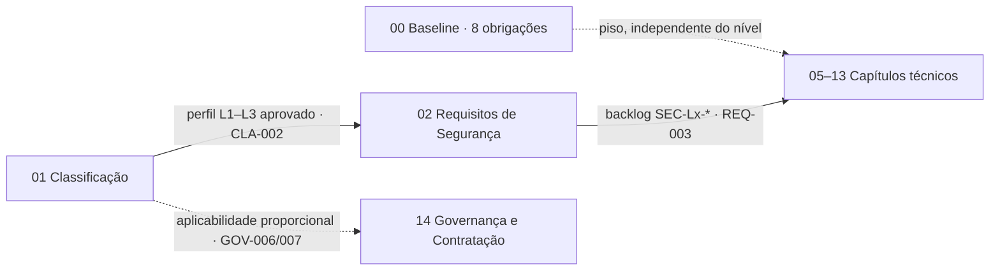
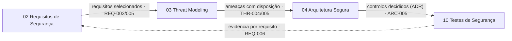
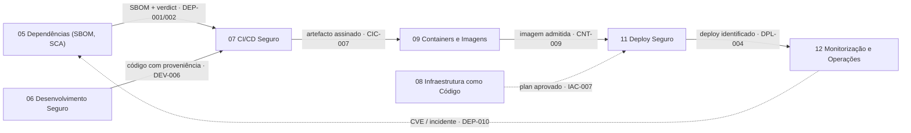
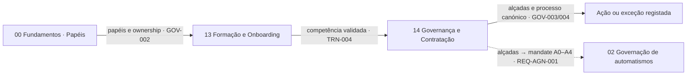
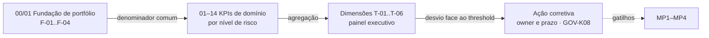

# The Five Macro-processes of Secure Engineering

Chapters 01–14 organise the Manual by **capability areas**. Each one states *what* has to exist and *how* it is done — with a requirements catalogue, *user stories*, exceptions, indicators and L1–L3 proportionality. An organisation can have all of these mechanisms and still not have them connected. The systemic failure that the macro-processes address lies in the **absence of governed linkage** between mechanisms that do exist: the classification is done but does not select the requirements; the *threat model* is approved but the tests do not close over its threats; the SBOM describes a *build* that is not the one in production; the exception is approved by someone without the authority to do so; the indicator measures activity instead of state.

This page describes the other dimension of the Manual: **what has to remain connected** between capabilities so that they operate as a single secure engineering system. Each of these connections is called a **continuity**, and the process that preserves it a **macro-process**. The five macro-processes are orthogonal to the chapters. Each one is a **path** through several chapters — a seam — and no chapter owns a macro-process. The value lies in the transitions: what leaves one chapter has to be exactly what enters the next.

The macro-processes are not lifecycle phases — the SDLC is covered on the **How to Do It** page of each chapter — and they are not new chapters. They are **invariants** in the sense the [Theory of Everything](/sbd-toe/teory-of-everything/intro) already gives them: conditions that cut across the whole SDLC, independent of technology, and whose violation makes the system non-auditable, non-attributable or non-defensible. Together, the five make up the **governed linkage layer** of the SbD-ToE. Beyond "what has to be done here?", the Manual now also answers the question: **"what has to remain connected before, during and after — and how is it known that it still is?"**

This page follows the pattern of the [cross-cutting verification matrix](/sbd-toe/sbd-manual/testes-seguranca/addon/matriz-verificacao-transversal): **it duplicates no prescription**. Every activity cited below lives in its chapter, with the requirement that prescribes it. The page is an index and a process definition; normative language appears only where it repeats an existing, cited prescription.

## The five macro-processes {#os-cinco-macro-processos}

| Label | Macro-process | Chapter traversal | Continuity | Invariant | Question it answers |
|---|---|---|---|---|---|
| MP1 | **Classify → Select** (CLASSIFY → SELECT) | 01 → 02 → 05–13 | Applicability | A recorded security profile selects requirements, gates, review depth, evidence and training. | "What applies here?" |
| MP2 | **Design → Assure** (DESIGN → ASSURE) | 03 → 04 → 10 | Intent | Threats, architecture decisions and tests close over the same declared outcome. | "Does what was designed and implemented satisfy the security intent?" |
| MP3 | **Build → Run** (BUILD → RUN) | 05 → 07 → 09 → 11 → 12 | Provenance / execution | The evidence from dependencies, *pipeline*, artefact, *deployment* and *runtime* describes the same released version. | "Is what is running or acting what was governed, verified and authorised?" |
| MP4 | **Authorise → Act / Except** (AUTHORISE → ACT / EXCEPT) | 00 → 13 → 14 (automation branch: 02) | Authority and agency | Roles, supplier duties, automated systems and exceptions require explicit authority and retained evidence. Capability does not imply authority. | "Who or what may decide or execute this, on whose behalf, within what scope, and when is an exception or an escalation mandatory?" |
| MP5 | **Measure → Improve** (MEASURE → IMPROVE) | 00–14 (all) | Assurance and learning | Every chapter needs an eligible population, an evidence contract, an owner and a measure of resulting state. | "Did the system work, and what has to change?" |

## How to read a macro-process {#como-ler-um-macro-processo}

Each macro-process is documented with the same *template*, in the form the Manual already uses to document processes (precedent: the [canonical exception process](/sbd-toe/sbd-manual/governanca-contratacao/addon/processo-excecoes)). **Purpose and invariant** states the condition to be preserved. **Chapter traversal** lists the transitions, one line per passage, with what leaves one chapter and has to enter the next. **Scope**, **Triggers**, **Inputs**, **Activities** and **Outputs** describe the process; every activity cites the chapter and at least one requirement or *user story* that prescribes it — a step without an anchor does not enter. **Roles** uses only the [13 canonical roles](/sbd-toe/sbd-manual/fundamentos/roles-responsabilidades/intro). **Control points** are the *gates* where the continuity can break, and what closes them. **Expected evidence** reuses evidence already required. **Indicators** reuse KPIs from the **KPIs and Metrics** pages of each chapter, declared with the MP5 measurement structure (eligible population · evidence contract · owner · resulting state), with no new target figures. **Extension to AI/agentic systems** cites only what is already prescribed. **Proportionality L1–L3** states what changes with the level.

## MP1 — Classify → Select {#mp1-classificar-selecionar}

### Purpose and invariant {#finalidade-e-invariante}

A recorded security profile selects requirements, gates, review depth, evidence and training. The risk classification is not a document: it is the act that makes the L1/L2/L3 columns of every catalogue binding. If the level exists but selects nothing, the Manual shrinks to a catalogue of good practices without applicability; if each chapter decides its own level, proportionality ceases to be a system. MP1 preserves the link between the profile and everything that depends on it.

### Chapter traversal {#percurso-de-capítulos}

- **Application Classification → Security Requirements (01 → 02).** What leaves is the E+D+I classification with an L1–L3 level approved by the proportional authority ([`CLA-001`](/sbd-toe/sbd-manual/classificacao-aplicacoes/addon/catalogo-requisitos-classificacao), [`CLA-002`](/sbd-toe/sbd-manual/classificacao-aplicacoes/addon/catalogo-requisitos-classificacao)) and the applied control matrix ([matrix by risk level](/sbd-toe/sbd-manual/classificacao-aplicacoes/addon/matriz-controlos-por-risco)). It enters Security Requirements (02) as the selection of requirements by criticality ([US-01](/sbd-toe/sbd-manual/requisitos-seguranca/aplicacao-lifecycle#us-01---seleção-de-requisitos-por-criticidade), [`REQ-003`](/sbd-toe/sbd-manual/requisitos-seguranca/addon/lista-requisitos-base)), with `SEC-Lx-*` *tags* in the *backlog* ([traceability taxonomy](/sbd-toe/sbd-manual/requisitos-seguranca/addon/taxonomia-rastreabilidade)).
- **Security Requirements → technical chapters (02 → 05–13).** What leaves is the *backlog* with `SEC-Lx-*` and references to Chapter 02 requirements validated in the *pipeline* (Security Requirements, US-04, US-12). It enters each technical chapter as applicability: `CLA-003` establishes that the level determines the set of base controls — CI/CD *gates*, testing requirements, review frequency and monitoring obligations — and the **Requirements Catalogue** of each chapter declares in its L1/L2/L3 columns what is mandatory for that level.
- **Foundation, independent of the level.** The [eight cross-cutting minimum obligations](/sbd-toe/sbd-manual/fundamentos/baseline) apply to every application, regardless of level; selection by level adds, never subtracts.
- **Procurement branch — Governance and Contracting (14).** Suppliers and third parties have their own applicability, proportional to risk: clauses ([`GOV-006`](/sbd-toe/sbd-manual/governanca-contratacao/addon/catalogo-requisitos-governanca)) and pre-*onboarding* validation (`GOV-007`, with SBOM, incident SLA and right of audit at L3).

### Scope {#âmbito}

It applies to the **application** (the unit of `CLA-001` and of the `CLA-008` inventory), to the **supplier** with access to data, code or *pipelines* (`GOV-007`) and to the **AI agent**, classified by autonomy level A0–A4 per agent and per context ([`REQ-AGN-002`](/sbd-toe/sbd-manual/requisitos-seguranca/addon/governanca-automatismos#req-agn)). The **change** is not a unit of applicability in its own right: it enters through the re-assessment triggers.

### Triggers {#gatilhos}

- New application or project start (Application Classification, US-01).
- Significant change — new critical integration, change of exposure, security incident, regulatory change — with re-assessment within a maximum of 30 days (`CLA-006`; criteria documented in `CLA-004`; list of *triggers* in the [risk lifecycle](/sbd-toe/sbd-manual/classificacao-aplicacoes/addon/ciclo-vida-risco)).
- Periodic cycle by level: L1 annual, L2 half-yearly, L3 quarterly (`CLA-005`).
- Relevant change of requirements, which reviews the selection and may trigger new *threat modelling* (Security Requirements, US-02; `REQ-005`).
- Introduction or modification of automation or decision support, including AI, when it alters assumptions about validation, evidence or reproducibility (risk lifecycle, *triggers*); and the matrix's step-up rule: low detectability, low evidentiability, non-deterministic behaviour or high delegation with real-world impact require the controls of the level immediately above, regardless of the level assigned.

### Inputs {#entradas}

- The Exposure, Data Type and Potential Impact axes and the L1–L3 thresholds ([classification model](/sbd-toe/sbd-manual/classificacao-aplicacoes/addon/modelo-classificacao-eixos), Application Classification).
- Central application inventory with level, review, *owner* and status (`CLA-008`, Application Classification).
- Control matrix by risk level (Application Classification).
- Requirements catalogues with L1/L2/L3 columns (chapters 02–14) and the eight *baseline* obligations (Fundamentals).

### Activities {#atividades}

1. **Classify** the application along the three axes and obtain the L1–L3 level — Application Classification, `CLA-001`, US-01.
2. **Approve proportionally** and record in the inventory: L1 by the technical lead, L2 by the AppSec Engineer, L3 by Executive Management / CISO — Application Classification, `CLA-002`, `CLA-008`, US-15.
3. **Apply the control matrix** to the level obtained — Application Classification, `CLA-003`, US-02.
4. **Select requirements** in the *backlog* with `SEC-Lx-*` and record the evidence of the decision — Security Requirements, `REQ-003`, US-01.
5. **Propagate applicability** to the technical chapters: the rows with ✔ in the level's column now require evidence — the [cross-cutting matrix](/sbd-toe/sbd-manual/testes-seguranca/addon/matriz-verificacao-transversal) formulates the *roll-up* rule ("for an L2 system, every row with ✔ in the L2 column has to have evidence") — Application Classification, `CLA-003`; Security Testing, [Cross-cutting Verification Matrix](/sbd-toe/sbd-manual/testes-seguranca/addon/matriz-verificacao-transversal).
6. **Validate in the *pipeline*** the presence and format of the *tags* and the link to the Chapter 02 requirement — Security Requirements, US-12.
7. **Re-assess** by trigger or by cycle, recording the trigger, the previous and new level and the justification — Application Classification, `CLA-004`, `CLA-005`, `CLA-006`, US-03; Security Requirements, US-02.
8. **Extend to suppliers** clauses and validation proportional to risk — Governance and Contracting (14), `GOV-006`, `GOV-007`.

### Outputs {#saídas}

- **Recorded security profile**: approved classification + inventory + requirements selection. Consumed by MP2 (formal *threat modelling* applies at L2+ — `THR-001`), by MP3 (*gates* and verification depth by level), by MP4 (approval authorities by level — `GOV-003`) and by MP5 (the classified inventory is the F-02 denominator of every KPI — see MP5).

### Roles {#papéis}

- **Process owner:** AppSec Engineer — validates the model applied, adjusts the level and applies the matrix (Application Classification, "Who is involved").
- **Participants:** Developer and Scrum Master / Team Lead (propose the classification; L1 approval); Software Architects (review exposure and flows); Product Owner (selects requirements in the *backlog*; approves risk acceptance); Executive Management / CISO (L3 approval); GRC / Compliance (inventory and traceability — Application Classification, US-15); Quality Assurance (QA) (validates compliance by level before *go-live* — Application Classification, US-05).

### Control points {#pontos-de-controlo}

- **Approval of the classification** by the authority proportional to the level (`CLA-002`). Without a recorded approval, there is no profile.
- **Verification of *tags* in the PR** (Security Requirements, US-12): a card without `SEC-Lx-*` and without a link to a Chapter 02 requirement fails.
- **Validation before *go-live*** (Application Classification, US-05): checklist of applicable controls with evidence and no unapproved exception pending.
- **Re-assessment deadline** after a significant change (`CLA-006`, 30 days).
- **Completeness of the denominator**: F-02 has to equal F-01 — every application is classified ([cross-cutting measurement structure](/sbd-toe/sbd-manual/governanca-contratacao/kpis-governanca)).

### Expected evidence {#evidência-esperada}

- Versioned classification document and applied control matrix (Application Classification, US-01: `classificacao-aplicacao.yaml`, `matriz-controlos-aplicada.md`).
- Central inventory with level, review date, *owner*, compliance status and approving authority (`CLA-008`).
- *Backlog* with `SEC-Lx-*` *tags* and exportable reports (Security Requirements, US-04).
- Review record with trigger, previous and new level, justification and person responsible (Application Classification, US-03).

### Indicators {#indicadores}

| Indicator (source) | Eligible population | Evidence contract | Collection owner | Resulting state |
|---|---|---|---|---|
| `CLA-K01` — % of portfolio applications with a formal, documented and accessible risk classification ([Ch. 01](/sbd-toe/sbd-manual/classificacao-aplicacoes/addon/kpis-metricas-classificacao)) | F-01 (total inventory) | Classification documented and accessible | AppSec Engineer (T-01) | Portfolio classified; F-02 = F-01 |
| `CLA-K03` — % of applications with a significant change whose classification was updated within ≤ 30 days (Ch. 01) | F-02, per event | Review record dated after the trigger | AppSec Engineer (T-01) | Profile current with respect to changes |
| `CLA-K04` — % of L2/L3 system classifications validated by AppSec or GRC (Ch. 01) | F-02 (L2/L3) | Validation by an independent second pair of eyes, other than the *owner* | AppSec Engineer (T-01) | Level is not a self-assessment |
| `RQS-K01` — % of applications with security requirements formally mapped to the classified risk level ([Ch. 02](/sbd-toe/sbd-manual/requisitos-seguranca/addon/kpis-metricas-requisitos)) | F-02, per level | Requirements ↔ level mapping available | AppSec Engineer (T-01) | Selection made; establishes F-03 |
| `RQS-K06` — # of requirements mandatory for the level with no implementation and no formal exception (Ch. 02) | Requirements mandatory for the level | Evidenced implementation or recorded exception | AppSec Engineer (T-01) | Zero ungoverned gaps |

### Extension to AI/agentic systems {#extensão-a-sistemas-aiagentic}

Applicability to agents follows the same movement — classify, then select — with an additional context axis: the [autonomy level A0–A4](/sbd-toe/sbd-manual/requisitos-seguranca/addon/governanca-automatismos#niveis-autonomia), assigned per agent and per context (project × environment × task), re-assessed at every change of context (`REQ-AGN-002`).

- The application classification identifies automation and AI tools and reflects them in the E/D/I axes (Application Classification, US-01); the control matrix applies the step-up rule to automation with real-world impact, with or without AI.
- The A0–A4 level selects the applicable `REQ-AGN-001..004` requirements (the table by risk level in [Governance of the Use of Automation](/sbd-toe/sbd-manual/requisitos-seguranca/addon/governanca-automatismos)) and the AI requirements of the technical chapters, all L2+: `DEP-011..014`, `ARC-014`, `THR-008`, `DPL-010`, `OPS-011..014`.
- Training in the safe use of AI and *tooling* is selected by profile and level (Training and Onboarding, US-19).

### Proportionality L1–L3 {#proporcionalidade-l1l3}

At L1, the foundation of the eight obligations and the low-level matrix apply, with approval by the technical lead and annual review. At L2, the classification is validated by the AppSec Engineer (`CLA-K04`), the review of requirements upon change is mandatory (Security Requirements, US-02) and re-assessment is half-yearly. At L3, approval rests with Executive Management / CISO, the cadence is quarterly, and validation before *go-live* is formal and signed (Application Classification, US-05).

### Cross-references {#referências-cruzadas}

[Ch. 01 — Application Classification](/sbd-toe/sbd-manual/classificacao-aplicacoes/intro) · [CLA catalogue](/sbd-toe/sbd-manual/classificacao-aplicacoes/addon/catalogo-requisitos-classificacao) · [axis model](/sbd-toe/sbd-manual/classificacao-aplicacoes/addon/modelo-classificacao-eixos) · [risk lifecycle](/sbd-toe/sbd-manual/classificacao-aplicacoes/addon/ciclo-vida-risco) · [control matrix by risk](/sbd-toe/sbd-manual/classificacao-aplicacoes/addon/matriz-controlos-por-risco) · [Ch. 02 — lifecycle](/sbd-toe/sbd-manual/requisitos-seguranca/aplicacao-lifecycle) · [base requirements list](/sbd-toe/sbd-manual/requisitos-seguranca/addon/lista-requisitos-base) · [Baseline](/sbd-toe/sbd-manual/fundamentos/baseline) · [GOV catalogue](/sbd-toe/sbd-manual/governanca-contratacao/addon/catalogo-requisitos-governanca) · [automation governance](/sbd-toe/sbd-manual/requisitos-seguranca/addon/governanca-automatismos)

## MP2 — Design → Assure {#mp2-desenhar-assegurar}

### Purpose and invariant {#finalidade-e-invariante-1}

Threats, architecture decisions and tests close over the same declared outcome. An approved *threat model*, a reviewed architecture and a green test suite can coexist without referring to the same object: the threat mitigated "on paper", the decision recorded without a control, the test that validates something else. MP2 preserves the link between the security intent and the evidence that it was satisfied, across chapters 03, 04 and 10, with Security Requirements (02) as the traceability backbone.

### Chapter traversal {#percurso-de-capítulos-1}

- **Security Requirements → Threat Modelling (02 → 03).** What leaves is the selected requirements (`REQ-003`) and the trigger for threat analysis after a change of requirement (`REQ-005`). It enters Threat Modelling (03) as formal *threat modelling* over the real architecture ([`THR-001`](/sbd-toe/sbd-manual/threat-modeling/addon/catalogo-requisitos-threat-modeling), `THR-002`).
- **Threat Modelling → Secure Architecture (03 → 04).** What leaves is the *threat model* with an explicit disposition and *owner* per threat (`THR-004`), DFDs and *trust boundaries* (`THR-002`) and the traceable requirements generated (`THR-005`). It enters Secure Architecture as *threat modelling* integrated into the critical flows ([`ARC-005`](/sbd-toe/sbd-manual/arquitetura-segura/addon/catalogo-requisitos-arquitetura)), *threat modelling* ↔ architecture synchronisation (Secure Architecture (04), US-09) and decisions recorded in ADRs (Secure Architecture, US-04).
- **Secure Architecture → Security Testing (04 → 10).** What leaves is the controls decided upon and the solution sheet (Secure Architecture, US-02). They enter Security Testing (10) as a formal testing strategy by level ([`TST-001`](/sbd-toe/sbd-manual/testes-seguranca/addon/catalogo-requisitos-testes)), minimum coverage per critical component (`TST-007`) and security regression (`TST-006`).
- **Security Testing → Security Requirements (10 → 02, closure).** What leaves is the test evidence linked to the *build* (`TST-004`). It enters Security Requirements again as validation per requirement (US-09: the Chapter 02 requirements → evidence) and as requirement → threat → test traceability ([`REQ-006`](/sbd-toe/sbd-manual/requisitos-seguranca/addon/lista-requisitos-base)); Threat Modelling closes the same loop in the direction threat → requirement → *backlog* → validation (`THR-005`).

Requirement `ARC-015` (AI agent as an isolated *principal* with a *mandate*) belongs to Secure Architecture, but the continuity it preserves is one of **authority**, not of intent: it is handled in MP4.

### Scope {#âmbito-1}

It applies to the L2+ **application** (the `THR-*` requirements and most of the `TST-*` requirements are L2+), to the **significant architectural change** (`THR-006`; Secure Architecture, US-06, US-11) and to the **AI/ML component** (`THR-008`, `ARC-014`).

### Triggers {#gatilhos-1}

- New L2+ application before *go-live* (`THR-001`, `THR-007`).
- Significant architectural change, with the *threat model* updated within a maximum of 30 days (`THR-006`; Threat Modelling, US-03; Secure Architecture, US-11 "living architecture").
- Relevant change of requirement (`REQ-005`).
- Vulnerability fixed, which gives rise to a regression test (`TST-006`).
- *Pipeline* run with a relevant change and no reference to an updated *threat model* (Threat Modelling, US-05, consistency *gate*).

### Inputs {#entradas-1}

- Requirements selected with `SEC-Lx-*` (MP1; Security Requirements).
- Real architecture represented in DFDs with *trust boundaries* (`THR-002`); documented trust zones (`ARC-001`).
- Catalogue of threats mitigated per chapter ([Mitigated Threats](/sbd-toe/sbd-manual/threat-modeling/canon/ameacas-mitigadas)), with the strength of the mitigation labelled.
- Catalogue of secure architecture patterns (Secure Architecture, US-13) and testing strategy (`TST-001`).

### Activities {#atividades-1}

1. **Model threats** with a structured methodology — STRIDE as the *baseline*, LINDDUN where there is personal data, PASTA at high risk — over up-to-date DFDs — Threat Modelling, `THR-002`, `THR-003`, US-01.
2. **Dispose of each threat** (mitigate, accept, transfer, exclude) with an *owner*, generate the traceable requirements and formally approve the model — Threat Modelling, `THR-004`, `THR-005`, US-09.
3. **Synchronise with the architecture**: integrate the result into the critical flows, record decisions in ADRs with a security rationale, maintain decision ↔ threat ↔ control ↔ requirement traceability — Secure Architecture, `ARC-005`, `ARC-001`, US-04, US-09.
4. **Review independently** the *threat model* and the architecture before *go-live* at L2+ — Threat Modelling, `THR-007`; Secure Architecture, US-03.
5. **Define validation criteria** per requirement and the testing strategy and coverage by level — Security Requirements, US-05; Security Testing, `TST-001`, `TST-007`.
6. **Verify** with the oracle appropriate to each activity: SAST as a *gate* ([`DEV-003`](/sbd-toe/sbd-manual/desenvolvimento-seguro/addon/catalogo-requisitos-desenvolvimento), `TST-002`), DAST in *staging* (`TST-005`), regression (`TST-006`), *pentesting* (`TST-008`) — the cross-cutting matrix indexes every activity and its *grounding*.
7. **Close over the requirement**: validate requirement → evidence and maintain the requirement → threat → test matrix — Security Requirements, US-09, `REQ-006`.
8. **Decide the *release*** with security acceptance criteria and explicit acceptance of residual risk; run the architectural *gate* before *go-live* — Security Testing, US-07; Secure Architecture, US-12, `ARC-012` (L3).
9. **Grant exceptions for** architectural deviations in an ADR with explicit risk acceptance and a record in the traceability matrix — Secure Architecture, [exceptions](/sbd-toe/sbd-manual/arquitetura-segura/addon/excecoes); the process is the canonical one (MP4).

### Outputs {#saídas-1}

- **Approved and versioned *threat model*** with decisions — consumed by MP3 (promotion gates) and by MP4 (accepted risk enters the chain of authority; `CLA-007` residual risk with *owner* and TTL).
- **Verification evidence linked to the *build*** (`TST-004`) — consumed by MP3 (promotion only with evidence) and by MP5 (`RQS-K03`, `THR-K02`).
- **Requirement → threat → test matrix** (`REQ-006`) — consumed by MP5 and by audit.

### Roles {#papéis-1}

- **Process owner:** AppSec Engineer — facilitates *threat modelling* and architecture review, formally approves residual risks, defines the false-positive *baseline* (`TST-002`).
- **Participants:** Software Architects (ADRs, synchronisation, *threat modelling* in the initial design at L2–L3); Developer (implementation and traceable annotations, `DEV-009` at L3); Quality Assurance (QA) (validation criteria, validation per requirement); Product Owner (security acceptance criteria, *go/no-go* decision); Scrum Master / Team Lead (approval of the *threat model*, Threat Modelling, US-09); Executive Management / CISO (architecture approval for L3 — `ARC-012`); DevOps / SRE (consistency *gate* in the CI/CD, Threat Modelling, US-05).

### Control points {#pontos-de-controlo-1}

- **Formal approval of the *threat model*** with a person responsible and minimum evidence (Threat Modelling, US-09).
- **Consistency *gate* in the CI/CD**: a relevant change with no reference to an updated *threat model* or an approved justification — non-blocking with an alert at L2, blocking at L3 (Threat Modelling, US-05).
- **Independent review by AppSec before *go-live*** at L2+ (`THR-007`).
- **Architectural *gate* before *go-live*** — conformity or a block with traceable deviations (Secure Architecture, US-12; formal signed checklist at L3, `ARC-012`).
- ***Release* criteria**: L2 blocks *High/Critical*; L3 allows no critical finding without a formal exception (Security Testing, US-07).

### Expected evidence {#evidência-esperada-1}

- Versioned *threat model* with decisions and an approval record (Threat Modelling, US-09).
- ADRs and solution sheet aligned; update record (Secure Architecture, US-04, US-09).
- Matrix or tool that demonstrates requirement ↔ threat ↔ test (`REQ-006`; `THR-005`).
- Result and evidence per requirement (Security Requirements, US-09).
- Test reports associated with the *build*, reproducible and retained (`TST-004`); `checklist-arquitetura.md` completed (Secure Architecture, US-12).

### Indicators {#indicadores-1}

| Indicator (source) | Eligible population | Evidence contract | Collection owner | Resulting state |
|---|---|---|---|---|
| `THR-K02` — % of threats identified in the threat model with an associated control or formally accepted risk ([Ch. 03](/sbd-toe/sbd-manual/threat-modeling/addon/kpis-metricas-threat-modeling)) | Threats identified, per *threat model* | Explicit disposition: control with a reference to the requirement, mitigation with a deadline, or risk accepted with an *owner* and a record | AppSec Engineer (T-01) | No threat without a disposition |
| `THR-K05` — % of threats identified in threat models mapped to canonical SbD-ToE requirements (Ch. 03) | Threats identified | Requirement field per threat | AppSec Engineer (T-01) | Threat linked to the requirement |
| `ARC-K02` — % of security architecture decisions with a recorded ADR traceable to a canonical ARC requirement ([Ch. 04](/sbd-toe/sbd-manual/arquitetura-segura/addon/kpis-metricas-arquitetura)) | Security architecture decisions | ADR with a person responsible and a reference to the requirement | AppSec Engineer (T-01) | Decision traceable |
| `RQS-K03` — % of applied requirements with complete traceability (requirement → implemented control → test evidence) ([Ch. 02](/sbd-toe/sbd-manual/requisitos-seguranca/addon/kpis-metricas-requisitos)) | Applied requirements (F-03) | Complete chain through to test evidence | AppSec Engineer (T-01) | Intent closed by evidence |
| `RQS-K05` — % of requirements with a verified acceptance criterion (tested or audited) vs merely declared as applied (Ch. 02) | Applied requirements | Verification, not declaration | AppSec Engineer (T-01) | Verified, not declared |
| `TST-K04` — % of critical/high findings in regression ([Ch. 10](/sbd-toe/sbd-manual/testes-seguranca/addon/kpis-metricas-testes)) | *Findings* declared resolved | Reappearance within 90 days | AppSec Engineer (T-03) | Fix that holds |

### Extension to AI/agentic systems {#extensão-a-sistemas-aiagentic-1}

AI/ML components enter the same loop with an extended *threat model* (`THR-008`; Threat Modelling, US-11 for agents with *tool-use*, US-12 for non-agentic components) and with dedicated architectural patterns — explicit *trust boundaries* between training data, model artefacts and inference *endpoints* (`ARC-014`; Secure Architecture, US-18). On the verification side, continuous *eval suites* ([Security Testing, §C5](/sbd-toe/sbd-manual/testes-seguranca/addon/ia-nos-testes#c5-eval-suites)) are the behavioural oracle for agents; their function as a *release* *gate* (`DPL-010`) belongs to MP3.

### Proportionality L1–L3 {#proporcionalidade-l1l3-1}

At L1, trust zones (`ARC-001`), SAST as a *gate* (`DEV-003`) and functional validation of requirements (`REQ-001`) apply; formal *threat modelling* and requirement → threat → test traceability begin at L2. At L2, the *threat model* is mandatory, reviewed by AppSec before *go-live*, synchronised with ADRs, and DAST runs in *staging*. At L3, independent review and PASTA at high risk (Threat Modelling, US-14), formal architecture approval (`ARC-012`), automatic topology validation (`ARC-013`), IAST and *fuzzing* (`TST-009`, `TST-010`) and traceable annotations in the code (`DEV-009`) are added.

### Cross-references {#referências-cruzadas-1}

[Ch. 03 — Threat Modelling](/sbd-toe/sbd-manual/threat-modeling/intro) · [THR catalogue](/sbd-toe/sbd-manual/threat-modeling/addon/catalogo-requisitos-threat-modeling) · [methodologies and tools](/sbd-toe/sbd-manual/threat-modeling/addon/metodologias-e-ferramentas) · [mitigated threats](/sbd-toe/sbd-manual/threat-modeling/canon/ameacas-mitigadas) · [Ch. 04 — Architecture](/sbd-toe/sbd-manual/arquitetura-segura/intro) · [ARC catalogue](/sbd-toe/sbd-manual/arquitetura-segura/addon/catalogo-requisitos-arquitetura) · [architectural exceptions](/sbd-toe/sbd-manual/arquitetura-segura/addon/excecoes) · [Ch. 10 — Testing](/sbd-toe/sbd-manual/testes-seguranca/intro) · [TST catalogue](/sbd-toe/sbd-manual/testes-seguranca/addon/catalogo-requisitos-testes) · [cross-cutting verification matrix](/sbd-toe/sbd-manual/testes-seguranca/addon/matriz-verificacao-transversal) · [Ch. 02 — base requirements list](/sbd-toe/sbd-manual/requisitos-seguranca/addon/lista-requisitos-base)

## MP3 — Build → Run {#mp3-construir-executar}

### Purpose and invariant {#finalidade-e-invariante-2}

The evidence from dependencies, *pipeline*, artefact, *deployment* and *runtime* describes the same released version. A correct SBOM of a *build* that is not the one promoted, a signature verified on an artefact different from the one running, or a *deploy* with no link to the originating *commit*, are each a break in provenance. MP3 preserves the identity of what executes, from the dependency through to the *runtime* signal, and it is the path that makes it possible to answer, during an incident, "is what is running what was governed, verified and authorised?".

### Chapter traversal {#percurso-de-capítulos-2}

- **Dependencies → Secure CI/CD (05 → 07).** What leaves is the SBOM per *build* ([`DEP-001`](/sbd-toe/sbd-manual/dependencias-sbom-sca/addon/catalogo-requisitos-dependencias)), the SCA *verdict* with blocking by severity (`DEP-002`) and pinned versions with integrity by *hash* (`DEP-003`). They enter Secure CI/CD as blocking security *gates* before promotion ([`CIC-004`](/sbd-toe/sbd-manual/cicd-seguro/addon/catalogo-requisitos-cicd)) and SBOM coverage in the *pipeline* (Secure CI/CD (07), US-08).
- **Secure Development → Secure CI/CD (06 → 07).** What leaves is code with identified provenance (`DEV-006`) and SAST as an integration *gate* (`DEV-003`). They enter as a promotion condition in the *pipeline* (`CIC-004`).
- **Secure CI/CD → Containers and Images (07 → 09).** What leaves is the artefact, signed or with a *hash*, with provenance (*commit* SHA, *run ID*, *build* environment) verifiable before promotion (`CIC-007`; run identifiable by a unique ID, `CIC-005`). It enters Containers and Images (09) as an image built from an approved base ([`CNT-001`](/sbd-toe/sbd-manual/containers-imagens/addon/catalogo-requisitos-containers)), signed (`CNT-007`), with an SBOM per image (`CNT-008`).
- **Infrastructure as Code (08).** Infrastructure declared as code follows the same discipline: modules with an immutable version ([`IAC-004`](/sbd-toe/sbd-manual/iac-infraestrutura/addon/catalogo-requisitos-iac)), *plan* approved before *apply* (`IAC-007`), *drift* detected between IaC and the real state (`IAC-012`).
- **Containers and Images → Secure Deployment (09 → 11).** What leaves is the image verified by *admission control* (`CNT-009`). It enters Secure Deployment (11) as promotion only of artefacts with verified provenance ([`DPL-002`](/sbd-toe/sbd-manual/deploy-seguro/addon/catalogo-requisitos-deploy)), automatic *gates* (`DPL-003`) and formal approval (`DPL-001`), with *end-to-end* traceability of the *deploy* (`DPL-004`).
- **Secure Deployment → Monitoring and Operations (11 → 12).** What leaves is the identified *deploy* (who approved, artefact + *commit* SHA, when, environment, *gates* run — `DPL-004`). It enters Monitoring and Operations (12) as monitoring during and after the *deploy* (`DPL-008`), structured and persistent *logging* ([`OPS-001`](/sbd-toe/sbd-manual/monitorizacao-operacoes/addon/catalogo-requisitos-operacoes)), a catalogue of critical events (`OPS-002`) and a continuous health signal (`OPS-015`).
- **Monitoring and Operations → Dependencies (12 → 05, loop).** A CVE detected in production returns to Dependencies (05) through SBOM → vulnerability → fix traceability (`DEP-010`) and through the SLA by severity (`DEP-007`); an incident returns to the originating *commit* through `DPL-004` and, if necessary, to the tested *rollback* (`DPL-005`).

### Scope {#âmbito-2}

It applies to the **released version** (*build* → artefact → image → *deploy* → process at *runtime*), to the ***pipeline*** as code (`CIC-001`), to the **declared infrastructure** (Infrastructure as Code, 08) and to the **AI agent in operation** (see extension).

### Triggers {#gatilhos-2}

- Every *build* (`DEP-001`), every PR (`DEV-003`) and every promotion between environments (`CIC-004`, `DPL-003`).
- New CVE in a dependency or image, with an SLA by severity (`DEP-007`, `TST-003`); base image update (`CNT-010`).
- *Drift* between IaC and the real state (`IAC-012`) or operational *drift* after the *deploy* (Secure Deployment, US-14).
- Incident in production, which requires reconstructing the path back to the *commit* (`DPL-004`; Secure CI/CD, US-09).
- Change of model version, *skill files* or *system prompts* in systems with agents (`DPL-010`, `DPL-011`).

### Inputs {#entradas-2}

- Code reviewed with a security checklist in critical components (`DEV-004`) and guidelines per *stack* (`DEV-001`).
- Dependencies from controlled registries and approved (`DEP-005`, `DEP-006`); base images from an approved origin (`CNT-001`); IaC versioned with an intact history (`IAC-005`).
- *Gates* and verification depth by level (MP1); *threat model* and test evidence (MP2); *deploy* approval by an authorised role (MP4).

### Activities {#atividades-2}

1. **Inventory and verify dependencies** per *build*: SBOM, SCA with blocking, pinned versions, manual copying prohibited — Dependencies, `DEP-001..004`.
2. **Build with integration *gates***: *linters* and *rulesets* (`DEV-002`), SAST (`DEV-003`), *secrets scanning* (`CIC-003`, `IAC-011`) — Secure Development, Secure CI/CD, Infrastructure as Code.
3. **Run the *pipeline* as code**, with *triggers* restricted to authorised sources and isolated *runners* — Secure CI/CD, `CIC-001`, `CIC-002`, `CIC-006`.
4. **Sign and record provenance** of the artefact and the image: *commit* SHA, *run ID*, signature verified before promotion — Secure CI/CD, `CIC-007`; Containers and Images, `CNT-007`, `CNT-008`.
5. **Apply *policy-as-code* and *admission control***: IaC validated before *apply* (`IAC-003`, `IAC-007`), *containers* admitted only by policy (`CNT-009`) — Infrastructure as Code, Containers and Images.
6. **Promote only with verified provenance, passed *gates* and human approval** — Secure Deployment, `DPL-002`, `DPL-003`, `DPL-001`; the separation between the automated signal and the promotion decision is explicit (Secure CI/CD, US-15; Secure Deployment, US-16).
7. **Record the *deploy*** with *end-to-end* traceability and evidence (Secure Deployment, `DPL-004`, US-17) and validate in *staging* before production (`DPL-007`).
8. **Observe at *runtime***: structured and centralised *logging*, critical events, alerts, health signals, *drift* detection — Monitoring and Operations, `OPS-001`, `OPS-002`, `OPS-004`, `OPS-005`, `OPS-015`; Infrastructure as Code, `IAC-012`.
9. **Close the loop** on vulnerabilities and incidents: SBOM → CVE → fix (`DEP-010`); tested *rollback* with an SLA (`DPL-005`); reproducibility of incidents at *runtime* (Secure Deployment, US-15).

### Outputs {#saídas-2}

- **Traceable *release*** (*pipeline* ID, artefact *hash*, *commit*, approver, *gates*) — consumed by MP5 (`DPL-K06`) and by audit and incident response.
- ***Runtime* telemetry** — consumed by MP5 (`OPS-010`, MTTD/MTTR) and by MP2 (a fixed vulnerability gives rise to a regression test, `TST-006`).
- ***Findings* and deviations** — consumed by MP4 when they require an exception (the exceptions pages of chapters 05–12).

### Roles {#papéis-2}

- **Process owner:** DevOps / SRE — integrates checks into the *pipeline*, automates *gates*, ensures secure execution and maintains monitoring.
- **Participants:** Developer (code, dependencies, images); AppSec Engineer (severity policy, SAST *baseline*, review of *gates*); Operations (Ops) (*runtime*, detection and response); Product Owner (*deploy* approval and *commit* → *deploy* traceability, Secure Deployment, US-05); GRC / Compliance (*commit* → *pipeline* → *release* traceability for audit, Secure CI/CD, US-09); Executive Management / CISO (mandatory notification on an *emergency deploy*, Secure Deployment, [deploy exceptions](/sbd-toe/sbd-manual/deploy-seguro/addon/excecoes-deploy)).

### Control points {#pontos-de-controlo-2}

- **SCA *gate*** with blocking by severity (`DEP-002`) and **blocking *pipeline* *gates*** before promotion (`CIC-004`).
- **Signature and provenance verification** before promotion (`CIC-007`, `CNT-007`, `DPL-002`): an artefact without verifiable provenance is rejected.
- ***Admission control*** (`CNT-009`) and ***plan* approved before *apply*** (`IAC-007`).
- **Human approval of the *deploy*** for irreversible actions (`DPL-001`; `CIC-004`), with no automated *bypass*; *gate* *bypass* only with a recorded formal approval (`CIC-K02`).
- **Post-*deploy* observation window** (`DPL-008`) and **detection of log ingestion failure** (`OPS-004`): monitoring that stops receiving is a signal, not silence.

### Expected evidence {#evidência-esperada-2}

- SBOM linked to the *build* that generated it (`DEP-001`); SCA report per run (`DEP-002`); SBOM → CVE → action traceability (`DEP-010`).
- *Pipeline* run identifiable with *inputs*, result and approver (`CIC-005`); artefact with *commit* SHA and *run ID* (`CIC-007`).
- SBOM and signature per image in the *registry* (`CNT-007`, `CNT-008`); admission and rejection logs (`CNT-009`).
- *Deploy* record with ID, approver, artefact, environment and *gates* (`DPL-004`).
- Structured logs persisted outside the instance and retained according to policy (`OPS-001`, `OPS-003`).

### Indicators {#indicadores-2}

| Indicator (source) | Eligible population | Evidence contract | Collection owner | Resulting state |
|---|---|---|---|---|
| `DEP-K01` — % of applications with an SBOM generated automatically and updated at every release ([Ch. 05](/sbd-toe/sbd-manual/dependencias-sbom-sca/addon/kpis-metricas-dependencias)) | F-02, per *release* | SBOM linked to the *build* | AppSec Engineer (T-01, T-05) | Inventory of the released version |
| `CIC-K03` — % of build artefacts digitally signed and with signature verification before deploy ([Ch. 07](/sbd-toe/sbd-manual/cicd-seguro/addon/kpis-metricas-cicd)) | *Build* artefacts, per *release* | Signature and verification recorded | AppSec Engineer (T-01) | Artefact with provenance |
| `CNT-K03` — % of production images digitally signed and with signature verification before deploy ([Ch. 09](/sbd-toe/sbd-manual/containers-imagens/addon/kpis-metricas-containers)) | Images in production | Signature verified by *admission* | AppSec Engineer (T-01, T-05) | The image is the one that was built |
| `DPL-K06` — % of releases with a traceable deploy evidence artefact (pipeline ID, artefact hash, timestamp) ([Ch. 11](/sbd-toe/sbd-manual/deploy-seguro/addon/kpis-metricas-deploy)) | *Releases* | *Deploy* evidence with the three identifiers | AppSec Engineer (T-01) | *Deploy* links to the *build* |
| `DEP-K02` — % of critical CVEs (CVSS ≥ 9.0) in direct dependencies mitigated within SLA (Ch. 05) | Critical CVEs detected | Mitigation recorded within the level's SLA | AppSec Engineer (T-03) | Released version with no critical CVE outside SLA |
| `IAC-K02` — # of infrastructure resources with drift detected and unresolved for more than 7 days ([Ch. 08](/sbd-toe/sbd-manual/iac-infraestrutura/addon/kpis-metricas-iac)) | Resources managed by IaC | *Drift* report and resolution | AppSec Engineer (T-01) | Real state = declared state |

### Extension to AI/agentic systems {#extensão-a-sistemas-aiagentic-2}

In a system with agents, the identity of what executes includes the model and its version, the *prompts* and *skill files*, the configuration of *tools* and MCP servers, and the *mandate* under which it operates. The Manual already prescribes each of these elements along the same path:

- **Dependencies** — inventory and provenance of AI/ML dependencies (`DEP-011`), an AI BOM per *build* in CycloneDX `ml-bom` with models, *datasets*, MCP servers/*tools* and embedded *prompts* (`DEP-012`; Dependencies, [US-14](/sbd-toe/sbd-manual/dependencias-sbom-sca/aplicacao-lifecycle#us-14)), pinned versions of models and *providers* with neither `latest` nor *ranges* (`DEP-013`), list of approved *providers* (`DEP-014`).
- **Secure Development** — *prompts*, *skill files*, *agent files* and *rules* managed as code, with *code review*, *secret scanning* and *drift detection*; *structured outputs* validated server-side against a versioned *schema* (Secure Development, US-15; [prompts as code](/sbd-toe/sbd-manual/desenvolvimento-seguro/addon/genia-e-seguranca#prompts-como-codigo)).
- **Secure CI/CD** — agents as *pipeline* *principals* with an ephemeral *workload* identity, *scopes* per *tool*, TTL ≤ 1h and an *audit event* per *tool invocation* with `mandate_ref` (Secure CI/CD, [US-19](/sbd-toe/sbd-manual/cicd-seguro/aplicacao-lifecycle#us-19)).
- **Containers and Images** — *self-hosted* model weights as a critical asset, with a SHA-256 *hash* declared in the AI BOM and validated at *runtime* start-up ([self-hosted inference](/sbd-toe/sbd-manual/containers-imagens/addon/self-hosted-inference)).
- **Secure Deployment** — *eval suite* as a mandatory *gate* when the promotion changes the model, *skill files* or *system prompts*, with model *rollback* independent of the application's (`DPL-010`); *canary* for a major model version and automatic demotion of the autonomy level on failure (`DPL-011`; Secure Deployment, [US-18](/sbd-toe/sbd-manual/deploy-seguro/aplicacao-lifecycle#us-18)).
- **Monitoring and Operations** — dedicated telemetry (`OPS-011`), complete *audit* per *tool invocation* (`OPS-012`), *budget* and *runaway* detection (`OPS-013`), detection of *jailbreak* and *off-policy actions* against the *scope* of the *mandate* (`OPS-014`; Monitoring and Operations, [US-13](/sbd-toe/sbd-manual/monitorizacao-operacoes/aplicacao-lifecycle#us-13)).

The *mandate* that defines what the agent may do is a matter for MP4; MP3 ensures that what runs is what the *mandate* references.

### Proportionality L1–L3 {#proporcionalidade-l1l3-2}

At L1, SBOM, SCA with blocking, pinned versions, *pipeline* *gates*, formal *deploy* approval, tested *rollback* and structured *logging* are mandatory (L1 columns of the catalogues). At L2, signature and provenance of artefacts and images (`CIC-007`, `CNT-007`), isolated *runners* (`CIC-006`), validation in *staging* (`DPL-007`), SIEM (`OPS-004`) and the AI requirements (`DEP-011..014`, `DPL-010`, `OPS-011..013`) are added. At L3, protection against unauthorised execution on *runners* (`CIC-010`), *policy-as-code* in IaC (`IAC-009`), network policies per *namespace* (`CNT-012`), progressive *deploy* (`DPL-009`), model *canary* (`DPL-011`), correlation and behavioural detection (`OPS-008`, `OPS-009`) and *jailbreak* detection (`OPS-014`) are added.

### Cross-references {#referências-cruzadas-2}

[Ch. 05 — Dependencies](/sbd-toe/sbd-manual/dependencias-sbom-sca/intro) · [DEP catalogue](/sbd-toe/sbd-manual/dependencias-sbom-sca/addon/catalogo-requisitos-dependencias) · [Ch. 06 — Development](/sbd-toe/sbd-manual/desenvolvimento-seguro/intro) · [DEV catalogue](/sbd-toe/sbd-manual/desenvolvimento-seguro/addon/catalogo-requisitos-desenvolvimento) · [Ch. 07 — CI/CD](/sbd-toe/sbd-manual/cicd-seguro/intro) · [CIC catalogue](/sbd-toe/sbd-manual/cicd-seguro/addon/catalogo-requisitos-cicd) · [Ch. 08 — IaC](/sbd-toe/sbd-manual/iac-infraestrutura/intro) · [IAC catalogue](/sbd-toe/sbd-manual/iac-infraestrutura/addon/catalogo-requisitos-iac) · [Ch. 09 — Containers](/sbd-toe/sbd-manual/containers-imagens/intro) · [CNT catalogue](/sbd-toe/sbd-manual/containers-imagens/addon/catalogo-requisitos-containers) · [Ch. 11 — Deployment](/sbd-toe/sbd-manual/deploy-seguro/intro) · [DPL catalogue](/sbd-toe/sbd-manual/deploy-seguro/addon/catalogo-requisitos-deploy) · [Ch. 12 — Monitoring](/sbd-toe/sbd-manual/monitorizacao-operacoes/intro) · [OPS catalogue](/sbd-toe/sbd-manual/monitorizacao-operacoes/addon/catalogo-requisitos-operacoes)

## MP4 — Authorise → Act / Except {#mp4-autorizar-agir-excecionar}

### Purpose and invariant {#finalidade-e-invariante-3}

Roles, supplier duties, automated systems and exceptions require explicit authority and retained evidence. Capability does not imply authority: having access to a repository, a *deploy* credential or an agent with *tools* is not the same as having the right to decide or to execute. MP4 preserves the link between who (or what) acts and the authority under which it acts — born in the roles (Fundamentals · Roles, 00), enabled by competence (Training and Onboarding, 13), exercised or excepted under governance and contracting (Governance and Contracting, 14) — and extends it to AI agents as a special case of "who acts" (Security Requirements, 02).

### Chapter traversal {#percurso-de-capítulos-3}

- **Fundamentals · Roles → Training and Onboarding (00 → 13).** What leaves is the [13 canonical roles](/sbd-toe/sbd-manual/fundamentos/roles-responsabilidades/intro) and security *ownership* per application ([`GOV-002`](/sbd-toe/sbd-manual/governanca-contratacao/addon/catalogo-requisitos-governanca)). They enter Training and Onboarding as a precondition of competence: mandatory *onboarding* before autonomous work ([`TRN-002`](/sbd-toe/sbd-manual/formacao-onboarding/addon/catalogo-requisitos-formacao)), validated against an objective criterion (`TRN-003`), and access to L2+ environments conditional on valid *onboarding* (`TRN-004`).
- **Training and Onboarding → Governance and Contracting (13 → 14).** What leaves is competence validated and maintained (`TRN-005`, continuous training at L2/L3). It enters Governance and Contracting as the exercise of authority within approval authorities known by level (`GOV-003`), exception management (`GOV-004`, `GOV-005`) and third-party duties: technical *onboarding* before access (`GOV-013`), periodic access review (`GOV-014`), clauses and validation (`GOV-006`, `GOV-007`).
- **Governance and Contracting → Automation governance (14 → 02, automation branch).** What leaves is the governance model with approval authorities. It enters Security Requirements as a recorded and versioned *mandate* per agent ([`REQ-AGN-001`](/sbd-toe/sbd-manual/requisitos-seguranca/addon/governanca-automatismos#req-agn)), an autonomy level per context (`REQ-AGN-002`), a *kill-switch* (`REQ-AGN-003`) and an *intent declaration* before a destructive action (`REQ-AGN-004`); the agent operates as an isolated *principal* with a *mandate* and *least privilege* ([`ARC-015`](/sbd-toe/sbd-manual/arquitetura-segura/addon/catalogo-requisitos-arquitetura)); the *mandate* is instrumented by [Policy 38](/sbd-toe/assets/policies/policy-mandates-agentes).

The backbone of the "Except" branch is the [canonical exception process](/sbd-toe/sbd-manual/governanca-contratacao/addon/processo-excecoes) of Governance and Contracting: the process, the approval authorities and the lifecycle are invariant and defined there; each domain chapter adds its own *triggers* and fields, without replacing them.

### Scope {#âmbito-3}

It applies to the **person in a role** (staff member, security *owner*, approver), to the **third party** with access to code, *pipelines* or data (`TRN-007`, `GOV-013`), to the **AI agent** in operational use (A1+, `REQ-AGN-001`) and to every **risk decision or exception** — any total non-application of a prescribed requirement or control activates the canonical process.

### Triggers {#gatilhos-3}

- Arrival of a staff member or change of function (Training and Onboarding, US-01; `TRN-002`); designation or rotation of the security *owner* (Governance and Contracting, US-09).
- *Onboarding* of a supplier or *contractor* (`GOV-007`, `GOV-013`); periodic access review — half-yearly at L1, quarterly at L2/L3 (`GOV-014`); *offboarding* (Governance and Contracting, US-17).
- Exception request (canonical process, step 1); expiry — default maximum term of 90 days — or an out-of-term *trigger*: an incident related to the missing control, a change of architecture, risk or classification, a change of supplier, dependency or environment (`GOV-005`; canonical process, "Validity, renewal and expiry").
- New agent, or change of autonomy level, *scope* or *tool* *allowlist*, which reopens the proposal → approval cycle (Security Requirements, [US-15](/sbd-toe/sbd-manual/requisitos-seguranca/aplicacao-lifecycle#us-15)).
- *Emergency deploy* — the only scenario with *post-facto* approval, within a maximum of 24h and with notification to Executive Management / CISO before or during ([deploy exceptions](/sbd-toe/sbd-manual/deploy-seguro/addon/excecoes-deploy)).

### Inputs {#entradas-3}

- Formal governance model with roles, responsibilities and a decision cycle (`GOV-001`); the 13 roles (Fundamentals).
- Application Classification by level (MP1), which fixes the approval authorities (`GOV-003`).
- Training tracks by profile and level (`TRN-001`); contracts with security clauses (`GOV-006`).
- Minimum *mandate* schema (Policy 38; Security Requirements, US-15).

### Activities {#atividades-3}

1. **Define roles and assign *ownership*** per application, with the competence and authority to decide within the scope of the project — Governance and Contracting, `GOV-001`, `GOV-002`, US-09 (the L2/L3 *owner* completes the Training and Onboarding training).
2. **Make authority conditional on competence**: validated *onboarding* before autonomous work and before access to L2+; continuous training half-yearly (L2) or quarterly (L3); equivalent *onboarding* for third parties — Training and Onboarding, `TRN-002`, `TRN-003`, `TRN-004`, `TRN-005`, `TRN-007`.
3. **Exercise authority within the approval authorities**: L1 technical lead; L2 AppSec + technical lead; L3 AppSec + GRC/CISO with a mandatory compensating measure — Governance and Contracting, `GOV-003`; canonical process, "Approval authorities". Decisions beyond one's authority escalate in a defined and traceable way.
4. **Grant exceptions through the canonical process** in six steps — identification, technical justification, impact assessment, compensating measures, formal approval, recording and activation of monitoring — with the mandatory fields, the chain of authority (who requested, who assessed, who approved) and a maximum term of 90 days; tacit approvals are invalid; an exception expired without renewal is a non-conformity — Governance and Contracting, `GOV-004`, `GOV-005`, canonical process; Security Requirements, US-03.
5. **Apply the domain-specific particulars**, without replacing the process: identification by the canonical catalogue ID ([Security Requirements](/sbd-toe/sbd-manual/requisitos-seguranca/addon/gestao-excecoes)); ADR with risk acceptance and a record in the traceability matrix ([Secure Architecture](/sbd-toe/sbd-manual/arquitetura-segura/addon/excecoes)); YAML record with approver and validity verified in the *pipeline* ([Dependencies (SBOM, SCA) (05)](/sbd-toe/sbd-manual/dependencias-sbom-sca/addon/excecoes-e-aceitacao-risco)); SAST markings do not replace formal approval ([Secure Development (06)](/sbd-toe/sbd-manual/desenvolvimento-seguro/addon/excecoes-e-justificacoes)); active exception visible in the *pipeline* logs and metadata ([Secure CI/CD (07)](/sbd-toe/sbd-manual/cicd-seguro/addon/controle-excecoes-visibilidade)); expired exception automatically blocks the *pipeline* ([Infrastructure as Code (08)](/sbd-toe/sbd-manual/iac-infraestrutura/addon/gestao-excecoes)); global deactivation of a *policy* is always non-conformant ([Containers and Images (09)](/sbd-toe/sbd-manual/containers-imagens/addon/excecoes-containers)); *break-glass* with *post-facto* approval within 24h ([Secure Deployment (11)](/sbd-toe/sbd-manual/deploy-seguro/addon/excecoes-deploy)); silencing with a mandatory end date and log retention with a term dictated by regulatory risk ([Monitoring and Operations (12)](/sbd-toe/sbd-manual/monitorizacao-operacoes/addon/excecoes-operacoes)).
6. **Mandate automation and agents**: *mandate* in VCS with identity, level, *scope*, *tools*, environments, *owner*, *approver*, *kill-switch* and validity window; approval by level — A1 Scrum Master / Team Lead; A2 + AppSec Engineer; A3 + GRC / Compliance; A4 Executive Management / CISO with a formal signature; *kill-switch* exercised before activation and periodically; a change of level reopens the cycle — Security Requirements, `REQ-AGN-001..004`, US-15; Secure Architecture, `ARC-015`. Human review and independent technical validation cannot be disabled on grounds of "trust in the tool" (Security Requirements, minimum governance rules).
7. **Govern third parties**: validation and proportional clauses before *onboarding*; technical preparation and training before access, with real access granted only afterwards; periodic access review with same-day removal of what is not needed; *offboarding* — Governance and Contracting, `GOV-006`, `GOV-007`, `GOV-013`, `GOV-014`, US-15, US-16, US-19, US-17.
8. **Retain the evidence of the decision**: referenceable artefacts and a verifiable chain of authority (`GOV-009`); a consolidated record per application linking risk → requirements → exceptions → suppliers → *owner* (`GOV-008`) — Governance and Contracting.

### Outputs {#saídas-3}

- **Active exception register**, with validity and chain of authority — consumed by MP5 (`GOV-K02..K04`) and by MP1/MP2 (residual risk accepted with *owner* and TTL, `CLA-007`).
- **Referenceable *mandate*** (`mandate_ref`) — consumed by MP3 (*audit events* `OPS-012`; *pipeline* identity, Secure CI/CD, US-19).
- ***Deploy* approval** by an authorised role — consumed by MP3 (`DPL-001`).
- **Access granted, reviewed or revoked** with evidence — consumed by MP5 (`TRN-K03`, `GOV-K01`).

### Roles {#papéis-3}

- **Process owner:** GRC / Compliance — ensures that exceptions are recorded, approved and temporary, and that the chain of authority is verifiable; consolidates the organisational register.
- **Participants:** Executive Management / CISO (final responsibility for governance; L3 approval; A4 *mandate*); AppSec Engineer (risk assessment in the chain of authority; technical approval; *approver* at A2+); Scrum Master / Team Lead (technical lead at L1; *approver* at A1); Product Owner (risk acceptance; authorises *releases* only when the criteria are met); Security Champion (security *owner* per application; in an HR capacity, preparation of third parties before access); Developer (proposer of the exception); Suppliers and Third Parties (comply with clauses, deliver evidence, submit to validation); Internal and External Auditors (verify the retained chain of authority).

### Control points {#pontos-de-controlo-3}

- **Access blocked until *onboarding* is validated** (`TRN-004`; Training and Onboarding, US-01: automatic blocking in Git and *pipelines*).
- **Explicit, nominal and recorded formal approval** — the canonical process invalidates tacit approvals and chains with missing steps.
- **Expiry** — 90 days by default; non-renewal turns the exception into an active non-conformity (`GOV-005`).
- **Periodic review of third-party access** with same-day removal (`GOV-014`; Governance and Contracting, US-19).
- **Reopening of the *mandate* cycle** at every change of level, *scope* or *allowlist* — informal *amendments* are prohibited (Security Requirements, US-15); ***kill-switch* exercised** (`REQ-AGN-003`).
- **Separation between the automated signal and the decision** to promote, to block and to take an irreversible action (Secure CI/CD, US-15; Security Testing, US-16; Secure Deployment, US-16): the tool signals, the role with authority decides.

### Expected evidence {#evidência-esperada-3}

- Exception record with every mandatory field and the chain of authority (canonical process, "Mandatory fields").
- Certificates and completion records in the LMS; access-blocking records (Training and Onboarding, US-01); "ready for access" record for third parties (Governance and Contracting, US-15).
- *Mandate* versioned in VCS with `mandate_ref` (`REQ-AGN-001`); *audit events* with `mandate_ref` and `autonomy_level` (`OPS-012`).
- Signed access review checklist and consolidated report (Governance and Contracting, US-19); *owner* designation document (Governance and Contracting, US-09).
- Referenceable decision artefacts — *ticket*, note, GRC record, ADR (`GOV-009`).

### Indicators {#indicadores-3}

| Indicator (source) | Eligible population | Evidence contract | Collection owner | Resulting state |
|---|---|---|---|---|
| `GOV-K02` — % of active exceptions with a complete chain of authority (who requested, who assessed, who approved) ([Ch. 14](/sbd-toe/sbd-manual/governanca-contratacao/addon/kpis-dominio-governacao)) | Active exceptions | Name and function of the requester, assessor and approver with authority | GRC / Compliance with AppSec Engineer (T-02) | No exception without authority |
| `GOV-K03` — % of active exceptions with a defined expiry date and a scheduled re-assessment date (Ch. 14) | Active exceptions | Expiry and re-assessment dates recorded | GRC / Compliance with AppSec Engineer (T-02) | No permanent exception |
| `GOV-K04` — # of expired exceptions without formal renewal (Ch. 14) | Exceptions with an expiry date | Formal renewal by the day after expiry | GRC / Compliance with AppSec Engineer (T-02) | Zero active non-conformities due to expiry |
| `GOV-K01` — % of applications with a security owner formally designated, recorded and with valid training (Ch. 14) | F-02 | Designation recorded **and** valid training — an *owner* without training counts towards the denominator, not the numerator | GRC / Compliance (T-04) | Authority enabled by competence |
| `TRN-K02` — % of security owners and exception approvers with valid SbD training (≤ 12 months) ([Ch. 13](/sbd-toe/sbd-manual/formacao-onboarding/addon/kpis-metricas-formacao)) | *Owners* and approvers | Dated completion record | GRC / Compliance (T-04) | Those who approve are trained |
| `TRN-K03` — % of suppliers with access to code, pipeline or data of L2/L3 systems with security training or questionnaire completed before onboarding (Ch. 13) | Suppliers with access to L2/L3 | Completion prior to *onboarding* | GRC / Compliance (T-04) | Third party enabled before acting |
| `CIC-K02` — % of security gate bypasses with a recorded and traceable formal approval ([Ch. 07](/sbd-toe/sbd-manual/cicd-seguro/addon/kpis-metricas-cicd)) | *Gate* *bypasses* | Person responsible, justification, reference to the exception and *timestamp* | GRC / Compliance with AppSec Engineer (T-02) | No *bypass* without authority |

### Extension to AI/agentic systems {#extensão-a-sistemas-aiagentic-3}

The AI agent is the case where the distance between capability and authority is greatest: an agent with credentials and *tools* **can** do a great deal; what it **is authorised** to do is only what the *mandate* declares. The Manual fixes the A0–A4 model per context (`REQ-AGN-002`; A4 only with a *mandate* signed by Executive Management / CISO and a scheduled audit), the versioned *mandate* (`REQ-AGN-001`), the *kill-switch* (`REQ-AGN-003`), the declaration of intent before a destructive action (`REQ-AGN-004`) and the agent as a distinct non-human *principal* (`ARC-015`). The approval ladder by autonomy level (Security Requirements, US-15) is the approval authority of the automation branch. On the human side, training in the safe use of AI and *tooling* (Training and Onboarding, US-19; [content by profile](/sbd-toe/sbd-manual/formacao-onboarding/addon/formacao-uso-seguro-ia-tooling)) is a precondition for autonomous use of AI *tooling*; on the contractual side, model *providers* enter into contracts with minimum clauses and a risk classification (Governance and Contracting, [US-21](/sbd-toe/sbd-manual/governanca-contratacao/aplicacao-lifecycle#us-21); `DEP-014`).

### Proportionality L1–L3 {#proporcionalidade-l1l3-3}

At L1, the exception is approved by the technical lead, *onboarding* is basic but mandatory before autonomous work, and technical *onboarding* of third parties is recommended (`GOV-013`). At L2, approval requires the AppSec Engineer plus the technical lead, the approval authorities are documented (`GOV-003`), continuous training is half-yearly and the review of third-party access is quarterly. At L3, approval requires the AppSec Engineer and GRC / Compliance or Executive Management / CISO with mandatory compensation, training is quarterly, and an A4 agent never operates without a *mandate* signed by Executive Management / CISO.

### Cross-references {#referências-cruzadas-3}

[Roles and responsibilities](/sbd-toe/sbd-manual/fundamentos/roles-responsabilidades/intro) · [Ch. 13 — Training](/sbd-toe/sbd-manual/formacao-onboarding/intro) · [TRN catalogue](/sbd-toe/sbd-manual/formacao-onboarding/addon/catalogo-requisitos-formacao) · [Ch. 14 — Governance](/sbd-toe/sbd-manual/governanca-contratacao/intro) · [GOV catalogue](/sbd-toe/sbd-manual/governanca-contratacao/addon/catalogo-requisitos-governanca) · [canonical exception process](/sbd-toe/sbd-manual/governanca-contratacao/addon/processo-excecoes) · [automation governance](/sbd-toe/sbd-manual/requisitos-seguranca/addon/governanca-automatismos) · [Policy 38 — agent mandates](/sbd-toe/assets/policies/policy-mandates-agentes) · [ARC catalogue](/sbd-toe/sbd-manual/arquitetura-segura/addon/catalogo-requisitos-arquitetura)

## MP5 — Measure → Improve {#mp5-medir-melhorar}

### Purpose and invariant {#finalidade-e-invariante-4}

Every chapter needs an eligible population, an evidence contract, an owner and a measure of resulting state. Measuring activity ("training sessions held", "scans run") does not say whether the system worked; measuring state ("% of L2/L3 applications with an up-to-date *threat model*", "# of expired exceptions without renewal") does. MP5 preserves the link between what each chapter prescribes and the way it is known, with evidence, whether the prescribed state was produced — and what has to change when it was not.

### Chapter traversal {#percurso-de-capítulos-4}

MP5 crosses the fourteen chapters with the **same measurement structure**, which the Manual already defines in the [cross-cutting measurement structure](/sbd-toe/sbd-manual/governanca-contratacao/kpis-governanca) of Governance and Contracting (14) in three layers — portfolio foundation, domain indicators, cross-cutting dimensions — and in an executive dashboard:

- **Fundamentals and Application Classification → every chapter (00/01 → all).** What leaves is the portfolio foundation: F-01 (total applications) and F-02 (applications with a formal classification, by level), established by `CLA-K01` and by the `CLA-008` inventory. It enters each chapter as the **common denominator** of every percentage: "% of applications with X" is always relative to F-02 segmented by the relevant level. F-03 (mapped requirements, `RQS-K01`) and F-04 (controls validated with evidence) complete the funnel.
- **Each chapter → cross-cutting dimensions.** What leaves is the domain indicators of the fourteen **KPIs and Metrics** pages, each with a type, *thresholds* by level, dimension and period. They enter the six cross-cutting dimensions T-01 (control coverage) to T-06 (SbD-ToE maturity), each with a collection *owner*.
- **Dimensions → decision.** What leaves is the executive dashboard. It enters the corrective action assigned to an *owner* with a deadline (`GOV-K08`; `GOV-010`) and the triggers of the other macro-processes: reclassification (MP1, `CLA-004`), security regression (MP2, `TST-006`), update of training content (MP4, `TRN-006`), renewal of exceptions (MP4, `GOV-005`).

### The measurement structure {#a-estrutura-de-medição}

Each of the four elements of the invariant has a home in the existing indicators:

| Element | Where it is in the Manual | What it answers |
|---|---|---|
| **Eligible population** | Portfolio foundation F-01..F-04; "Denominator and portfolio foundation" on each KPIs page | *Which set is being talked about?* Without a complete F-02, the percentage has no interpretable base. |
| **Evidence contract** | "Complementary definitions" and "Collection and instrumentation" (primary source) on each KPIs page; "mandatory evidence" | *What counts as proof?* An indicator without evidence is a declaration. |
| **Owner** | "Collection and responsibilities" per cross-cutting dimension (T-01/T-03 AppSec Engineer; T-02 GRC / Compliance with AppSec Engineer; T-04 GRC / Compliance; T-05 AppSec Engineer with GRC / Compliance (Procurement); T-06 Executive Management / CISO with GRC / Compliance) | *Who answers for the number?* |
| **Measure of resulting state** | The indicator itself — named as a state ("% of applications with…", "# … without…"), not as an activity | *Does the state that the activity was supposed to produce exist?* |

The owner is defined per cross-cutting dimension, not per indicator; and the applications that enter the denominator but not the numerator (for example, a designated *owner* without valid training, in `GOV-K01`) are precisely what the structure makes visible.

### Scope {#âmbito-4}

It applies to the **organisation's practices, controls and knowledge**, measured over the classified portfolio. The evolution of the Manual itself is a process of the research programme and does not enter here.

### Triggers {#gatilhos-4}

- Period of each indicator (weekly to annual, according to the catalogue); continuous validation cycle by asset type — L3 quarterly, L2 half-yearly, critical suppliers annually (`GOV-010`).
- Annual structured maturity assessment by domain, with a mandatory comparison to the previous cycle (T-06; `GOV-012` at L3).
- Deviation from the level's *threshold*, which generates a corrective action (`GOV-011`; Training and Onboarding, US-18).
- Incident, which requires measuring MTTD/MTTR (`OPS-006`, `OPS-010`) and checking whether the root cause is a training gap (`TRN-K05`).

### Inputs {#entradas-4}

- Classified inventory (F-01, F-02; `CLA-008`) and mapped requirements (F-03).
- The fourteen domain indicator catalogues and the governance catalogue ([Governance and Contracting](/sbd-toe/sbd-manual/governanca-contratacao/addon/kpis-dominio-governacao)).
- Evidence produced by the other macro-processes: exception register (MP4), traceable *releases* and telemetry (MP3), traceability matrices and test reports (MP2).
- Method for validating *claims* through evidence ([Claims Validation Methodology](/sbd-toe/sbd-manual/fundamentos/canon/metodologia-validacao-claims)): distinguish explicit presence, semantic presence, partial presence and real absence; do not promote weak presence to complete coverage.

### Activities {#atividades-4}

1. **Establish the foundation**: complete and classified inventory — F-02 equal to F-01 — before reporting any domain percentage — Application Classification (01), `CLA-008`, `CLA-K01`; Governance and Contracting, cross-cutting measurement structure.
2. **Collect the domain indicators** with the declared primary source and the mandatory evidence — the fourteen **KPIs and Metrics** pages; prescribed in `TRN-009` (training), `GOV-011` (governance), `OPS-010` (monitoring).
3. **Aggregate into the cross-cutting dimensions** T-01..T-06 and report on the executive dashboard — Governance and Contracting, cross-cutting measurement structure; Governance and Contracting, US-05, US-11.
4. **Validate through evidence, not plausibility**: every coverage *claim* has a *backtrace* to a concrete artefact; insufficient evidence does not allow the residual risk to be considered low — [Claims Validation Methodology](/sbd-toe/sbd-manual/fundamentos/canon/metodologia-validacao-claims); Application Classification, [residual risk](/sbd-toe/sbd-manual/classificacao-aplicacoes/addon/risco-residual).
5. **Prioritise with threat context**: EPSS and KEV as a layer over CVSS, which brings remediation forward and never postpones it beyond the severity's SLA — Monitoring and Operations (12), [EPSS/KEV](/sbd-toe/sbd-manual/monitorizacao-operacoes/addon/epss-kev-priorizacao); MTTD and MTTR measured and compared with previous cycles — `OPS-006`, `OPS-010`.
6. **Act on deviations**: corrective action assigned to an *owner* with a deadline; inverse-count indicators with a target of zero (`RQS-K06`, `GOV-K04`, `TRN-K05`) handled with the SLA of a critical *finding* — Governance and Contracting, `GOV-K08`, `GOV-010`; Security Requirements (02) and Governance and Contracting (indicator definitions); Training and Onboarding, US-18.
7. **Assess maturity** by domain on the 1–3 scale of T-06, with an evolution plan; a domain at the same level for two cycles without an active plan is stagnation — Governance and Contracting, T-06, `GOV-012`; the **Achievable Maturity** page of each chapter aligns with SAMM v2.1 and DSOMM and records that regulatory alignment is not a maturity *score*.
8. **Feed back into the other macro-processes**: fixed vulnerability → regression test (`TST-006`); change of catalogue or *threat model* → updated training content (`TRN-006`, `TRN-K04`); significant change → reclassification (`CLA-004`, `CLA-006`); *jailbreak* signals in production → *eval suite* (Monitoring and Operations, US-13).

### Outputs {#saídas-4}

- **Executive dashboard and reports per period** — consumed by Executive Management / CISO and GRC / Compliance.
- **Corrective actions with an *owner* and a deadline** — consumed by MP1–MP4 in their triggers.
- **Annual maturity assessment by domain** (T-06) — consumed by the evolution plan; it is the base on which a future SbD maturity measurement may rest, without this page defining it.

### Roles {#papéis-4}

- **Process owner:** GRC / Compliance — consolidates governance and maturity KPIs (Governance and Contracting, US-05, US-11) and upskilling KPIs (Training and Onboarding, US-14, US-18), collection *owner* of T-04 and co-*owner* of T-02 and T-06.
- **Participants:** AppSec Engineer (collection *owner* of T-01, T-03, T-05); Executive Management / CISO (T-06; decides on the dashboard); Operations (Ops) (MTTD/MTTR, detection coverage); Product Owner and Scrum Master / Team Lead (corrective action within the scope of the application); Security Champion (security *owner* per application, recipient of the corrective action); Internal and External Auditors (verify the evidence of the indicators).

### Control points {#pontos-de-controlo-4}

- **F-02 = F-01** before any percentage: unclassified applications invalidate the denominator.
- **Cumulative *thresholds* by level** (L3 includes the L1 and L2 obligations) and inverse indicators with a target of zero.
- **Mandatory evidence per indicator**: a value without a primary source is not reported as coverage.
- **Mandatory comparison with the previous cycle** in T-06 and in `OPS-010`.
- **Deviation without an assigned corrective action** (`GOV-K08` below the *threshold*) is a failure of the measurement process itself.

### Expected evidence {#evidência-esperada-4}

- Indicator records per period with a primary source ("Collection and instrumentation" section of each catalogue).
- Executive dashboard with F-01..F-04 and T-01..T-06 (Governance and Contracting, cross-cutting measurement structure).
- Annual structured maturity assessment with evidence per domain (T-06; `GOV-012`).
- Corrective action register with *owner*, deadline and closure (`GOV-010`).

### Indicators {#indicadores-4}

The following table illustrates the measurement structure with three chapters, filled in from the existing catalogues. It is a reading example, not a new catalogue.

| Chapter | Indicator | Eligible population | Evidence contract | Collection owner | Resulting state |
|---|---|---|---|---|---|
| [Ch. 03](/sbd-toe/sbd-manual/threat-modeling/addon/kpis-metricas-threat-modeling) | `THR-K02` — % of threats identified in the threat model with an associated control or formally accepted risk (L2 ≥ 90%, L3 100%) | Threats identified, per *threat model*, in F-02 applications (L2/L3) | *Threat model* with a disposition column per threat: control with a reference to the requirement, mitigation with a deadline, or risk accepted with an *owner* and a record | AppSec Engineer (T-01) | No threat without a disposition — "threats without a disposition are process gaps, not conscious risk positions" |
| [Ch. 07](/sbd-toe/sbd-manual/cicd-seguro/addon/kpis-metricas-cicd) | `CIC-K02` — % of security gate bypasses with a recorded and traceable formal approval (L1 ≥ 80%, L2/L3 100%) | *Bypasses* of an active *gate*, per event | *Pipeline* logs and approval record with the person responsible, technical justification, reference to the *ticket* or exception and *timestamp*; generic approvals are not valid | GRC / Compliance with AppSec Engineer (T-02) | No *bypass* without authority |
| [Ch. 14](/sbd-toe/sbd-manual/governanca-contratacao/addon/kpis-dominio-governacao) | `GOV-K04` — # of expired exceptions without formal renewal (= 0 at every level) | Exceptions with an expiry date, weekly | Exception management system with automatic date checking; expired on the day after the date without formal renewal | GRC / Compliance with AppSec Engineer (T-02) | Zero active non-conformities due to expiry — handled with the SLA of a critical *finding* |

The foundation and second-order indicators that MP5 tracks directly are F-01..F-04, `CLA-K01`, `GOV-K07` (% of applications with complete and up-to-date organisational traceability), `GOV-K08` (% of deviations with a corrective action assigned to an owner with a deadline) and T-06.

### Extension to AI/agentic systems {#extensão-a-sistemas-aiagentic-4}

The measurement sources prescribed for agents are dedicated telemetry (`OPS-011`), the *audit* per *tool invocation* (`OPS-012`), the consumption *budget* (`OPS-013`) and the detection of *jailbreak* and *off-policy actions* (`OPS-014`), together with continuous *eval suites* ([Security Testing, §C5](/sbd-toe/sbd-manual/testes-seguranca/addon/ia-nos-testes#c5-eval-suites)) and the KPIs for training in the safe use of AI (Training and Onboarding, US-19). The feedback is prescribed: divergence between the *intent event* and the real action opens an incident (`OPS-014`), and production signals feed the offline *eval suite* (Monitoring and Operations, US-13). The aggregation of these sources follows the same measurement structure — population (A1+ agents with a *mandate*), evidence (*audit events* with `mandate_ref`), owner (T-03), state (agent within the *mandate*).

### Proportionality L1–L3 {#proporcionalidade-l1l3-4}

The *thresholds* of each indicator are defined by level in the catalogues and are cumulative. At L1, the indicators are collected with the base *thresholds* and T-06 expects level 1. At L2, the *thresholds* tighten, continuous validation is half-yearly and T-06 expects level 2. At L3, most indicators require 100%, the maturity model is active with measured and planned evolution (`GOV-012`), validation is quarterly and T-06 expects level 3.

### Cross-references {#referências-cruzadas-4}

[Cross-cutting measurement structure — Ch. 14](/sbd-toe/sbd-manual/governanca-contratacao/kpis-governanca) · [Domain KPIs — Governance](/sbd-toe/sbd-manual/governanca-contratacao/addon/kpis-dominio-governacao) · [Classification KPIs — Ch. 01](/sbd-toe/sbd-manual/classificacao-aplicacoes/addon/kpis-metricas-classificacao) · [residual risk](/sbd-toe/sbd-manual/classificacao-aplicacoes/addon/risco-residual) · [metrics and indicators — Ch. 12](/sbd-toe/sbd-manual/monitorizacao-operacoes/addon/metricas-indicadores) · [Operations KPIs — Ch. 12](/sbd-toe/sbd-manual/monitorizacao-operacoes/addon/kpis-metricas-operacoes) · [EPSS/KEV](/sbd-toe/sbd-manual/monitorizacao-operacoes/addon/epss-kev-priorizacao) · [claims validation methodology](/sbd-toe/sbd-manual/fundamentos/canon/metodologia-validacao-claims) · [cross-cutting verification matrix](/sbd-toe/sbd-manual/testes-seguranca/addon/matriz-verificacao-transversal)

## Summary matrix {#matriz-resumo}

| Macro-process | Chapter traversal | Main anchor IDs | Exceptions page | KPIs page |
|---|---|---|---|---|
| MP1 Classify → Select | [Ch. 01](/sbd-toe/sbd-manual/classificacao-aplicacoes/intro) → [Ch. 02](/sbd-toe/sbd-manual/requisitos-seguranca/intro) → Chs. 05–13; [Baseline](/sbd-toe/sbd-manual/fundamentos/baseline); [Ch. 14](/sbd-toe/sbd-manual/governanca-contratacao/intro) (procurement and suppliers) | [`CLA-001`](/sbd-toe/sbd-manual/classificacao-aplicacoes/addon/catalogo-requisitos-classificacao)–`CLA-008`; [`REQ-003`](/sbd-toe/sbd-manual/requisitos-seguranca/addon/lista-requisitos-base); [US-01](/sbd-toe/sbd-manual/requisitos-seguranca/aplicacao-lifecycle#us-01---seleção-de-requisitos-por-criticidade), US-02, US-12 (Ch. 02); [`GOV-006`](/sbd-toe/sbd-manual/governanca-contratacao/addon/catalogo-requisitos-governanca), `GOV-007`; [A0–A4 levels](/sbd-toe/sbd-manual/requisitos-seguranca/addon/governanca-automatismos#niveis-autonomia) | [Ch. 02](/sbd-toe/sbd-manual/requisitos-seguranca/addon/gestao-excecoes) | [Ch. 01](/sbd-toe/sbd-manual/classificacao-aplicacoes/addon/kpis-metricas-classificacao) · [Ch. 02](/sbd-toe/sbd-manual/requisitos-seguranca/addon/kpis-metricas-requisitos) |
| MP2 Design → Assure | [Ch. 03](/sbd-toe/sbd-manual/threat-modeling/intro) → [Ch. 04](/sbd-toe/sbd-manual/arquitetura-segura/intro) → [Ch. 10](/sbd-toe/sbd-manual/testes-seguranca/intro); [Ch. 02](/sbd-toe/sbd-manual/requisitos-seguranca/intro) (requirements and traceability) | [`THR-001`](/sbd-toe/sbd-manual/threat-modeling/addon/catalogo-requisitos-threat-modeling)–`THR-008`; mitigated threats ([mitigated threats](/sbd-toe/sbd-manual/threat-modeling/canon/ameacas-mitigadas)); [`ARC-001`](/sbd-toe/sbd-manual/arquitetura-segura/addon/catalogo-requisitos-arquitetura)–`ARC-014`; [`REQ-005`](/sbd-toe/sbd-manual/requisitos-seguranca/addon/lista-requisitos-base), `REQ-006`; [`TST-001`](/sbd-toe/sbd-manual/testes-seguranca/addon/catalogo-requisitos-testes)–`TST-010`; [cross-cutting verification matrix](/sbd-toe/sbd-manual/testes-seguranca/addon/matriz-verificacao-transversal) | [Ch. 04](/sbd-toe/sbd-manual/arquitetura-segura/addon/excecoes) · [Ch. 02](/sbd-toe/sbd-manual/requisitos-seguranca/addon/gestao-excecoes) | [Ch. 03](/sbd-toe/sbd-manual/threat-modeling/addon/kpis-metricas-threat-modeling) · [Ch. 04](/sbd-toe/sbd-manual/arquitetura-segura/addon/kpis-metricas-arquitetura) · [Ch. 10](/sbd-toe/sbd-manual/testes-seguranca/addon/kpis-metricas-testes) |
| MP3 Build → Run | [Ch. 05](/sbd-toe/sbd-manual/dependencias-sbom-sca/intro) → [Ch. 07](/sbd-toe/sbd-manual/cicd-seguro/intro) → [Ch. 09](/sbd-toe/sbd-manual/containers-imagens/intro) → [Ch. 11](/sbd-toe/sbd-manual/deploy-seguro/intro) → [Ch. 12](/sbd-toe/sbd-manual/monitorizacao-operacoes/intro); [Ch. 06](/sbd-toe/sbd-manual/desenvolvimento-seguro/intro) and [Ch. 08](/sbd-toe/sbd-manual/iac-infraestrutura/intro) (built artefacts) | [`DEP-001`](/sbd-toe/sbd-manual/dependencias-sbom-sca/addon/catalogo-requisitos-dependencias), [`DEP-011`](/sbd-toe/sbd-manual/dependencias-sbom-sca/addon/catalogo-requisitos-dependencias)–`DEP-014`; [`DEV-001`](/sbd-toe/sbd-manual/desenvolvimento-seguro/addon/catalogo-requisitos-desenvolvimento); [`CIC-001`](/sbd-toe/sbd-manual/cicd-seguro/addon/catalogo-requisitos-cicd); [US-19](/sbd-toe/sbd-manual/cicd-seguro/aplicacao-lifecycle#us-19) (Ch. 07); [`IAC-001`](/sbd-toe/sbd-manual/iac-infraestrutura/addon/catalogo-requisitos-iac); [`CNT-001`](/sbd-toe/sbd-manual/containers-imagens/addon/catalogo-requisitos-containers); [`DPL-001`](/sbd-toe/sbd-manual/deploy-seguro/addon/catalogo-requisitos-deploy), [`DPL-010`](/sbd-toe/sbd-manual/deploy-seguro/addon/catalogo-requisitos-deploy), `DPL-011`; [`OPS-001`](/sbd-toe/sbd-manual/monitorizacao-operacoes/addon/catalogo-requisitos-operacoes), [`OPS-015`](/sbd-toe/sbd-manual/monitorizacao-operacoes/addon/catalogo-requisitos-operacoes) | [Ch. 05](/sbd-toe/sbd-manual/dependencias-sbom-sca/addon/excecoes-e-aceitacao-risco) · [Ch. 06](/sbd-toe/sbd-manual/desenvolvimento-seguro/addon/excecoes-e-justificacoes) · [Ch. 07](/sbd-toe/sbd-manual/cicd-seguro/addon/controle-excecoes-visibilidade) · [Ch. 08](/sbd-toe/sbd-manual/iac-infraestrutura/addon/gestao-excecoes) · [Ch. 09](/sbd-toe/sbd-manual/containers-imagens/addon/excecoes-containers) · [Ch. 11](/sbd-toe/sbd-manual/deploy-seguro/addon/excecoes-deploy) · [Ch. 12](/sbd-toe/sbd-manual/monitorizacao-operacoes/addon/excecoes-operacoes) | [Ch. 05](/sbd-toe/sbd-manual/dependencias-sbom-sca/addon/kpis-metricas-dependencias) · [Ch. 06](/sbd-toe/sbd-manual/desenvolvimento-seguro/addon/kpis-metricas-desenvolvimento) · [Ch. 07](/sbd-toe/sbd-manual/cicd-seguro/addon/kpis-metricas-cicd) · [Ch. 08](/sbd-toe/sbd-manual/iac-infraestrutura/addon/kpis-metricas-iac) · [Ch. 09](/sbd-toe/sbd-manual/containers-imagens/addon/kpis-metricas-containers) · [Ch. 11](/sbd-toe/sbd-manual/deploy-seguro/addon/kpis-metricas-deploy) · [Ch. 12](/sbd-toe/sbd-manual/monitorizacao-operacoes/addon/kpis-metricas-operacoes) |
| MP4 Authorise → Act / Except | [Ch. 00](/sbd-toe/sbd-manual/fundamentos/roles-responsabilidades/intro) → [Ch. 13](/sbd-toe/sbd-manual/formacao-onboarding/intro) → [Ch. 14](/sbd-toe/sbd-manual/governanca-contratacao/intro); automation branch: [Ch. 02](/sbd-toe/sbd-manual/requisitos-seguranca/addon/governanca-automatismos) | 13 canonical roles; [`TRN-002`](/sbd-toe/sbd-manual/formacao-onboarding/addon/catalogo-requisitos-formacao), `TRN-004`, `TRN-005`; [`GOV-001`](/sbd-toe/sbd-manual/governanca-contratacao/addon/catalogo-requisitos-governanca)–`GOV-005`, [`GOV-013`](/sbd-toe/sbd-manual/governanca-contratacao/addon/catalogo-requisitos-governanca), `GOV-014`; [`REQ-AGN-001`](/sbd-toe/sbd-manual/requisitos-seguranca/addon/governanca-automatismos#req-agn)–`REQ-AGN-004`; [`ARC-015`](/sbd-toe/sbd-manual/arquitetura-segura/addon/catalogo-requisitos-arquitetura); [US-03](/sbd-toe/sbd-manual/requisitos-seguranca/aplicacao-lifecycle#us-03---gestão-de-exceções-com-ttl-e-revalidação-obrigatória), [US-15](/sbd-toe/sbd-manual/requisitos-seguranca/aplicacao-lifecycle#us-15) (Ch. 02); [Policy 38](/sbd-toe/assets/policies/policy-mandates-agentes) | [Ch. 14](/sbd-toe/sbd-manual/governanca-contratacao/addon/processo-excecoes) (canonical process) + domain-specific particulars in Chs. 02, 04, 05, 06, 07, 08, 09, 11, 12 | [Ch. 13](/sbd-toe/sbd-manual/formacao-onboarding/addon/kpis-metricas-formacao) · [Ch. 14](/sbd-toe/sbd-manual/governanca-contratacao/addon/kpis-dominio-governacao) · [Ch. 02](/sbd-toe/sbd-manual/requisitos-seguranca/addon/kpis-metricas-requisitos) |
| MP5 Measure → Improve | Chs. 00–14 (all); [cross-cutting measurement structure](/sbd-toe/sbd-manual/governanca-contratacao/kpis-governanca) (Ch. 14); [Ch. 12](/sbd-toe/sbd-manual/monitorizacao-operacoes/intro) (metrics and prioritisation) | F-01..F-04, T-01..T-06; 14 KPIs pages; `CLA-K01`, `GOV-K07`, `GOV-K08`, `GOV-012`; [residual risk](/sbd-toe/sbd-manual/classificacao-aplicacoes/addon/risco-residual) (Ch. 01); [metrics and indicators](/sbd-toe/sbd-manual/monitorizacao-operacoes/addon/metricas-indicadores), [EPSS/KEV](/sbd-toe/sbd-manual/monitorizacao-operacoes/addon/epss-kev-priorizacao) (Ch. 12); [cross-cutting verification matrix](/sbd-toe/sbd-manual/testes-seguranca/addon/matriz-verificacao-transversal) (Ch. 10); [claims validation methodology](/sbd-toe/sbd-manual/fundamentos/canon/metodologia-validacao-claims) (Ch. 00) | — | All: Chs. [01](/sbd-toe/sbd-manual/classificacao-aplicacoes/addon/kpis-metricas-classificacao) · [02](/sbd-toe/sbd-manual/requisitos-seguranca/addon/kpis-metricas-requisitos) · [03](/sbd-toe/sbd-manual/threat-modeling/addon/kpis-metricas-threat-modeling) · [04](/sbd-toe/sbd-manual/arquitetura-segura/addon/kpis-metricas-arquitetura) · [05](/sbd-toe/sbd-manual/dependencias-sbom-sca/addon/kpis-metricas-dependencias) · [06](/sbd-toe/sbd-manual/desenvolvimento-seguro/addon/kpis-metricas-desenvolvimento) · [07](/sbd-toe/sbd-manual/cicd-seguro/addon/kpis-metricas-cicd) · [08](/sbd-toe/sbd-manual/iac-infraestrutura/addon/kpis-metricas-iac) · [09](/sbd-toe/sbd-manual/containers-imagens/addon/kpis-metricas-containers) · [10](/sbd-toe/sbd-manual/testes-seguranca/addon/kpis-metricas-testes) · [11](/sbd-toe/sbd-manual/deploy-seguro/addon/kpis-metricas-deploy) · [12](/sbd-toe/sbd-manual/monitorizacao-operacoes/addon/kpis-metricas-operacoes) · [13](/sbd-toe/sbd-manual/formacao-onboarding/addon/kpis-metricas-formacao) · [14](/sbd-toe/sbd-manual/governanca-contratacao/addon/kpis-dominio-governacao) |

## Boundaries {#fronteiras}

- **Maturity.** The indicators of each macro-process are declared with the MP5 measurement structure so that, in future, they can serve as the base for an SbD maturity measurement. This page does not define that model. The T-06 dimension of Governance and Contracting and requirement `GOV-012` already measure maturity by domain on a 1–3 scale, and the **Achievable Maturity** page of each chapter aligns with SAMM and DSOMM; the macro-processes confine themselves to naming, on top of those instruments, what has to remain connected.
- ***Operating model*.** RACI, *decision rights* and cadences define *who* and *when*, and live on another surface of the programme. The macro-processes define *what has to remain connected*; the roles named here are those the chapters already assign.
- **Ontology and knowledge graph.** The MP1–MP5 labels are not requirement IDs; the process view is modelled in the ontology as `MacroProcess` since v2.5.

## Cross-references {#referências-cruzadas-5}

| Document | Relation |
|---|---|
| [Theory of Everything — invariants](/sbd-toe/teory-of-everything/intro) | Defines invariant; the macro-processes are its process form |
| [How to use the Manual](/sbd-toe/sbd-manual/fundamentos/como-usar) | Structure per chapter and L1–L3 proportionality |
| [Roles and responsibilities](/sbd-toe/sbd-manual/fundamentos/roles-responsabilidades/intro) | The 13 canonical roles used on this page |
| [Baseline](/sbd-toe/sbd-manual/fundamentos/baseline) | Foundation, independent of the level (MP1) |
| [Cross-cutting verification matrix](/sbd-toe/sbd-manual/testes-seguranca/addon/matriz-verificacao-transversal) | Precedent of an index without duplication; oracles (MP2) |
| [Canonical exception process](/sbd-toe/sbd-manual/governanca-contratacao/addon/processo-excecoes) | Precedent of process documentation; backbone of MP4 |
| [Cross-cutting measurement structure](/sbd-toe/sbd-manual/governanca-contratacao/kpis-governanca) | Foundation F-01..F-04, dimensions T-01..T-06 (MP5) |
| [Automation governance](/sbd-toe/sbd-manual/requisitos-seguranca/addon/governanca-automatismos) | A0–A4 levels and `REQ-AGN-*` (AI extensions of MP1, MP3, MP4) |
| [Claims validation methodology](/sbd-toe/sbd-manual/fundamentos/canon/metodologia-validacao-claims) | Evidence over plausibility (MP5) |
| **Requirements Catalogue** of each chapter (01–14) | Source of every ID cited |
| **KPIs and Metrics** of each chapter (01–14; in Governance and Contracting, *Domain KPIs*) | Source of every indicator cited |
