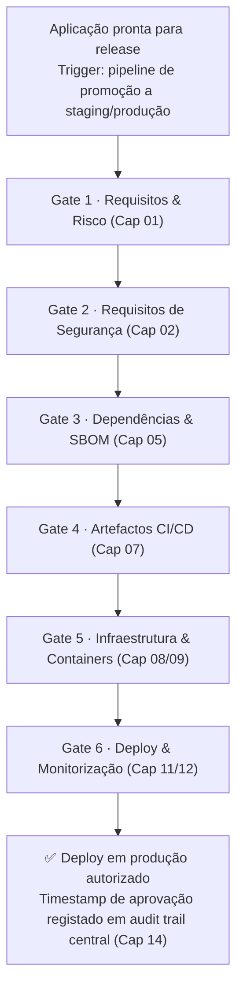

# Applying Criticality Classification Throughout the Lifecycle

The correct application of criticality classification (L1–L3) throughout the entire development cycle is essential to ensure that security controls are always proportional to the real risk, effectively traceable and reviewed in line with relevant events and changes.

This chapter details, in an operational and prescriptive way, **when and how to implement criticality classification in practice**, describing the actions expected from each role, the artefacts produced, and presenting examples of reusable user stories - always in accordance with the application's risk level.

---

## 🧭 Scope and when to apply {#-abrangência-e-quando-aplicar}

| Phase / Event                          | Expected action                                                   | Supporting document                                                                 |
|----------------------------------------|-----------------------------------------------------------------|-------------------------------------------------------------------------------------|
| 🚧 Project start                   | Classify the application according to the E+D+I model                      | [Classification Model](/sbd-toe/sbd-manual/classificacao-aplicacoes/addon/modelo-classificacao-eixos) |
| 🔄 New release or integration          | Review the classification on the basis of relevant changes           | [Risk Lifecycle](/sbd-toe/sbd-manual/classificacao-aplicacoes/addon/ciclo-vida-risco) |
| 🛠️ Change in data, exposure or automation/assistance | Reclassify the E/D/I axes according to impact; assess residual risk | [Residual Risk](/sbd-toe/sbd-manual/classificacao-aplicacoes/addon/risco-residual) |
| 🧪 Architecture review              | Apply the semi-quantitative assessment and validate the control applied  | [Quantitative Assessment](/sbd-toe/sbd-manual/classificacao-aplicacoes/addon/atributos-risco) |
| 🚀 Go-live                             | Validate compliance with the controls matrix by risk          | [Controls Matrix by Risk](/sbd-toe/sbd-manual/classificacao-aplicacoes/addon/matriz-controlos-por-risco) |
| ⚠️ Emerging threat or new CVE        | Reassess criticality and threat coverage                    | [Threat Mapping by Risk](/sbd-toe/sbd-manual/classificacao-aplicacoes/addon/mapeamento-ameacas-risco) |
| 🗓️ Passage of time (formal cadence) | **Periodic time-based review** of the classification               | [Risk Lifecycle](/sbd-toe/sbd-manual/classificacao-aplicacoes/addon/ciclo-vida-risco) |

---

## 👥 Who performs each action {#-quem-executa-cada-ação}

| Formal Role (07-roles) | Responsibilities in Ch. 01 |
|---|---|
| **Developer** | Propose the initial classification; record E/D/I changes; update documentation in commits |
| **Scrum Master / Team Lead** | Facilitate the integration of classification into the backlog; remove operational blockers |
| **AppSec Engineer** | Validate the model applied; adjust the level (especially at L2/L3); map threats; parameterise the cadence; approve classifications |
| **Software Architects** | Review technical risk implications, exposure scenarios and architectural impact |
| **Product Owner** | Notified of level changes (especially L1→L3); approve the business impact of exceptions |
| **GRC/Compliance** | Normative traceability; define TTL/expiry of exceptions; consolidate KPIs; audit decisions |
| **QA** | Validate fulfilment of requirements per level before go-live; document evidence |
| **DevOps / SRE** | Apply the classification to technical artefacts (pipeline/IaC/images) in chapters 07/08/09 |
| **Executive Management / CISO** | Approve classification and risk acceptance policies; oversee exceptions at L3 |
| **Auditors** | Validate the effective application of classifications; audit traceability; produce findings |

---

## 🛠️ Reusable user stories {#️-user-stories-reutilizáveis}

### US-01 - Initial classification of the application {#us-01---classificação-inicial-da-aplicação}

**Context.**  
The initial classification of the application is the entry point for the proportional application of security controls (L1–L3). Without this step, neither traceability nor proportionality can be guaranteed.

:::userstory
**Story.**  
As a **Developer / Scrum Master / Team Lead**, I want **to classify the application on the basis of the Exposure, Data and Impact axes (E+D+I)**, so that security controls are applied proportionally across all chapters.

**Acceptance criteria (BDD).**
- **Given** a new application or one at project start  
  **When** I apply the E+D+I classification model  
  **Then** I obtain a score per axis and an overall level **L1–L3 defined, validated by the AppSec Engineer and documented**

**Acceptance criteria (DoD).**
- [ ] E+D+I classification model applied to the application  
- [ ] Criticality level (L1–L3) defined and **validated by the AppSec Engineer**  
- [ ] Classification document recorded and versioned in a Git repository  
- [ ] Automation/assistance tools (incl. AI) identified and reflected in the E/D/I axes  
- [ ] Minimum controls extracted from the risk matrix and associated with the application  
- [ ] **At L2/L3: formal approval by the AppSec Engineer documented**  
- [ ] **Product Owner notified if the classification is L3**  
- [ ] **If tool-assisted:**
  - [ ] Tool output (E/D/I scores, reasoning) attached
  - [ ] Clear human narrative justification (why E=X, D=Y, I=Z)
  - [ ] Validation of each axis by specialists (Developer, Architects)
  - [ ] Final approval by the AppSec Engineer with an explicit record
  - [ ] Tool, version and date documented
  - [ ] Reference: [addon-11: Tool-Assisted Validation](/sbd-toe/sbd-manual/classificacao-aplicacoes/addon/validacao-assistida-ferramentas)

:::

**Artefacts & evidence.**
- File: `classificacao-aplicacao.yaml` - Location: Repo `security/`  
- File: `matriz-controlos-aplicada.md` - Evidence: Attached to the PR or wiki

**Proportionality by risk.**
| Level | Mandatory? | Adjustments |
|---|---|---|
| L1 | Yes | Simplified classification, main axes only |
| L2 | Yes | Full classification with **formal validation by the AppSec Engineer** |
| L3 | Yes | Formal classification, **validated and approved by the AppSec Engineer + GRC/Compliance** |

**Integration into the SDLC.**
| Phase | Trigger | Responsible | SLA |
|---|---|---|---|
| Start | Kick-off / Project definition | **Developer + Scrum Master / Team Lead + AppSec Engineer** | Before the first release |
| Architecture | Initial design review | **Developer + Software Architects + AppSec Engineer** | Before architecture approval |

**Useful links.**
- [Classification Model](/sbd-toe/sbd-manual/classificacao-aplicacoes/addon/modelo-classificacao-eixos)  
- [Controls Matrix by Risk](/sbd-toe/sbd-manual/classificacao-aplicacoes/addon/matriz-controlos-por-risco)  
- [07-roles.md](/sbd-toe/sbd-manual/fundamentos/roles-responsabilidades/intro)

---

### US-02 - Applying the controls matrix {#us-02---aplicação-da-matriz-de-controlo}

**Context.**  
The controls matrix defines which security requirements apply according to the risk level. Without explicit mapping, there is a risk of over-protection or under-protection.

:::userstory
**Story.**  
As a **Developer / Scrum Master / Team Lead**, I want **to apply the controls matrix and map each requirement to its counterpart in Chapter 02**, so that only the necessary requirements are demanded and traceable.

**Acceptance criteria (BDD).**
- **Given** an application already classified (L1, L2 or L3)  
  **When** I consult the controls matrix  
  **Then** I extract only the requirements corresponding to the assigned level **and map each one to the specific requirement in Ch. 02**

**Acceptance criteria (DoD).**
- [ ] Matrix consulted for the application's level  
- [ ] Requirements turned into backlog cards/stories  
- [ ] **Each requirement explicitly mapped to the requirement's catalogue ID** (e.g. `LOG-001` from Ch. 02, `ARC-003` from Ch. 04)  
- [ ] Tracking table: `controlo | L1/L2/L3 | requisito | responsável`  
- [ ] Exceptions documented, approved by the AppSec Engineer with technical justification  
- [ ] **AppSec Engineer validates the mapping before entry into the backlog**  

:::

**Artefacts & evidence.**
- File: `matriz-controlos-aplicada.md` with tracking to the Ch. 02 requirement  
- Location: Backlog / Wiki / Documentation repository

**Proportionality by risk.**
| Level | Mandatory? | Adjustments |
|---|---|---|
| L1 | Yes | Apply minimum controls |
| L2 | Yes | Full controls with mandatory tracking |
| L3 | Yes | Full + reinforced controls + validation by AppSec |

**Integration into the SDLC.**
| Phase | Trigger | Responsible | SLA |
|---|---|---|---|
| Planning | After classification | **Developer + Scrum Master / Team Lead + AppSec Engineer** | Before implementation |

**Useful links.**
- [Controls Matrix by Risk](/sbd-toe/sbd-manual/classificacao-aplicacoes/addon/matriz-controlos-por-risco)  
- [Chapter 02 - Security Requirements](/sbd-toe/sbd-manual/requisitos-seguranca/intro)  
- [07-roles.md](/sbd-toe/sbd-manual/fundamentos/roles-responsabilidades/intro)

---

### US-03 - Review upon relevant change (event-based) {#us-03---revisão-por-alteração-relevante-event-based}

**Context.**  
The classification must be reviewed whenever there are significant changes in architecture, data or exposure. Without review, slow changes can create misalignment between the level and the controls.

:::userstory
**Story.**  
As an **AppSec Engineer**, I want **to review the criticality classification whenever relevant changes occur**, so that the controls remain continuously adequate to the real technical context.

**Acceptance criteria (BDD).**
- **Given** that a significant change has occurred (e.g. new API, new sensitive data, change of exposure)  
  **When** I review the classification  
  **Then** I document whether the level was kept or changed, with clear technical justification

**Acceptance criteria (DoD).**
- [ ] Review trigger identified and documented  
- [ ] Classification document updated or revalidated  
- [ ] Technical justification recorded (e.g. "E increased from 1→2 due to exposure to a public API")  
- [ ] **If the level changed: triggers the matrix review (US-02) and threat mapping (US-06)**  
- [ ] **Product Owner notified if there is business impact** (especially on L1→L3 escalation)  
- [ ] GRC/Compliance records the change in an auditable trail  
- [ ] **If assisted by a detection tool:**
  - [ ] Tool & detection method documented
  - [ ] Technical trigger validated (false positive ruled out)
  - [ ] Business context confirmed (change genuinely relevant)
  - [ ] Impact on E/D/I explained
  - [ ] If the level changed: escalation trail documented
  - [ ] Reference: [addon-11: Tool-Assisted Validation](/sbd-toe/sbd-manual/classificacao-aplicacoes/addon/validacao-assistida-ferramentas)

:::

**Artefacts & evidence.**
- File: `classificacao-revisao.md` or an entry in the issue tracker  
- Content: `data | trigger | nível_anterior | nível_novo | justificação | responsável`  
- Evidence: traceable signed commit, commented issue, or record in GRC

**Proportionality by risk.**
| Level | Mandatory? |
|---|---|
| L1 | Yes (upon relevant change) |
| L2 | Yes |
| L3 | Yes |

**Integration into the SDLC.**
| Phase | Trigger | Responsible | SLA |
|---|---|---|---|
| Continuous | Change in architecture, data or exposure | **AppSec Engineer + Developer + GRC/Compliance + Product Owner** | 3 working days after the trigger |

**Useful links.**
- [Risk Lifecycle](/sbd-toe/sbd-manual/classificacao-aplicacoes/addon/ciclo-vida-risco)  
- [07-roles.md](/sbd-toe/sbd-manual/fundamentos/roles-responsabilidades/intro)

---

### US-04 - Residual risk analysis {#us-04---análise-de-risco-residual}

**Context.**  
Even after the matrix has been applied, residual risks may remain that must be documented, quantified and formally approved. Without residual analysis, exceptions are left without clear technical justification.

:::userstory
**Story.**  
As a **GRC/Compliance** role, I want **to record the residual risk after applying the defined controls**, so that decisions on risk acceptance, mitigation or transfer are substantiated.

**Acceptance criteria (BDD).**
- **Given** that some controls are not applicable or have been excepted  
  **When** I document the technical justifications and assess the residual risk  
  **Then** I record the analysis in an auditable form with **approval by the AppSec Engineer and Management**

**Acceptance criteria (DoD).**
- [ ] Controls not applied explicitly identified  
- [ ] Detailed technical justification recorded (e.g. "Requirement X not applicable because Y")  
- [ ] **Residual risk assessed against L1–L3 thresholds** (e.g. L2 maximum = medium risk)  
- [ ] **Formal approval by the AppSec Engineer documented**  
- [ ] **At L3: additional approval by Executive Management/CISO**  
- [ ] Entry in the GRC tool with an audit trail  

:::

**Artefacts & evidence.**
- File: `risco-residual.md` or an entry in the GRC tool  
- Content: `id | controlo_não_aplicado | justificação | risco_residual | aprovadores | data`  
- Evidence: digital signature, approval email, or versioned record

> **Reference:** This US implements [Ch. 14-US-01: Formal exceptions process]
> in the context of residual risk analysis. The formal approval and the TTL of exceptions must follow the master policy defined in Ch. 14.

**Proportionality by risk.**
| L1 | L2 | L3 |
|----|----|----|
| Optional (if critical) | Mandatory | Mandatory |

**Integration into the SDLC.**
| Phase | Trigger | Responsible | SLA |
|---|---|---|---|
| Validation | After matrix mapping; pre-release | **GRC/Compliance + AppSec Engineer + Developer** | 5 working days |

**Useful links.**
- [Residual Risk](/sbd-toe/sbd-manual/classificacao-aplicacoes/addon/risco-residual)  
- [Risk Acceptance Criteria](/sbd-toe/sbd-manual/classificacao-aplicacoes/addon/criterios-aceitacao-risco)  
- [07-roles.md](/sbd-toe/sbd-manual/fundamentos/roles-responsabilidades/intro)

---

### US-05 - Validation before go-live {#us-05---validação-antes-do-go-live}

**Context.**  
Before going into production it is necessary to validate whether all applicable requirements have been fulfilled. This step prevents deploys with incomplete security coverage.

:::userstory
**Story.**  
As a **QA** role, I want **to validate that the requirements applicable to the risk level are fulfilled before entry into production**, so that compliance with the assigned classification is ensured.

**Acceptance criteria (BDD).**
- **Given** that the application is ready for go-live  
  **When** I review the checklist of applicable controls (extracted from US-02)  
  **Then** I confirm that **evidence is documented, tested and approved by the AppSec Engineer**

**Acceptance criteria (DoD).**
- [ ] Controls checklist fully reviewed (based on the matrix applied)  
- [ ] Evidence documented (tests, reports, scans, reviews)  
- [ ] **Formal approval by the AppSec Engineer recorded**  
- [ ] **At L3: additional approval by Executive Management or the CISO**  
- [ ] No unapproved exception pending  
- [ ] Tracking: each control ↔ evidence documented  

:::

**Artefacts & evidence.**
- File: `checklist-go-live.md` or an entry in the pipeline CI/CD  
- Content: `controlo | L1/L2/L3 | evidência | aprovação_AppSec | status_go_live`  
- Evidence: approval log in the pipeline, signature on a document, or record in GRC

**Proportionality by risk.**
| L1 | L2 | L3 |
|----|----|----|
| Recommended | Recommended (mandatory) | Mandatory (formal + signature) |

**Integration into the SDLC.**
| Phase | Trigger | Responsible | SLA |
|---|---|---|---|
| Pre-Release | Application ready for go-live | **QA + AppSec Engineer + Executive Management (L3)** | 2 working days before deploy |

**Useful links.**
- [Controls Matrix by Risk](/sbd-toe/sbd-manual/classificacao-aplicacoes/addon/matriz-controlos-por-risco)  
- [07-roles.md](/sbd-toe/sbd-manual/fundamentos/roles-responsabilidades/intro)

---

### US-06 - Threat mapping by risk level {#us-06---mapeamento-de-ameaças-por-nível-de-risco}

**Context.**  
Each criticality level must be confronted with known threats (STRIDE, MITRE ATT&CK) to validate that the coverage of controls is adequate. Without mapping, the selection of controls becomes ad hoc.

:::userstory
**Story.**  
As an **AppSec Engineer**, I want **to verify whether the threats expected for the criticality level are covered by applied controls or traceable exceptions**, so that the selection of controls is grounded in real threats.

**Acceptance criteria (BDD).**
- **Given** that the application has a defined criticality level (L1/L2/L3)  
  **When** I consult the appropriate threat mapping (STRIDE, MITRE ATT&CK)  
  **Then** I verify that **all critical threats are covered by a control or a documented exception**

**Acceptance criteria (DoD).**
- [ ] Threats identified per level (e.g. STRIDE for L1, MITRE ATT&CK for L2/L3)  
- [ ] **Threat ↔ control mapping documented** (e.g. Spoofing → MFA, Tampering → TLS)  
- [ ] Coverage validated by an applied control or an approved exception  
- [ ] **Architects involved to validate the technical context**  
- [ ] Results recorded and traceable  
- [ ] **If a critical threat is not covered: triggers US-04 (residual risk) or mandatory mitigation**  
- [ ] **If assisted by a mapping tool:**
  - [ ] Tool & version documented
  - [ ] Generic, non-contextual threats filtered out?
  - [ ] Domain-specific threats added (specialist validation)?
  - [ ] Prioritisation (critical vs. minor) correct?
  - [ ] Uncovered critical threats triggered US-04 (residual risk)?
  - [ ] Validation by Architects + domain specialists completed
  - [ ] Reference: [addon-11: Tool-Assisted Validation](/sbd-toe/sbd-manual/classificacao-aplicacoes/addon/validacao-assistida-ferramentas)

:::

**Artefacts & evidence.**
- File: `ameacas-mapeamento.md` with table: `ameaca | categoria | controlo_aplicado | cobertura_sim_nao | exceção`  
- Location: Security documentation repo  
- Evidence: tracking in Jira/backlog, validation by AppSec + Architects

**Proportionality by risk.**
| L1 | L2 | L3 |
|----|----|----|
| Optional (basic STRIDE) | Recommended (full STRIDE) | Mandatory (STRIDE + MITRE ATT&CK) |

**Integration into the SDLC.**
| Phase | Trigger | Responsible | SLA |
|---|---|---|---|
| Design | After the architecture is defined | **AppSec Engineer + Architects + Developer** | Before development starts |
| Validation | Pre-release (L2/L3) | **AppSec Engineer** | 1 week before release |

**Useful links.**
- [Threat Mapping by Risk](/sbd-toe/sbd-manual/classificacao-aplicacoes/addon/mapeamento-ameacas-risco)  
- [Chapter 03 - Threat Modelling](/sbd-toe/sbd-manual/threat-modeling/intro)  
- [07-roles.md](/sbd-toe/sbd-manual/fundamentos/roles-responsabilidades/intro)

---

### **US-07 - Periodic Time-Based Review of the Classification (Mandatory Cadence)** {#us-07---revisão-periódica-time-based-da-classificação-cadência-obrigatória}

**Context.**  
Beyond change-driven triggers, the classification must have a **fixed periodic cadence**. Without a calendar, slow changes (e.g. growth in critical data) go undetected.

:::userstory
**Story.**  
As an **AppSec Engineer**, I want **to review the classification at a fixed cadence (L1 yearly, L2 half-yearly, L3 quarterly)**, so that the criticality level and the controls remain adequate to the current context.

**Acceptance criteria (BDD).**
- **Given** that an active classification exists with a defined next review date  
  **When** the review date arrives  
  **Then** I reassess the E/D/I axes, document the decision (keep/change) and **schedule the next review**

**Acceptance criteria (DoD).**
- [ ] Review calendar defined per level (L1=12m, L2=6m, L3=3m)  
- [ ] Review minutes or issue created, dated and documented with technical evidence  
- [ ] Justification: "Changed" (with new level and drivers) or "Unchanged" (with observations)  
- [ ] Next review date scheduled and alerts configured (in the GRC tool where possible)  
- [ ] **If the level changed: triggers US-02 (matrix) and US-06 (threats)**  
- [ ] **Product Owner notified if there is business impact** (especially L1→L3)  
- [ ] **GRC/Compliance records it in the audit trail**  
- [ ] **If assisted by an analysis tool:**
  - [ ] Did the tool provide an E/D/I re-scoring?
  - [ ] Comparison: previous score vs. new score documented
  - [ ] If there is disagreement (machine vs. AppSec): resolution trail recorded
  - [ ] Temporal validation: review of data, dependencies and expected impact for the next 12m
  - [ ] Reference: [addon-11: Tool-Assisted Validation](/sbd-toe/sbd-manual/classificacao-aplicacoes/addon/validacao-assistida-ferramentas)
:::

**Artefacts & evidence.**
- File: `classificacao-revisoes.md` or an entry in the GRC tool  
- Table: `data_revisao | nível_anterior | nível_novo | justificação | próxima_data | responsável`  
- Evidence: dated traceable issue, versioned commit, or auditable record

**Proportionality (typical cadence).**
| Level | Suggested frequency | Mandatory? |
|---|---|---|
| L1 | 12 months | Recommended |
| L2 | 6 months | Mandatory |
| L3 | 3 months (or per sprint) | Mandatory |

**Integration into the SDLC.**
| Phase | Trigger | Responsible | SLA |
|---|---|---|---|
| Operations + Governance | Time-based calendar + Critical events | **AppSec Engineer + GRC/Compliance + Product Owner** | Completion within 5 working days of the review date |

**Useful links.**
- [Risk Lifecycle](/sbd-toe/sbd-manual/classificacao-aplicacoes/addon/ciclo-vida-risco)  
- [Risk Acceptance Criteria](/sbd-toe/sbd-manual/classificacao-aplicacoes/addon/criterios-aceitacao-risco)  
- [07-roles.md](/sbd-toe/sbd-manual/fundamentos/roles-responsabilidades/intro)

---

### **US-08 - Risk Acceptance with TTL and Mandatory Revalidation** {#us-08---aceitação-de-risco-com-ttl-e-revalidação-obrigatória}

**Context.**  
When the residual risk level is acceptable but with a **limited Time-To-Live (TTL)**, the risk may expire. Without automatic revalidation, exceptions "sleep" indefinitely.

:::userstory
**Story.**  
As a **GRC/Compliance** role, I want to record acceptances with an **explicit TTL and a re-approval alert**, so that exceptions do not become permanent through oversight.

**Acceptance criteria (BDD).**
- **Given** that there is a decision to accept residual risk  
  **When** I define the TTL of the acceptance in accordance with the master policy on exceptions and risk acceptance ([Canonical Exception Management Process](/sbd-toe/sbd-manual/governanca-contratacao/addon/processo-excecoes), Ch. 14)  
  **Then** I configure a **revalidation alert 15 days before expiry**  
- And I document that **without explicit re-approval, the exception expires automatically**

**Acceptance criteria (DoD).**
- [ ] Exception owner designated and contactable  
- [ ] TTL defined in accordance with the master policy on exceptions and risk acceptance ([Canonical Exception Management Process](/sbd-toe/sbd-manual/governanca-contratacao/addon/processo-excecoes), Ch. 14): default maximum period, extension only with reassessment  
- [ ] Clear closure criteria (e.g. "after implementation of mitigation X" or "until date Y")  
- [ ] **Alerts configured 15 days before expiry** (email or automatic issue)  
- [ ] Traceable record in the GRC tool or repository (with date and decision-maker)  
- [ ] **Explicit re-approval required for extension** (same approval criterion as the original)  
- [ ] **At L3: additional approval by Executive Management/CISO before renewal**  
- [ ] **If the business impact is relevant: Product Owner notified and in agreement**  

:::

**Artefacts & evidence.**
- File: `aceitacoes-risco.md` or an entry in the GRC/JIRA tool  
- Table: `excepção_id | L1/L2/L3 | data_aceitação | TTL | data_expiração | owner | critério_encerramento | status`  
- Evidence: dated approval, expiry alert, documented re-approval or closure record

**Proportionality (TTL per level).**
| Level | TTL | Revalidation | Mandatory? |
|---|---|---|---|
| L1 | per master policy (Ch. 14) | Yearly | Recommended |
| L2 | per master policy (Ch. 14) | Half-yearly | Mandatory |
| L3 | per master policy (Ch. 14) | Quarterly | **Mandatory + Executive Management** |

**Integration into the SDLC.**
| Phase | Trigger | Responsible | SLA |
|---|---|---|---|
| Governance + Security | Decision to accept risk; alert 15d before expiry | **GRC/Compliance (creates, records) + AppSec Engineer (revalidates, approves) + Executive Management/CISO (approves L3) + Product Owner (notified if business impact)** | Creation: 2 working days; Re-approval: 5 working days before expiry |

**Useful links.**
- [Risk Acceptance Criteria](/sbd-toe/sbd-manual/classificacao-aplicacoes/addon/criterios-aceitacao-risco)  
- [Residual Risk Analysis](#us-04---análise-de-risco-residual)
- [07-roles.md](/sbd-toe/sbd-manual/fundamentos/roles-responsabilidades/intro)

---

### **US-09 - Classification of Technical Artefacts (Pipeline, IaC, Images)** {#us-09---classificação-de-artefactos-técnicos-pipeline-iac-imagens}

**Context.**  
Classifying the application is not enough; **delivery artefacts** (Dockerfile, CI/CD scripts, IaC, images) inherit the criticality and require the specific controls described in chapters 07 (Secure CI/CD), 08 (IaC), 09 (Containers).

:::userstory
**Story.**  
As a **DevOps/SRE**, I want to classify the **application's technical artefacts** (Dockerfile, pipeline, IaC, images) with the same criticality, so that security controls keep pace with the integrity of the delivery.

**Acceptance criteria (BDD).**
- **Given** that an application has an L1/L2/L3 classification  
  **When** I create/review delivery artefacts (Dockerfile, CI/CD script, IaC manifest, image)  
  **Then** I apply the **controls of chapters 07/08/09 equivalent to the level**  
- And I document **traceability: application → artefact → chapter 07/08/09 → requirement**

**Acceptance criteria (DoD).**
- [ ] Technical artefacts identified (Dockerfile, pipeline/GitHub Actions/GitLab CI, Terraform/Helm, registered image)  
- [ ] **Artefact classification recorded = application classification** (e.g. L3 app → L3 Dockerfile, L3 pipeline)  
- [ ] **Ch. 07 (CI/CD) controls applied if pipeline** (secrets manager, signing, scanning, audit log)  
- [ ] **Ch. 08 (IaC) controls applied if infrastructure-as-code** (versioning, rigorous review, scanning, tags)  
- [ ] **Ch. 09 (Containers) controls applied if Docker image** (secure base image, vulnerability scanning, runtime policy, registry authentication)  
- [ ] **Tracking table: artefact | level | chapter | requirement | responsible | status**  
- [ ] **Architects validate the alignment between the artefact's controls and the application's needs**  
- [ ] **AppSec Engineer approves before deploy**  

:::

**Artefacts & evidence.**
- File: `artefactos-tecnicos.md` or a table in the repository  
- Table: `artefacto | nível | tipo (Dockerfile/pipeline/IaC) | capítulo | requisito | status | owner`  
- Evidence: commit with classification tags, traceable issue, scan report, approval email

**Proportionality (by artefact type).**
| Artefact | Applicable Ch. | L1 (Recommended) | L2 (Mandatory) | L3 (Reinforced) |
|---|---|---|---|---|
| Dockerfile | 09 | Secure base | Full hardening + scanning | Audited secure base, automatic scanning, private registry |
| Pipeline (GH/GL/Jenkins) | 07 | Secrets in variables | Secrets in KV, audit log, SAST | Secrets in KV, audit log, SAST+DAST, image signing, 2FA |
| IaC (Terraform/Helm) | 08 | Versioning | Versioning + review | Versioning + rigorous review + compliance scanning |
| Registered image | 09 | Explicit version | Vulnerability scan | Scan + runtime policy + image signing |

**Integration into the SDLC.**
| Phase | Trigger | Responsible | SLA |
|---|---|---|---|
| Build + Delivery | Creation/update of an artefact | **DevOps/SRE (owner, implements controls) + Architects (validate alignment) + AppSec Engineer (approves)** | Approval before deploy: 2 working days |

**Useful links.**
- [Ch. 07 - Secure CI/CD](/sbd-toe/sbd-manual/cicd-seguro/intro)  
- [Ch. 08 - IaC and Infrastructure](/sbd-toe/sbd-manual/iac-infraestrutura/intro)  
- [Ch. 09 - Containers and Images](/sbd-toe/sbd-manual/containers-imagens/intro)  
- [07-roles.md](/sbd-toe/sbd-manual/fundamentos/roles-responsabilidades/intro)

---

### **US-10 - KPIs, Metrics and Reporting on Classification and Compliance** {#us-10---kpis-métricas-e-reporting-de-classificação-e-conformidade}

**Context.**  
Without indicators and executive visibility, there is neither effective governance nor a feedback loop for continuous improvement. Operational and compliance metrics on the classification cycle must be consolidated.

:::userstory
**Story.**  
As a **GRC/Compliance** role, I want to consolidate **monthly/quarterly KPIs** on classification, exceptions and review cycles, so that governance maturity can be demonstrated to **Executive Management/CISO** and to **Audit**.

**Acceptance criteria (BDD).**
- **Given** that classifications, exceptions, reviews and artefacts are recorded  
  **When** I consolidate the data monthly  
  **Then** I generate a report with **KPIs per level, trends, compliance alerts and recommendations**  
- And I distribute it to **Executive Management/CISO + Internal Auditors**

**Acceptance criteria (DoD).**
- [ ] **KPI 1: % of applications classified** (valid, with an upcoming review/revalidation date)  
- [ ] **KPI 2: % of exceptions still active** vs **% expired or extended** (per level)  
- [ ] **KPI 3: Lead time to initial classification** (days from creation until L1/L2/L3 assigned)  
- [ ] **KPI 4: Lead time to review** (days from trigger until final decision)  
- [ ] **KPI 5: Compliance with the review cadence** (% of L2/L3 apps reviewed within the 6m/3m deadline)  
- [ ] **KPI 6: % of controls mapped** (applications with all the level's requirements implemented or with a valid TTL exception)  
- [ ] **KPI 7: Uncovered critical threats** (number and list of applications with critical residual risk)  
- [ ] **Time series (trend)**: Charts of KPIs 1–7 for the last 6 months  
- [ ] **Automatic alerts**: Notification if KPI 2 (expired exceptions) > 5%, KPI 5 (compliance) < 90%  
- [ ] **Single source of data**: GRC tool, repository, or integrated dashboard (with traceability to the original application)  
- [ ] **Quarterly report** signed by **GRC/Compliance**, distributed to **Executive Management/CISO + Auditors**  
- [ ] **Actionable recommendations**: Top 3 causes of delay or non-compliance + action plan  

:::

**Artefacts & evidence.**
- File: `kpi-classificacao-YYYY-MM.md` or an entry in the BI/dashboard tool  
- Table: `data | KPI | valor | meta | % conformidade | tendência | alertas`  
- Evidence: dated PDF/markdown report, email distribution, presentation to Executive Management, audit record

**Proportionality (reporting by level of detail).**
| Audience | Frequency | Minimum KPIs | Format |
|---|---|---|---|
| **Operations/AppSec** | Weekly (optional) | % classified, exceptions close to expiry, review delays | Internal dashboard |
| **Product Owners** | Monthly | % classified (per business area/squad), lead time, app exceptions |  Summary email or Slack |
| **Executive Management/CISO** | Quarterly | KPIs 1,2,5,6,7; critical alerts; recommendations | Formal PDF with charts |
| **Internal Auditors** | Yearly + ad hoc | Full series KPIs 1-7; compliance with regulations; draft policies; list of exceptions | PDF + access to the versioned repository |

**Integration into the SDLC.**
| Phase | Trigger | Responsible | SLA |
|---|---|---|---|
| Governance + Reporting | End of period (monthly/quarterly) | **GRC/Compliance (collects data, consolidates, drafts) + AppSec Engineer (validates technical metrics) + Executive Management/CISO (approves distribution)** | Report: 10 working days after the end of the period; Distribution: 1 day after approval |

**Useful links.**
- [Risk Acceptance Criteria](/sbd-toe/sbd-manual/classificacao-aplicacoes/addon/criterios-aceitacao-risco)  
- [Threat Mapping](/sbd-toe/sbd-manual/classificacao-aplicacoes/addon/mapeamento-ameacas-risco)  
- [07-roles.md](/sbd-toe/sbd-manual/fundamentos/roles-responsabilidades/intro)  
- [Audit & Traceability (Ch. 02)](/sbd-toe/sbd-manual/requisitos-seguranca/intro)

---

### **US-11 - Formal Organisational Policies (Classification, Risk, Periodic Review, Traceability)** {#us-11---políticas-organizacionais-formais-classificação-risco-revisão-periódica-rastreabilidade}

**Context.**  
User stories US-01 to US-15 define **how to operationalise** the classification. Organisational policies define the **why** (mandate), **who approves**, **what the criterion is** and **how to audit**. Without policies, there is neither formal governance nor compliance with regulations (NIS2, DORA,).

:::userstory
**Story.**  
As **Executive Management/CISO**, I want **4 formal, approved organisational policies** to exist (Risk Classification, Risk Acceptance, Periodic Review, Traceability/Audit), so that **all teams operate under the same criteria** and the manual is **applied uniformly and audited**.

**Acceptance criteria (BDD).**
- **Given** that the organisation needs **formal compliance** with regulations (NIS2, DORA, ISO 27001)  
  **When** I publish 4 organisational policies signed by **Executive Management**  
- And mandatory training is documented with an **attestation** of understanding  
  **Then** **Auditors can validate compliance** and **all classification/risk decisions have a normative basis**

**Acceptance criteria (DoD).**
- [ ] **Policy 1 - Risk Classification**: E+D+I model, L1/L2/L3 criteria, responsibilities per level, review frequency (mandatory at L2/L3)  
- [ ] **Policy 2 - Risk Acceptance**: Acceptability criteria, TTL per level, approvers, exceptions + mandatory revalidation before expiry  
- [ ] **Policy 3 - Periodic Review**: Time-based cadence (12m/6m/3m), owners, escalation of decisions, triggers for matrix and threat review  
- [ ] **Policy 4 - Traceability & Audit**: Centralised record of classifications, exceptions, reviews; versioning; audit trail; data retention; restricted access  
- [ ] **Each policy contains**: objective, scope, responsible parties, decision criteria, approval process, review frequency, link to chapters of the manual  
- [ ] **Formal, dated signature** by **Executive Management/CISO** and **GRC/Compliance**  
- [ ] **Accessible publication** on the internal Wiki, policy repository, or compliance portal  
- [ ] **Mandatory training** for **all teams** (Dev, AppSec, GRC, Management, Auditors) with **attestation of attendance + comprehension quiz**  
- [ ] **Annual review** by **GRC/Compliance + Internal Auditors** with a record of any change  
- [ ] **Evidence of compliance**: Checklist for each application validating adherence to the 4 policies (L1/L2/L3)  

:::

**Artefacts & evidence.**
- File: `POLITICA-01-classificacao-risco.md`, `POLITICA-02-aceitacao-risco.md`, `POLITICA-03-revisao-periodica.md`, `POLITICA-04-rastreabilidade-auditoria.md`  
- Location: Institutional Wiki, `docs/policies/` Repository or compliance server  
- Evidence: signed PDF, date/version, email distribution, training record (name+date+signature), quiz scores, annual audit  

**Proportionality (application per level).**
| Level | Classification | Acceptance | Periodic Review | Traceability |
|---|---|---|---|---|
| L1 | Recommended (simplified) | Recommended | Recommended (yearly) | Recommended |
| L2 | Mandatory (full) | Mandatory + TTL | Mandatory (half-yearly) | Mandatory + audit trail |
| L3 | Mandatory (formal with approvals) | Mandatory + TTL + Management re-approval | Mandatory (quarterly) | Mandatory + granular tracking |

**Integration into the SDLC.**
| Phase | Trigger | Responsible | SLA |
|---|---|---|---|
| Governance + Compliance | Kick-off (policy creation), yearly (review) | **Executive Management/CISO (signs, approves) + GRC/Compliance (drafts, distributes, trains) + AppSec Engineer (technical input) + Internal Auditors (validate compliance) + All teams (training + attestation)** | Drafting: 30 days; Signature: 5 days; Distribution: 1 day; Initial training: 10 days; Annual review: 15 days |

**Useful links.**
- [Ch. 01 Intro - E+D+I Model and Cycles](/sbd-toe/sbd-manual/classificacao-aplicacoes/intro)  
- [Risk Acceptance Criteria (addon 03)](/sbd-toe/sbd-manual/classificacao-aplicacoes/addon/criterios-aceitacao-risco)  
- [Risk Lifecycle (addon 02)](/sbd-toe/sbd-manual/classificacao-aplicacoes/addon/ciclo-vida-risco)  
- [NIS2 / DORA / ISO 27001 (Ch. 002)](/sbd-toe/cross-check-normativo/intro)  
- [07-roles.md](/sbd-toe/sbd-manual/fundamentos/roles-responsabilidades/intro)

---

### US-12 - Reinforcing controls by risk attributes {#us-12---reforço-de-controlos-por-atributos-do-risco}

The L1–L3 classification is a simplified projection (E/D/I); certain internal attributes of the risk require the controls of the next level up, regardless of the level assigned.  

**Context.** An L1 or L2 application with low detectability, low evidentiability, non-deterministic behaviour or automatic delegation/execution with real impact is under-protected if the controls follow only the nominal level.  

:::userstory
**Story.**   
As an **AppSec Engineer**, I want **to assess the risk attributes (detectability, evidentiability, reproducibility, automatic delegation/execution) and escalate the controls to the next level up where indicated**, so that the proportionality of the controls is real and not merely nominal.  

**Acceptance criteria (BDD).**  
- **Given** an application classified L1 or L2 whose risk attributes indicate low detectability, low evidentiability, non-determinism or automatic execution with real impact  
  **When** I assess the risk attributes against the controls matrix  
  **Then** I apply the controls equivalent to the next level up and record the rationale for the reinforcement traceably  

**Checklist.**  
- [ ] Risk attributes explicitly assessed for the application (detectability, evidentiability, reproducibility, automatic delegation/execution)  
- [ ] Reinforcement decision (yes/no) documented with a technical rationale per triggering attribute  
- [ ] When reinforcement is applied: controls of the higher level associated with the application and traceable to the pipeline/backlog  
- [ ] Reinforcement applied regardless of the explicit presence of AI (technology-neutral rule)  

:::

**Artefacts & evidence.** Record of the risk-attribute assessment attached to the classification (`classificacao-aplicacao.yaml` or minutes); table `atributo | valor | desencadeia reforço? | controlos do nível superior aplicados`.  

**Proportionality L1–L3.**  
| L1 | L2 | L3 |
|----|----|----|
| Assessment mandatory; reinforces to L2 when an attribute triggers | Assessment mandatory; reinforces to L3 when an attribute triggers | Already at the top; attributes require stronger upstream controls and reinforced evidence |

**Integration into the SDLC.**  
| Phase | Trigger | Responsible | SLA |
|------|---------|-------------|-----|
| Classification / Design | After the initial classification or when automation/assistance with impact on the attributes is introduced | AppSec Engineer + Software Architects | Before architecture approval |

**Useful links.** [Controls Matrix by Risk](/sbd-toe/sbd-manual/classificacao-aplicacoes/addon/matriz-controlos-por-risco) · [Risk Attributes](/sbd-toe/sbd-manual/classificacao-aplicacoes/addon/atributos-risco)

---

### US-13 - Prohibitions on risk acceptance in automation and decision support {#us-13---interdições-de-aceitação-de-risco-em-automação-e-apoio-à-decisão}

There are situations in which risk acceptance (including residual risk) is categorically prohibited, regardless of urgency, cost or the application's level.  

**Context.** Without an explicit prohibition gate, automated decisions/actions with real impact may be accepted without effective human review, or with non-reproducible results, bypassing the formal acceptance criteria.  

:::userstory
**Story.**   
As a **GRC/Compliance** role, I want **to block any risk acceptance that falls under one of the prohibited automation/decision-support situations**, so that no risk with real impact is accepted without effective human review, reproducibility and evidence.  

**Acceptance criteria (BDD).**  
- **Given** a request to accept risk (or residual risk) that involves automation or decision support  
  **When** I check the prohibition conditions  
  **Then** the acceptance is refused if: automated action with real impact without effective human review; results that are not reproducible/not independently verifiable; absence of evidence that the controls work; significant legal/regulatory/reputational impact; or an L3 application that depends exclusively on implicit trust in the automated mechanism  

**Checklist.**  
- [ ] List of prohibition conditions checked for every acceptance decision involving automation/AI  
- [ ] Acceptance refused (and recorded as refused) whenever any prohibited condition holds  
- [ ] Evidence of the correct functioning of the controls required before any valid acceptance  
- [ ] At L3: confirmed that the decision does not depend exclusively on implicit trust in non-deterministic automation/tooling  

:::

**Artefacts & evidence.** Record of the acceptance/refusal decision with the completed prohibitions checklist; entry in the GRC tool with rationale and approvers.  

**Proportionality L1–L3.**  
| L1 | L2 | L3 |
|----|----|----|
| Apply the prohibitions; informal acceptance only outside the prohibited conditions | Prohibitions mandatory; acceptance with formal validation and record | Prohibitions mandatory; automatic refusal if dependent on a non-deterministic mechanism or without human review |

**Integration into the SDLC.**  
| Phase | Trigger | Responsible | SLA |
|------|---------|-------------|-----|
| Validation / Risk acceptance | Request to accept risk or residual risk involving automation/AI | GRC/Compliance + AppSec Engineer | Before the acceptance is recorded |

**Useful links.** [Criteria for Risk Acceptance](/sbd-toe/sbd-manual/classificacao-aplicacoes/addon/criterios-aceitacao-risco) · [Residual Risk Analysis](/sbd-toe/sbd-manual/classificacao-aplicacoes/addon/risco-residual)

---

### US-14 - Adoption of an alternative classification model (DRP/BIA) mapped to E/D/I {#us-14---adoção-de-modelo-de-classificação-alternativo-drpbia-mapeado-para-edi}

The organisation may reuse an existing impact classification (DRP/BIA or another formal method) provided that it maps its results to the application development context.  

**Context.** Reusing a DRP/BIA classification without a mapping confirmed by security analysis may import a criticality misaligned with the exposure and the nature of the application's data.  

:::userstory
**Story.**   
As a **GRC/Compliance** role, I want **to adopt the existing DRP/BIA classification as input and map it to the L1–L3 risk level, confirming the result by security analysis**, so that duplication of effort is avoided without losing rigour in application criticality.  

**Acceptance criteria (BDD).**  
- **Given** that an up-to-date DRP/BIA classification exists for the application  
  **When** I import and map it (Critical→High, Important/Medium→Medium, Non-essential/Low→Low)  
  **Then** the resulting L1–L3 level is confirmed by security analysis considering exposure and the nature of the data, and divergences are recorded with both rationales  

**Checklist.**  
- [ ] DRP/BIA classification verified as up to date and matching the scope of the current application  
- [ ] DRP/BIA → L1–L3 mapping applied and confirmed by security analysis (exposure + data)  
- [ ] Multi-module applications classified per component where applicable, not only globally  
- [ ] DRP vs. security divergence recorded with both rationales and discussed with the teams involved  
- [ ] Impact classification attached/referenced (cross-link) in the versioned risk register  

:::

**Artefacts & evidence.** Risk register with import/cross-link to the DRP/BIA record; table `componente | classe DRP/BIA | nível L1–L3 | confirmação segurança | divergência/racional`.  

**Proportionality L1–L3.**  
| L1 | L2 | L3 |
|----|----|----|
| Direct mapping admissible; light confirmation | Mapping confirmed by security analysis and recorded | Formal confirmation by security; classification per component when multi-module |

**Integration into the SDLC.**  
| Phase | Trigger | Responsible | SLA |
|------|---------|-------------|-----|
| Initial classification | Existence of a DRP/BIA applicable to the application | GRC/Compliance + AppSec Engineer | Before the first release |

**Useful links.** [Adoption of DRP/BIA](/sbd-toe/sbd-manual/classificacao-aplicacoes/addon/adopcao-drp-bia) · [Axis-Based Classification Model](/sbd-toe/sbd-manual/classificacao-aplicacoes/addon/modelo-classificacao-eixos)

---

### US-15 - Production and maintenance of the central inventory with level-proportional approval authority {#us-15---produção-e-manutenção-do-inventário-central-com-autoridade-de-aprovação-proporcional}

The central/GRC inventory (CLA-008) is the primary evidence artefact in an audit; it must be produced and kept up to date, with the approval authority proportional to the level (CLA-002) recorded per application.  

**Context.** The existing US consume the central inventory but none produces it; without an up-to-date record of level, owner, review date and approving authority, the evidence of compliance is not defensible in an audit.  

:::userstory
**Story.**   
As a **GRC/Compliance** role, I want **to maintain an up-to-date central inventory (or GRC) with the classification level, date of last review, security owner, compliance status and approval authority proportional to the level**, so that the classification evidence is accessible for audit without manual preparation.  

**Acceptance criteria (BDD).**  
- **Given** that an application is classified, reclassified or changes owner  
  **When** I update the central inventory  
  **Then** each application is listed with its current level, date of last review, owner, compliance status and approving authority (L1 tech lead, L2 AppSec, L3 CISO), accessible for audit without manual preparation  

**Checklist.**  
- [ ] Central inventory or GRC exists and records all applications with level, review date, owner and compliance status  
- [ ] Approval recorded by the authority proportional to the level: L1 Tech Lead, L2 AppSec Engineer, L3 CISO — dated and attributed to the responsible person  
- [ ] Inventory updated after every classification change or transfer of responsibility  
- [ ] Inventory accessible for audit without manual preparation  

:::

**Artefacts & evidence.** Central/GRC inventory; record per application `id | nível | data revisão | owner | estado conformidade | autoridade aprovadora | data aprovação`.  

**Proportionality L1–L3.**  
| L1 | L2 | L3 |
|----|----|----|
| Entry in the inventory; approval by the Tech Lead | Inventory with audit trail; approval by the AppSec Engineer | Inventory with granular tracking; approval by the CISO/equivalent |

**Integration into the SDLC.**  
| Phase | Trigger | Responsible | SLA |
|------|---------|-------------|-----|
| Governance | Initial classification, reclassification or transfer of responsibility | GRC/Compliance (maintains) + approval authority per level | Update ≤ 5 working days after the event |

**Useful links.** [Classification Requirements Catalogue](/sbd-toe/sbd-manual/classificacao-aplicacoes/addon/catalogo-requisitos-classificacao) · [Review Checklist](/sbd-toe/sbd-manual/classificacao-aplicacoes/canon/checklist-revisao)

---

## 🚧 Cascade of Validation Gates (US-05 in Context) {#-cascata-de-gates-de-validação-us-05-em-contexto}

Validation before go-live is implemented through a **cascade of sequential gates**, each verifying specific security dimensions in distinct chapters. Failure at any gate blocks promotion to production.

| Gate | Responsible | Validates | Blocks if |
|---|---|---|---|
| Gate 1 · Requirements & Risk (Ch. 01) | QA + AppSec Engineer | ✓ Risk classification assigned (L1/L2/L3) ✓ Matrix of applicable controls extracted ✓ Expected threats mapped (STRIDE, MITRE ATT&CK) ✓ No unapproved residual risk exception pending | Residual risk > approved threshold or pending exceptions |
| Gate 2 · Security Requirements (Ch. 02) | AppSec Engineer | ✓ Functional + security requirements complete ✓ Exception management: all exceptions have approval + SLA ✓ Requirement ↔ test ↔ evidence tracking complete | Incomplete requirements or exceptions without approval |
| Gate 3 · Dependencies & SBOM (Ch. 05) | DevOps + AppSec Engineer | ✓ Complete SBOM in CycloneDX/SPDX (all dependencies listed) ✓ Vulnerability scan: no unmitigated critical at L2/L3 ✓ CVEs with risk > threshold have documented mitigation/exception ✓ Dependencies verified in reputable repositories | Unmitigated critical CVE or incomplete SBOM |
| Gate 4 · CI/CD Artefacts (Ch. 07) | DevOps + AppSec Engineer | ✓ CI/CD pipeline: versioned, audited, secrets in a manager ✓ Signing & provenance of artefacts (in-toto, Cosign) ✓ Integrated security tests (SAST, dependency scanning, SBOM) ✓ Audit logs of every deploy collected and retained | Unaudited pipeline or unsigned artefacts |
| Gate 5 · Infrastructure & Containers (Ch. 08/09) | DevOps + Architects | ✓ IaC versioned, approved, tested (Terraform, Helm, CloudFormation) ✓ Container images: secure base, SBOM, scanning, signed ✓ Runtime policies (OPA/Kyverno) active and blocking at L2/L3 ✓ Network policies and RBAC configured | Unsigned image or inactive policies |
| Gate 6 · Deployment & Monitoring (Ch. 11/12) | DevOps + AppSec Engineer + SRE | ✓ Only signed artefacts are promoted ✓ Staging environment validated (tests + approvals completed) ✓ Monitoring + alerts activated pre-deploy (logs, metrics, events) ✓ Incident playbook documented and tested ✓ Formal approval recorded (signature, timestamp, audit trail) | Inactive monitoring or undocumented approval |

**Critical Characteristics of the Cascade:**
- **Sequential:** Each gate is a prerequisite for the next (failure at gate N blocks gate N+1)
- **Distributed:** Each gate is owned by a specific chapter, but overseen by centralised AppSec (Ch. 14)
- **Auditable:** All decisions and approvals are recorded with timestamp and responsible person
- **Proportional:** L1 may have lighter gates (audit mode), L2/L3 are blocking (enforce mode)
- **Traceable:** Gate 6 (Ch. 11/12) feeds the tracking matrix in Ch. 14 for evidence of compliance

---

## 📑 Expected artefacts (per phase) {#-artefactos-esperados-por-fase}

| Phase         | Artefact                          | Who produces it         | Where it lives                  | Minimum evidence                              |
|--------------|------------------------------------|---------------------|----------------------------|-----------------------------------------------|
| Start       | `classificacao-aplicacao.yaml`     | Developer / Scrum Master / Team Lead     | Repo `security/`           | Commit + AppSec Engineer review |
| Planning  | `matriz-controlos.md`              | Developer / Scrum Master / Team Lead     | Backlog / wiki             | referenced requirements (Ch. 02); AppSec approved |
| Review      | `classificacao-revisao.md`         | AppSec Engineer      | Repo `docs/`               | Dated issue/minutes; justified decision |
| Release      | `checklist-go-live.md`             | QA                  | Pipeline CI/CD             | Formal approval by the AppSec Engineer + Management (L3) |
| Operation     | `risco-residual.md`                | GRC/Compliance    | GRC tool / repo      | Owner + TTL + closure criteria; approval |
| Periodic    | `classificacao-revisao-anual.md` (L1), `semestral.md` (L2), `trimestral.md` (L3) | AppSec Engineer + GRC/Compliance | Docs repo / GRC | Review date, keep/change justification, next date |
| Acceptance    | `aceitacoes-risco.md` with TTL      | GRC/Compliance    | GRC tool / repo      | TTL defined, owner, closure criterion, alerts |
| Artefacts   | `artefactos-tecnicos.md`           | DevOps/SRE + Architects | Repo `platform/docs` | Classification per artefact, REQ tracking, AppSec approval |
| Continuous     | `kpi-classificacao-YYYY-MM.md`    | GRC/Compliance    | Dashboard / Reporting repository | KPIs 1-7, time series, alerts, recommendations |
| Governance   | `politicas-organizacionais.md` (4 policies) | GRC/Compliance + AppSec | Docs / Wiki / Policy | Executive Management approval, training + attestation, audit |

> **Canonical evidence format** (suggestion): `id`, `data`, `eixos` (E/D/I), `nível`, `decisão`, `owner`, `ligações` (issues/PRs), `aprovadores`, `expiração` (if applicable).

---

## 📊 L1–L3 proportionality matrix {#-matriz-de-proporcionalidade-l1l3}

| Practice / Story                                 | L1 | L2 | L3 | Observations |
|-------------------------------------------------|----|----|----|-------------|
| US-01 - Initial classification                    | ✔  | ✔  | ✔  | AppSec validation mandatory at L2/L3 |
| US-02 - Applying the matrix (with Ch. 02 requirements)        | ✔  | ✔  | ✔  | REQ traceability to Ch. 02 |
| US-03 - Review upon relevant change          | ✔  | ✔  | ✔  | Event-based, cascades to US-02/US-06 |
| **US-07 - Periodic time-based review**        | ✔ (Rec.) | ✔  | ✔  | Cadence: 12m / 6m / 3m (mandatory at L2/L3) |
| US-04 - Residual risk                           | (optional) | ✔ | ✔  | Formal approvals at L3 |
| **US-08 - Acceptance with TTL**                    | (Rec.) | ✔ | ✔  | TTL per master policy (Ch. 14); re-approval mandatory at L2/L3 |
| US-05 - Go-live validation                        | (Rec.) | ✔ | ✔  | AppSec + Management approval at L3 |
| US-06 - Threat mapping                    | (optional) | ✔ | ✔  | Architect validation; escalates critical risk |
| US-09 - Classification of technical artefacts    | ✔ (Rec.) | ✔ | ✔  | Applies Ch. 07/08/09 controls; Architects validate |
| **US-11 - Formal Organisational Policies**   | (Rec.) | ✔ | ✔  | 4 policies mandatory at L2/L3; training + audit |
| **US-10 - KPIs and Reporting**                    | (Rec.) | ✔ | ✔  | Monthly (ops), quarterly (management), yearly (auditors) |

---

## 📝 Operational recommendations {#-recomendações-operacionais}

- Integrate risk classification from the project **kick-off**.  
- Reassess the classification **upon change** and **by calendar** (time-based).  
- Keep the documentation **versioned and traceable** in a controlled repository.  
- Map requirements directly to **the Ch. 02 requirements** in the backlog.  
- Require **TTL/expiry** on all risk acceptances.  
- Validate proportionality at go-live and document evidence.  
- Consolidate organisational **KPIs** for *compliance* and continuous improvement.  
- Align practices with the **organisational policies** on classification, exceptions and periodic review.
