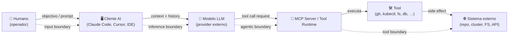

# Threat Modelling Methodologies and Tools

## 🌟 Objective {#-objetivo}

To provide a comparative, decision-oriented view of the main threat modelling **methodologies and tools**, helping teams to:

- Select the appropriate model based on the type and criticality of the system;
- Assess the available tools by maturity and context;
- Structure and version threat modelling artefacts in a reusable way.

---

## 🧠 Existing models and when to apply them {#-modelos-existentes-e-quando-aplicar}

### ✅ Comparison of methodologies {#-comparação-de-metodologias}

| Model          | Main focus              | When to use                                      | Complexity | Typical output                          |
| --------------- | --------------------------- | ------------------------------------------------ | ------------ | -------------------------------------- |
| **STRIDE**      | Technical threats            | Any exposed application or one with critical logic | Medium        | List of threats per component        |
| **LINDDUN**     | Privacy threats       | Systems with personal data, GDPR, consent | Medium        | Privacy assessment per flow     |
| **PASTA**       | Risk-based modelling  | Regulated, critical systems with formal requirements   | High         | Threats mapped to risk and control |
| **MITRE ATLAS** | Adversarial threats to AI/ML | Systems with ML/LLM/agentic components         | Medium        | Mapping of AI-specific tactics/techniques |

> 💡 STRIDE is versatile and the most widely used. LINDDUN complements it with a focus on privacy. PASTA suits mature teams or regulatory contexts. MITRE ATLAS is mandatory as a complement (not a substitute) in systems with AI/ML components — see [§AI/ML](#ai-ml).

---

### ♻️ Recommended application {#️-aplicação-recomendada}

- **STRIDE**: ideal as the base for any application with an exposed interface or sensitive logic.
- **LINDDUN**: apply when there are personal data, privacy concerns or legal requirements (e.g. GDPR).
- **PASTA**: use in systems with regulatory requirements (e.g. PCI-DSS, NIS2), or where formal tracing between risk, threat and control is required.
- **MITRE ATLAS**: apply as a complement (not a substitute) when the system integrates AI/ML components — predictive models, LLMs behind a conversational interface, retrieval-augmented generation (RAG) systems, autonomous agents with tool invocation. It introduces AI-system-specific attack tactics/techniques that STRIDE does not natively cover.

---

### 🧮 Recommendation by system type {#-recomendação-por-tipo-de-sistema}

| System type                | Recommended model | Technical rationale                                                               |
| ------------------------------ | ------------------ | ---------------------------------------------------------------------------------- |
| Critical exposed API            | STRIDE             | Technical focus on spoofing, tampering, DoS; simple coverage per component         |
| Service with personal data     | STRIDE + LINDDUN   | Technical coverage (STRIDE) and privacy assessment (LINDDUN)                    |
| Regulated application (PCI, NIS2) | PASTA (+ STRIDE)   | Requires formal tracing threat → risk → control, but STRIDE helps with identification |
| Internal (private) platform   | STRIDE or LINDDUN  | Depending on criticality and the type of data processed                                 |
| Legacy system under assessment    | STRIDE             | Lightweight approach, compatible with missing documentation or incomplete diagrams        |

---

## 🛠️ Available tools {#️-ferramentas-disponíveis}

### ✅ Practical comparison {#-comparação-prática}

| Tool          | Supported models | Collaboration | Key features                          | Recommended for…                    |
| ------------------- | ------------------ | ----------- | ---------------------------------------------- | ------------------------------------ |
| Microsoft TMT       | STRIDE             | ❌           | Fixed model, integration with Visio diagrams    | Architects, Microsoft teams       |
| OWASP Threat Dragon | STRIDE             | ✅           | Open source, online/offline, exports diagrams | DevSecOps teams, agile teams     |
| IriusRisk           | STRIDE / Custom    | ✅ (premium) | Risk management, API, integration with Jira/Git  | Organisations with budget and formal GRC |
| Draw.io / Miro      | All (visual)    | ✅           | Free-form diagramming, plugins, export            | Collaborative visualisation            |
| Markdown + Mermaid  | All              | ✅           | Versionable, lightweight, integrates with GitHub       | Technical teams and CI/CD pipelines   |

---

### 🧩 Recommendations by maturity level {#-recomendações-por-nível-de-maturidade}

| Team maturity | Recommended approach                           |
| -------------------- | ----------------------------------------------- |
| Low / starting out       | STRIDE with Threat Dragon or simple diagrams   |
| Medium / DevSecOps    | STRIDE with templates, Mermaid or Draw.io       |
| High / regulatory   | PASTA or STRIDE + IriusRisk, with GRC integration |

---

## 📁 Organisation of artefacts and templates {#-organização-de-artefactos-e-templates}

Suggested structure for keeping models reusable and versioned:

```
📁 threat-model/
├── README.md            # Resumo do modelo, âmbito e metodologia usada
├── dfd-diagram.drawio   # Diagrama de fluxo de dados
├── threats.csv          # Matriz de ameaças por componente (STRIDE)
├── mitigations.md       # Mitigações propostas e estado (em progresso, validado, etc.)
└── decisions.md         # Decisões tomadas e justificações (aceitação de risco, exceções)
```

Whenever possible, the requirements derived from threats should be traceable to the catalogue defined in Chapter 2 - Security Requirements.

---

## 🤖 Threat modelling for AI/ML systems {#ai-ml}

Systems that incorporate artificial intelligence components — predictive models, LLMs behind a conversational interface, retrieval-augmented generation (RAG) systems, autonomous agents with tool invocation — introduce **attack surfaces that are qualitatively distinct** from those of traditional applications. Adversarial threats to these components do not reduce to classic STRIDE: targets such as training data, model weights and prompt context, and mechanisms such as adversarial examples, prompt injection (direct and indirect) or data poisoning, require dedicated framing.

### Reference catalogues {#catálogos-de-referência}

| Catalogue | Focus | When to consult |
|---|---|---|
| **MITRE ATLAS** (Adversarial Threat Landscape for AI Systems) | AI-system-specific attack tactics/techniques, in a format analogous to MITRE ATT&CK | Initial identification and systematic coverage of adversarial threats |
| **NIST AI 100-2 e2025** — Adversarial Machine Learning Taxonomy | Formal taxonomy: model poisoning, evasion, availability, integrity and privacy attacks by attacker capability | Rigorous classification of attack vectors; mapping to the risk register |
| **NIST AI RMF 1.0** | Risk Management Framework for AI: GOVERN / MAP / MEASURE / MANAGE | Structuring AI risk at the organisational level |
| **OWASP LLM Top 10 (2025)** | Top 10 vulnerabilities in LLM applications (prompt injection, sensitive information disclosure, supply chain, etc.) | Quick triage in applications with LLMs |
| **OWASP ML Top 10 (2023)** | Top 10 vulnerabilities in ML applications (input manipulation, model theft, model poisoning, etc.) | Quick triage in applications with predictive models |
| **OWASP MCP Top 10 (2025)** | Top 10 vulnerabilities specific to *MCP servers* (Model Context Protocol) — prompt injection in an MCP context, tool poisoning, excessive permissions, inadequate authentication/authorisation, insecure transport, input validation, output handling, insufficient monitoring, insecure defaults | Quick triage when **exposing** or **operating** an MCP server (as distinct from consuming one — see the [MCP mini-site §troubleshooting](/sbd-toe/assets/mcp/troubleshooting-faq) for the distinction) |

### Adversarial threats catalogue primer (MITRE ATLAS) {#adversarial-threats-catalog-primer-mitre-atlas}

MITRE ATLAS organises adversarial threats to AI systems into **tactics** (attacker objectives: Reconnaissance, Resource Development, Initial Access, AI Model Access, Execution, Persistence, Privilege Escalation, Defense Evasion, Credential Access, Discovery, Collection, AI Attack Staging, Command & Control, Exfiltration, Impact) and **techniques** (concrete procedures for achieving each tactic). Examples relevant to application threat modelling:

- **Prompt Injection** (`AML.T0051.001` Indirect / `AML.T0093` via Public-Facing App) — the adversary injects prompts through data channels ingested by the LLM (websites, databases, files) to manipulate the model's behaviour
- **AI Model Manipulation** (`AML.T0018` Manipulate AI Model / `AML.T0018.000` Poison AI Model) — direct modification of the model's weights or architecture
- **Training Data Poisoning** (`AML.T0019` Publish Poisoned Datasets / `AML.T0020` Poison Training Data) — corrupting training data to induce malicious behaviour or degrade accuracy
- **AI Supply Chain Compromise** (`AML.T0109` AI Supply Chain Rug Pull / `AML.T0110` AI Agent Tool Poisoning) — distributing malicious AI artefacts through legitimate channels (model registries, MCP tools)
- **Exfiltration via AI Agent Tool Invocation** (`AML.T0086`) — using the AI agent's write capabilities to exfiltrate data

The ATLAS IDs (`AML.*`) referenced above are canonical, navigable identifiers for technical analysis; each corresponds to a traceable item in this chapter's [Chapter 25 — Traceability](../canon/25-rastreabilidade.md).

### Good practices for AI/ML threat modelling {#boas-práticas-para-threat-modeling-aiml}

- **Apply STRIDE or LINDDUN as the baseline**; add ATLAS-driven analysis for the specific AI/ML components — complement, do not replace.
- **Identify additional trust boundaries**: training data → model (training-time boundary), prompt input → model (inference-time boundary), model → tool invocations (agentic boundary), model → output rendering (output boundary).
- **Map adversary capabilities** via NIST AI 100-2 (model access: black-box / grey-box / white-box; query access; training data control) before selecting mitigations.
- **Document AI-specific dependencies** in the SBOM (base model, datasets, MCP tools, embedded prompts) — see [Ch. 5 — Dependencies and SBOM](../../05-dependencias-sbom-sca/intro.md) for AI supply chain framing.

> The MITRE ATLAS extension does not replace STRIDE analysis — some adversaries combine AI-specific techniques with classic attacks (e.g. traditional exfiltration via prompt-injection-induced behaviour). The threat model must cover both surfaces coherently.

### Concrete playbook for agents with tool use {#playbook-agentic}

The previous subsection covers threat modelling of **AI/ML components in general**. When the system under analysis includes **autonomous agents** — that is, models that invoke real *tools* (creating PRs, reading secrets, deploying, writing to external systems, calling APIs) — a dedicated step is added, because what defines the attack surface is no longer just the model: it now includes **the closed set of *tools* the agent can invoke and the boundaries between the agent and the external resources**.

#### Canonical DFD for an agentic flow {#dfd-canónico-para-um-flow-agentic}

In any architecture with agent + tool use, at least five distinct participants and four trust boundaries can be identified. The model below is deliberately minimal — detail is added as the case requires, without ever removing any of these pieces.



| Boundary | Typical adversaries | What to control at this boundary |
|---|---|---|
| **Input** (human → client) | Legitimate operator deceived by a third party; prompt injection via chat channels or files opened in the IDE | Intent validation; operational awareness ("the agent is about to do X — confirm?") |
| **Inference** (client → model) | Compromised provider; channel hijacking; prompt *side-channels* | TLS, attestation, canonical `system`/`user`/`assistant` separation, PII redaction |
| **Agentic** (model → tool runtime) | Tool poisoning; manipulated *function call*; *meta prompt extraction* | Schema validation of *tool calls*, *tool* allowlist, scoping; rate limits |
| **Tool** (runtime → external system) | Abused credentials; *agent excessive agency*; exfiltration via a destructive tool | Ephemeral workload identity (OIDC), least privilege per *tool*, full audit per invocation |

> The "agentic boundary" was already marked in the coverage of Ch. 04 (ARC-014). Here it is specialised with the **model → tool runtime → external system** separation, which is where the concrete effect materialises.

#### Agentic threat library — real IDs {#threat-library-agentic--ids-reais}

The IDs used are MITRE ATLAS (`AML.*`) and OWASP LLM Top 10 2025 (`LLM*-2025`); no parallel codes are invented. The threats below are those most often found in flows with agents + tool use; each comes with its target boundary and with mitigations that point to chapters of the Manual.

| Threat | Canonical ID | Target boundary | Primary mitigations (cross-chapter) |
|---|---|---|---|
| Indirect prompt injection via repo content / RAG | `AML.T0051.001` · LLM01-2025 | Input · Inference | Ch. 04 — *boundary controls for prompt injection*; treat retrieved content as user-untrusted |
| Tool poisoning (malicious or compromised MCP server) | `AML.T0110` | Agentic | Ch. 04 — validation of MCP servers as a dependency; Ch. 05 — *tool* supply chain |
| AI agent excessive agency | LLM06-2025 | Agentic · Tool | Ch. 02 — [`REQ-AGN-002`](/sbd-toe/sbd-manual/requisitos-seguranca/addon/governanca-automatismos#req-agn) (classified level); Ch. 04 — [`ARC-015`](/sbd-toe/sbd-manual/arquitetura-segura/addon/catalogo-requisitos-arquitetura#arc-015) (least privilege per tool) |
| Exfiltration via AI agent tool invocation | `AML.T0086` | Tool | Ch. 04 — [`ARC-015`](/sbd-toe/sbd-manual/arquitetura-segura/addon/catalogo-requisitos-arquitetura#arc-015) (full audit per tool call); Ch. 12 — agentic telemetry |
| Data destruction via AI agent | `AML.T0101` | Tool | Ch. 02 — [`REQ-AGN-003`](/sbd-toe/sbd-manual/requisitos-seguranca/addon/governanca-automatismos#req-agn) (kill-switch) and [`REQ-AGN-004`](/sbd-toe/sbd-manual/requisitos-seguranca/addon/governanca-automatismos#req-agn) (intent declaration); Ch. 04 — out-of-band approval at A2+ |
| LLM meta-prompt extraction | `AML.T0061` · LLM07-2025 | Inference | Ch. 04 — output filtering against system prompt exfiltration; assume the system prompt is public |
| LLM jailbreak (multi-turn social) | `AML.T0054` | Inference | Ch. 10 — regression eval suites; continuous red-teaming |
| AI supply chain "rug pull" (model/tool changes silently) | `AML.T0109` | Agentic · (Tool) | Ch. 05 — provider pinning + AI BOM; Ch. 12 — drift detection |

> 💡 When the agent is part of the product shipped to the customer (and not merely an internal operator), the AI Act requirements additionally apply — see the [AI Act cross-check](/sbd-toe/cross-check-normativo/ai-act/intro) and the [convergence with the CRA](/sbd-toe/cross-check-normativo/ai-act/convergencia-cra).

#### Steps of the agentic threat modelling exercise {#passos-do-exercício-de-threat-modeling-agentic}

1. **Agent inventory**: which AI client, which model, which A0–A4 level is declared in the *mandate* (`REQ-AGN-001/002`), which *tools* are on the allowlist.
2. **Draw the agentic DFD**: mark the five participants and the four boundaries; identify where each *tool* sits and its associated external system.
3. **Mark destructive actions**: which *tool calls* can delete, write externally, rotate secrets, *deploy*. These are the ones that require [`REQ-AGN-004`](/sbd-toe/sbd-manual/requisitos-seguranca/addon/governanca-automatismos#req-agn) (intent declaration) and out-of-band approval.
4. **Apply the threat library**: for each boundary, go through the table above; eliminate those that do not apply, with a short justification.
5. **Map to controls**: each *threat* not eliminated generates a control entry to land in Ch. 04 (architecture), Ch. 07 (CI/CD), Ch. 10 (testing) or Ch. 12 (monitoring).
6. **Couple to the organisational register**: cross-check with the agent's *mandate* (Policy 38) — if a mitigation is not implemented, the agent does not operate at that level until it is.

> 🧭 The exercise is repeated whenever the A level changes, whenever a *tool* is added to the allowlist, and whenever the model provider changes major version (see `REQ-DEP-AI-002` once v1.7.0 comes into force).

---

## ✅ Good practices {#-boas-práticas}

- Choose the analysis model based on the sensitivity of the system;
- Use versionable diagrams and artefacts that are readable and accessible to the team;
- Ensure traceability between threats, requirements and the controls applied;
- Repeat the exercise at points of change: new architecture, new features or incidents.

---

## 📎 Cross-references {#-referências-cruzadas}

| Document                    | Relation to this file                         |
|------------------------------|---------------------------------------------------|
| `01-metodologia-base.md`     | General approach and objectives of threat modelling    |
| `03-diagramas-ameacas.md`    | Support for creating DFDs and visual representation    |
| `07-validacao-ameacas.md`    | Validation and coverage of the models used      |

---

## 🔗 Useful resources {#-recursos-úteis}

- [OWASP Threat Modelling Cheat Sheet](https://cheatsheetseries.owasp.org/cheatsheets/Threat_Modeling_Cheat_Sheet.html)
- [OWASP Threat Dragon](https://owasp.org/www-project-threat-dragon/)
- [Microsoft Threat Modeling Tool](https://learn.microsoft.com/en-us/azure/security/develop/threat-modeling-tool)
- [IriusRisk](https://www.iriusrisk.com/)
- [STRIDE Method - Microsoft SDL](https://learn.microsoft.com/en-us/security/engineering/stride-overview)
