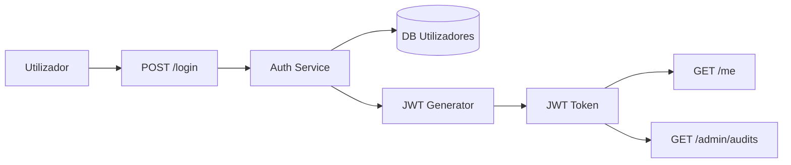

# Practical Example - Threat Modelling with LINDDUN

This example demonstrates how to apply the **LINDDUN** model to identify privacy threats in an application that processes personal data and user authentication.

The LINDDUN model makes it possible to identify specific threats associated with:

* *Linkability*, *Identifiability*, *Non-repudiation*, *Detectability*, *Disclosure*, *Unawareness*, *Non-compliance*

---

## 🎯 Application context {#-contexto-da-aplicação}

Authentication service `auth-service` with the following characteristics:

* Login via form (`POST /login` with `email` and `password`)
* JWT generation with claims: `sub`, `email`, `role`, `iat`, `exp`
* Endpoint `/me` returns the authenticated user's data
* Endpoint `/admin/audits` returns the user's logs and actions
* No explicit consent or information about data retention

---

## 📈 Data model and flows (simplified DFD) {#-modelo-de-dados-e-fluxos-dfd-simplificado}

---

## 🔍 Threats identified (LINDDUN model) {#-ameaças-identificadas-modelo-linddun}

| Category       | Threat identified                                         | Impact | Associated requirement (Ch. 2)                             |
| --------------- | ----------------------------------------------------------- | ------- | -------------------------------------------------------- |
| Linkability     | JWT allows users to be tracked across sessions and apps      | High    | EX-DAT-008: JWT must not contain traceable IDs         |
| Identifiability | Endpoint `/me` exposes `email` and `role` directly           | Medium   | EX-DAT-002: Minimise exposure of identifiable data |
| Unawareness     | User not informed about the use of their data                | High    | EX-PRI-001: Mandatory privacy policy         |
| Non-compliance  | No record of consent or legal basis                  | High    | EX-PRI-004: Explicit and auditable consent         |
| Disclosure      | Logs accessible via `/admin/audits` contain full email addresses | High    | EX-LOG-004: Pseudonymisation of data in logs            |

*Illustrative identifiers (`EX-…`); they do not correspond to the Requirements Catalogue of Ch. 02.*

---

## ✅ Control recommendations {#-recomendações-de-controlo}

* Anonymise or pseudonymise sensitive claims in the JWTs (use `sub` without `email`)
* Apply RBAC to the `/admin/audits` endpoint and filter the data returned
* Show a notice and a link to the privacy policy before login
* Implement a consent record with date, IP and purpose

---

## 🧭 Validation of Ch. 2 requirements {#-validação-de-requisitos-do-cap-2}

This model demonstrates the need to apply security and privacy requirements (Ch. 2) in three domains:

- **Privacy and Personal Data** (minimisation, pseudonymisation, purpose)
- **Information and Transparency** (duty to inform, consent where applicable)
- **Logging and Auditing** (data minimisation in logs, access control and retention)

Integration rules (prescriptive):
- The requirements **must be recorded in the backlog** as traceable items (e.g. `THREAT-*` / `REQ-*` according to the taxonomy in use in the project).
- The prioritisation and acceptance of trade-offs is a **human decision** (PO + Tech Lead + AppSec, as the case may be).
- The evidence of implementation must be verifiable (commits, tests, versioned configurations, review records).
- The model and the decisions must remain **versioned** and referenceable per release.

---

> The use of LINDDUN makes it possible to anticipate legal and operational risks associated with personal data and to reinforce the coverage of Chapter 2 in a threat-oriented way.

---
