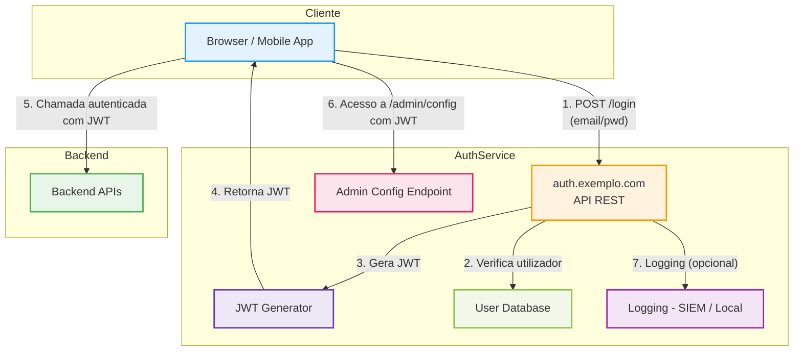

# Practical example - Threat Modelling of an authentication service with JWT

## 🎯 Technical context {#-contexto-técnico}

During the design phase of a new authentication service (`auth-service`), the team identified the following components and flows:

- Publicly accessible REST API at `https://auth.exemplo.com`
- Login flow:
  1. The user submits `email + password` via `POST /login`
  2. The service validates the credentials locally in a database
  3. If valid, the service **generates a JWT token**
  4. The JWT is returned to the client and used in future requests (`Authorization: Bearer`)
- Initial configuration:
  - JWT with `alg: none` (no signature)
  - Claims: `sub`, `email`, `role`, `exp` (24h)
  - No MFA
  - Endpoint `/admin/config` accessible with any JWT
  - No structured logging and no profile control

---

## 🔁 Modelling with a DFD (representation of the system) {#-modelação-com-dfd-representação-do-sistema}

### 🔷 Threat Model - auth-service (DFD in Mermaid) {#-threat-model---auth-service-dfd-em-mermaid}

---

### 🧱 Elements identified {#-elementos-identificados}

| Element                | Type             | Description                                                         |
|-------------------------|------------------|-------------------------------------------------------------------|
| `Browser / Mobile App`  | External Actor   | Client that initiates the login                                          |
| `auth.exemplo.com`      | Process          | Public API that exposes the `/login` endpoint                         |
| `JWT Generator`         | Process          | Logic that generates the JWT tokens                                     |
| `User Database`         | Data Store       | User database                                     |
| `SIEM / Logs`           | Data Store       | Structured event storage                              |
| `Admin Config Endpoint` | Process          | Sensitive endpoint: `/admin/config`                                |
| `Backend APIs`          | Process          | Protected APIs that consume and validate the JWT                      |

---

### 🔁 Data flows {#-fluxos-de-dados}

| Source                   | Destination              | Data Transmitted                                  |
|------------------------|----------------------|-----------------------------------------------------|
| Browser → auth API     | `email/password` via `POST /login` (HTTPS)               |
| auth API → DB          | User lookup                                  |
| auth API → JWT Gen     | JWT token request                                      |
| JWT Gen → Browser      | JWT (`Authorization: Bearer &lt;token&gt;`)                   |
| Browser → Backend APIs | Authenticated request with JWT                              |
| Browser → Admin Config | Access with JWT to `/admin/config`                        |
| auth API → SIEM        | (Absent) - no structured logs                       |

---

### 🔍 STRIDE threats per element {#-ameaças-stride-por-elemento}

| Element               | STRIDE Category         | Threat Identified                                                                | Severity | Recommended Mitigation                                                               |
|------------------------|--------------------------|------------------------------------------------------------------------------------|-----------|--------------------------------------------------------------------------------------|
| `auth.exemplo.com`     | **Spoofing**             | Login with reused credentials or without MFA                                     | High      | MFA, rate limiting, context analysis (device/IP)                                |
| `JWT Generator`        | **Tampering**            | Tamperable JWTs (`alg: none`)                                                    | High      | RS256 signature, header validation, reduced TTL                                |
| `Admin Config`         | **Elevation of Privilege** | Any user can access administrative endpoints                        | High      | Claims-based RBAC, validation of `role` in the backend                             |
| `auth.exemplo.com`     | **Repudiation**          | No record of logins or sensitive changes                                       | Medium     | Structured logging with `userId`, IP, action, result                             |
| `JWT Generator`        | **Information Disclosure** | Excessive claims (`email`, `role`, `createdAt`) exposed to the client               | Medium     | Minimise claims in the JWT, context-based scoping                               |
| `auth.exemplo.com`     | **Denial of Service**    | Brute force on `/login` or mass reuse of JWTs                                  | Medium     | Rate limiting, CAPTCHA, progressive delays                                        |

---

### 🛡️ Threat ↔ control map {#️-mapa-ameaça--controlo}

| Threat                      | Recommended Control                                                                 |
|----------------------------|----------------------------------------------------------------------------------------|
| Spoofing                   | Mandatory MFA; context-aware login; device binding                                 |
| Tampering                  | Signed JWT (RS256); validation of `alg`, `aud`, `iss`; TTL ≤ 15 min                 |
| Elevation of Privilege     | RBAC with explicit control of claims (e.g. `role: admin`)                            |
| Repudiation                | Centralised logging; action tracking; integration with SIEM                    |
| Information Disclosure     | Minimal JWT; segregation of claims per endpoint; scoping                          |
| Denial of Service          | Rate limiting on the `/login` endpoint; protection at the API Gateway; quotas                 |

---

### ✅ Conclusion {#-conclusão}

This example illustrates a typical case of modern architecture with:

- JWT-based authentication
- Public API accessible via the Internet
- Lack of basic validations and controls

> Even in apparently simple architectures, the **misuse of standards** (e.g. unsigned JWT) can introduce **critical flaws**.  
> The use of a structured approach (e.g. STRIDE) and an explicit representation of the flows (DFD) makes it possible to identify and mitigate threats before going into production.

This threat model must be documented, versioned and reused in other services with an identical architecture, as described in the section “♻️ Reuse of Threat Models”.
