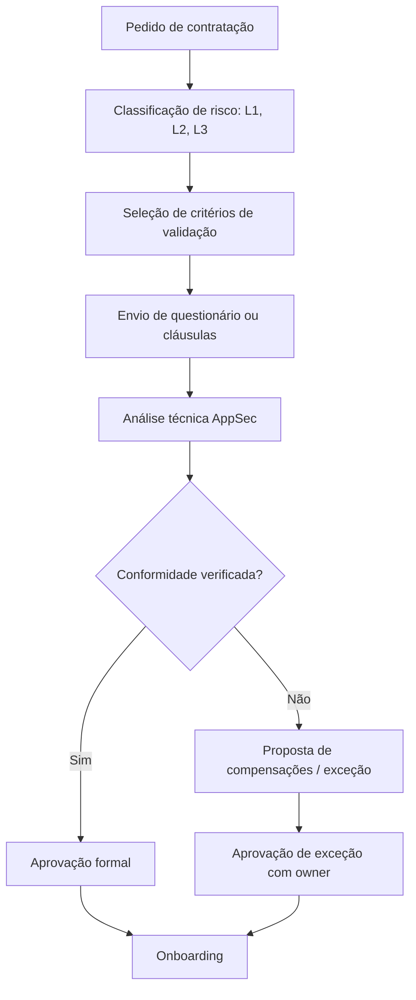

# Supplier and Third-Party Validation Model

## 🌟 Objective {#-objetivo}

To establish a formal, proportional and auditable process to:

* Assess the adequacy of suppliers and external services according to the risk level;
* Demand minimum security requirements from the onboarding phase;
* Record, justify and approve exceptions or compensations;
* Support **due diligence**, traceability and security audits.

---

## 🔁 How to apply {#-como-aplicar}

### 📊 Typical validation flow {#-fluxo-de-validação-típico}

> This flow integrates with chapters 01 (classification), 02 (requirements) and 14.1 (governance).

---

## 🧲 Validation criteria by risk {#-critérios-de-validação-por-risco}

| Criterion                                  |  L1 |  L2 |  L3 |
| ----------------------------------------- | :-: | :-: | :-: |
| Security questionnaire                 |  ✔️ |  ✔️ |  ✔️ |
| Security contractual clauses        |  ✔️ |  ✔️ |  ✔️ |
| Validation by the AppSec team               |     |  ✔️ |  ✔️ |
| Technical evidence (reports, policies) |     |  ✔️ |  ✔️ |
| SBOM or component inventory         |     |     |  ✔️ |
| Incident response SLA (`<`24h)       |     |     |  ✔️ |
| Right to audit                      |     |     |  ✔️ |

> The criticality matrix of Ch. 01 must be used as the basis for assigning the risk level.

---

## 📝 Practical examples {#-exemplos-práticos}

### ✔️ Normal approval (level L2) {#️-aprovação-normal-nível-l2}

* Questionnaire completed successfully
* Vulnerability policy presented
* Contractual clauses aligned with Ch. 2

### ❌ Rejection (level L3) {#-rejeição-nível-l3}

* Refusal of clauses on incidents
* Absence of SBOM or external tests
* Rejected for not meeting critical requirements

### ⚠️ Approved exception (level L3) {#️-exceção-aprovada-nível-l3}

* Critical supplier without SBOM, but with its own scanner
* Approved with an identified owner, defined compensation and scheduled review

---

## 🗂️ Examples of a security questionnaire (excerpt) {#️-exemplos-de-questionário-de-segurança-excerto}

| Area                    | Question                                                   | Mandatory (L2/L3) |
| ----------------------- | ---------------------------------------------------------- | ------------------- |
| Vulnerabilities        | Is there a formal patching policy with an SLA &lt; 7 days?       | Yes (L2+)           |
| Privileged access   | Is MFA used for remote administration of systems?         | Yes (L2+)           |
| Secure development  | Do they adopt ASVS or equivalent practices?                      | Recommended         |
| Security incidents | Is there a 24/7 channel and a formal incident response plan? | Yes (L3)            |
| Transparency / SBOM    | Do they provide an up-to-date SBOM on request?                  | Yes (L3)            |

> It may be integrated into Forms, Excel, Confluence or procurement systems.

When part of the validation process is supported by automated mechanisms, it must be possible to identify clearly which steps were executed in that way, as well as the moment of, and the person responsible for, the final validation decision.

---

## ✅ Good practices {#-boas-práticas}

* Apply this model to all suppliers with access to critical data, code or pipelines;
* Formalise criteria and exceptions in traceable systems (Git, SharePoint, etc.);
* Review suppliers on the basis of events (incidents, releases, contractual changes);
* Cross-check results with the requirements of chapters 01 and 02;
* Involve GRC and AppSec in the final approval whenever the risk is L3.

---

## 🔗 Cross-references {#-referências-cruzadas}

| Document / Chapter              | Relationship with supplier validation       |
| --------------------------------- | ------------------------------------------- |
| Ch. 01 - Risk classification  | Defines the level of application of the model       |
| Ch. 02 - Security requirements | Determines what to validate by type of risk   |
| addon/02-clausulas-contratuais.md | Clauses by type of contract and risk      |
| addon/01-modelo-governancao.md     | Roles and approval authorities for the approval of exceptions |
| addon/05-exemplos-praticos.md     | Real cases of application of the model          |

---
