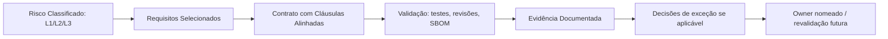

# Organisational Traceability Model

## 🌟 Objective {#-objetivo}

To guarantee that there is a **clear, documented and auditable link** between:

* The **risk classification** assigned to each application or system;
* The **security requirements applied** (Ch. 2);
* The **contractual clauses and demands on third parties** (`addon/02-clausulas-contratuais.md`);
* The **validation mechanisms** (tests, reviews, evidence);
* The **documentation of exceptions or compensations** (`addon/12-processo-excecoes.md`);
* And the **named owners** of each decision.

This traceability model assumes that all evidence, regardless of whether it is produced manually or by automated technical processes, is always associated with an explicit organisational owner.

The existence of technical evidence does not replace the need for a conscious decision and formal accountability.

---

## 📈 Recommended traceability structure {#-estrutura-de-rastreabilidade-recomendada}

| Application / Project | Risk (L1-L3) | Requirements applied | Approved exceptions  | Supplier / Service | Existing evidence | Security owner  |
| -------------------- | ------------- | -------------------- | ------------------- | -------------------- | ------------------- | ------------------- |
| E.g. HR Portal        | L3            | REQ-001, REQ-002...  | EX-REQ-017 justified | Supplier ABC       | CI test + clause | joao.silva\@empresa |

*Illustrative identifiers (`EX-…`); they do not correspond to the Requirements Catalogue of Ch. 02.*

> 🔹 This structure may be maintained in Excel, SharePoint, Jira or another ALM tool with support for traceability.

Where applicable, the evidence column must make it possible to identify whether the validation was supported by automated mechanisms, as well as the person responsible for accepting that evidence.

---

## 🔄 Update mechanisms {#-mecanismos-de-atualização}

* The table must be updated:

  * At each relevant release;
  * Whenever there are changes of risk, supplier or requirements;
  * On the approval of exceptions or the onboarding of new third parties.

* Responsibility for updating must be assigned to the **project's security owner**.

---

## 🔢 Integration with GRC, audits and compliance {#-integração-com-grc-auditorias-e-conformidade}

* This model may be used as a **source of truth** for:

  * Compliance assessment against ISO 27001, NIS2, PCI-DSS;
  * Internal GRC reviews;
  * Analysis of exceptions and compensations by the AppSec team.

* It may be consolidated with **quarterly or half-yearly dashboards**, such as:

  * % of applications with complete traceability;
  * % of applications with approved exceptions;
  * % of applications with validated evidence.

---

## 📊 Suggested visualisation {#-sugestão-de-visualização}

---

## ✅ Final recommendations {#-recomendações-finais}

* This table must be used as the **basis for technical governance** and executive decision;
* It must integrate the data coming from the **per-chapter checklists SbD-ToE**;
* It may be used to **build maturity and visibility KPIs** (see `addon/kpis-governanca.md`).

---

## 🔗 Cross-links {#-ligações-cruzadas}

* Ch. 1 - Risk classification
* Ch. 2 - Requirements and application matrix
* `addon/01-modelo-governancao.md` - Governance and exceptions
* `addon/02-clausulas-contratuais.md` - Contractual clauses
* `addon/03-modelo-validacao-fornecedores.md` - Supplier validation
* `addon/kpis-governanca.md` - Governance KPIs

---
