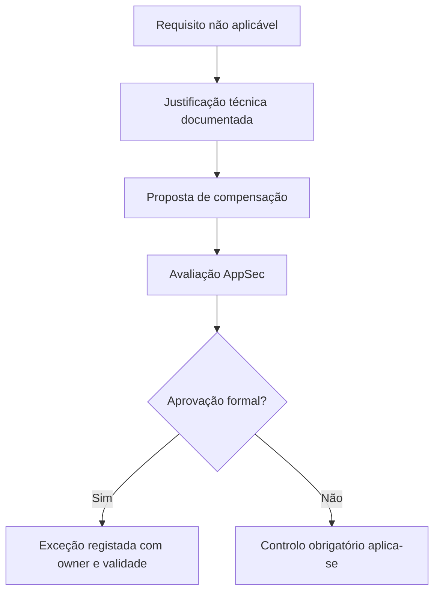
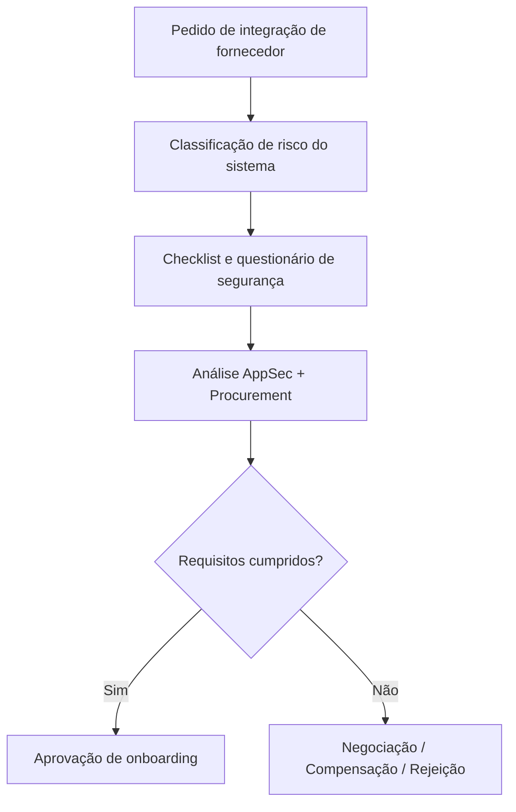
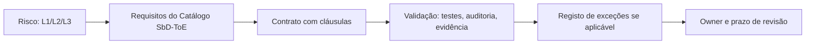
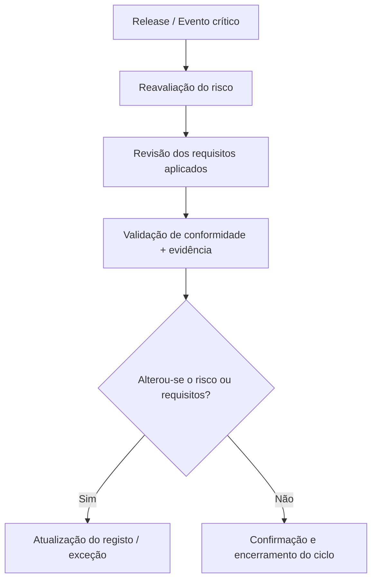

# Governance Support Diagrams

This annex includes diagrams representing the main decision, traceability and validation flows described in Chapter 14 - Governance and Contracting.

---

## 📌 1. Exception approval flow {#-1-fluxo-de-aprovação-de-exceção}

---

## 📅 2. External supplier onboarding {#-2-onboarding-de-fornecedor-externo}

---

## 🔗 3. Organisational traceability {#-3-rastreabilidade-organizacional}

---

## 🔄 4. Continuous review and validation cycle {#-4-ciclo-de-revisão-e-validação-continuada}

