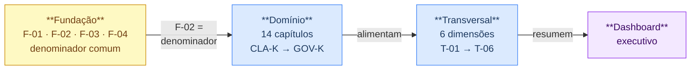
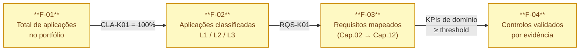

<!--template: sbdtoe-addon -->

# KPI Architecture - Overview

For definitions, thresholds and the full catalogue of indicators, see [`kpis-governanca`](./kpis-governanca).

---

## D1 - Layer cascade {#d1---cascata-de-camadas}

---

## D2 - Mapping chapter → cross-cutting dimension {#d2---mapeamento-capítulo--dimensão-transversal}

| Chapter | T-01 Coverage | T-02 Exceptions | T-03 Speed | T-04 Ownership | T-05 Chain | T-06 Maturity |
|----------|:--------------:|:--------------:|:---------------:|:--------------:|:-----------:|:---------------:|
| Ch.01 · CLA-K | ✔ | - | - | - | - | ✔ |
| Ch.02 · RQS-K | ✔ | - | - | - | - | ✔ |
| Ch.03 · THR-K | ✔ | - | - | - | - | ✔ |
| Ch.04 · ARC-K | ✔ | - | - | ✔ | - | ✔ |
| Ch.05 · DEP-K | ✔ | - | ✔ | - | ✔ | - |
| Ch.06 · DEV-K | ✔ | ✔ | ✔ | - | - | - |
| Ch.07 · CIC-K | ✔ | ✔ | ✔ | - | - | - |
| Ch.08 · IAC-K | ✔ | ✔ | - | - | - | - |
| Ch.09 · CNT-K | ✔ | - | ✔ | - | ✔ | - |
| Ch.10 · TST-K | ✔ | - | ✔ | - | - | - |
| Ch.11 · DPL-K | ✔ | ✔ | - | - | - | - |
| Ch.12 · OPS-K | - | - | ✔ | - | - | - |
| Ch.13 · TRN-K | - | - | - | ✔ | - | - |
| Ch.14 · GOV-K | - | ✔ | - | ✔ | ✔ | - |
| **Contributors** | **12** | **5** | **7** | **3** | **3** | **4** |

**Reading:** T-01 (Coverage) is the most cross-cutting dimension - present in 12 of the 14 chapters. T-04 (Ownership) and T-05 (Supply chain) have concentrated coverage, which is expected: only the chapters with direct responsibility for supply chain and ownership contribute.

---

## D3 - Adoptability funnel {#d3---funil-de-adoptabilidade}

| Observed gap | Diagnosis | Priority action |
|---------------|-------------|-------------------|
| F-01 unknown | Incomplete inventory - the entire measurement programme is invalid | Complete the inventory before any other metric |
| F-02 ≪ F-01 | Classification lagging behind | Activate CLA-K01; without classification there is no valid denominator |
| F-03 ≪ F-02 | Requirements not mapped - controls without a formal basis | Activate RQS-K01 |
| F-04 ≪ F-03 | Controls declared but not validated | Activate the evidence process |
| F-04 ≈ F-03 | Mature programme | Focus on T-03, T-02 and T-06 |
