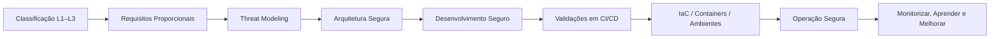

# 🚀 TL;DR - Executive Summary of SbD-ToE {#tldr-sbdtoe}

<!--web-only-->
> This page provides an executive view of the **Security by Design - Theory of Everything (SbD-ToE)** manual and an objective synthesis of each chapter.  
> It is the quick-reading layer for technical teams, management, auditors and new readers.
<!--/web-only-->

---

# 📘 1. What is SbD-ToE? {#o-que-e}
*Security by Design - Theory of Everything (SbD-ToE)* is a **prescriptive, proportional and verifiable** model for building, validating and operating secure software in any organisation.

It integrates principles of **secure engineering**, governance, SDLC practices, threat modelling, requirements, architecture, dependencies, pipelines, IaC, containers, operations and continuous control - all with **auditable evidence**, **global traceability**, **mapping to frameworks** (SAMM, SSDF, SLSA, DSOMM) and **canonical checklists**.

SbD-ToE works as:

- a **normative manual** (clear, verifiable and binary prescriptions),
- an **operational framework** (how to apply it across the lifecycle),
- an **implicit maturity system** (alignment with international models),
- a **governance and evidence system** (policies, artefacts, documentation),
- a **cross-cutting organisational standard**.

---

# 🧭 2. How to use the manual (short version) {#como-usar}

1. **Classify the application**  
   Determine L1/L2/L3 based on Exposure, Data and Impact.

2. **Derive proportional requirements**  
   Apply the technical and governance requirements appropriate to the level.

3. **Model threats before design**  
   Identify abuse paths and mitigation measures.

4. **Design the architecture with native controls**  
   Define boundaries, trust zones, identities, secrets and flows.

5. **Build and validate**  
   Pipelines with code validations, SBOM, signatures and policies.

6. **Treat infrastructure as a product**  
   IaC, containers, supply chain, reproducible environments.

7. **Operate with evidence**  
   Records, metrics, audit, use of formal policies and KPIs.

---

# 🧱 3. Fundamental Pillars of SbD-ToE {#pilares}

- Proportional classification (L1–L3)  
- Testable security requirements  
- Continuous Threat Modelling  
- Verifiable secure architecture  
- Secure development and coding practices  
- Dependencies, SBOM and Supply Chain Security  
- Secure and reproducible CI/CD pipelines  
- Infrastructure as Code (IaC) as a product  
- Signed and verified containers and images  
- Operation, monitoring, logs and continuous control  
- Organisational governance and formal policies  

---

# 🗺️ 4. TL;DR by chapter {#tldr-capitulos}

> Each synthesis points to the corresponding chapter with absolute links.

## 📘 Chapter 01 - Application Classification {#tldr-cap01}
- Defines the L1/L2/L3 level based on Exposure, Data and Impact.  
- Requires the level to be documented for each application/project.  
- Determines all the proportionality of the manual.  
- Evidence: E+D+I classification, record in the repository, formal acceptance.

🔗 [Chapter introduction](/sbd-toe/sbd-manual/classificacao-aplicacoes/intro)  
🔗 [Review checklist](/sbd-toe/sbd-manual/classificacao-aplicacoes/canon/checklist-revisao)  

---

## 📘 Chapter 02 - Security Requirements {#tldr-cap02}
- Prescriptive and testable catalogue of L1–L3 requirements.  
- Global traceability to frameworks (SSDF, SAMM, SLSA, etc.).  
- Recommended practical validation per requirement.  
- Evidence: requirements matrix, validations, records per sprint.

🔗 [Chapter introduction](/sbd-toe/sbd-manual/requisitos-seguranca/intro)  
🔗 [Review checklist](/sbd-toe/sbd-manual/requisitos-seguranca/canon/checklist-revisao)  

---

## 📘 Chapter 03 - Threat Modelling {#tldr-cap03}
- Systematic identification of threats and abuse paths.  
- Integration with design, architecture and requirements.  
- Proportional application by level L1–L3.  
- Evidence: diagrams, abuse scenarios, integrated mitigation.

🔗 [Chapter introduction](/sbd-toe/sbd-manual/threat-modeling/intro)  
🔗 [Application across the lifecycle](/sbd-toe/sbd-manual/threat-modeling/aplicacao-lifecycle)  

---

## 📘 Chapter 04 - Secure Architecture {#tldr-cap04}
- Trust zones, boundaries, flows, identities and secrets.  
- Domain-specific ARC-XXX requirements.  
- Mapping of threats and native controls.  
- Evidence: diagrams, ADRs, control of secrets and flows.

🔗 [Chapter introduction](/sbd-toe/sbd-manual/arquitetura-segura/intro)  
🔗 [Threats mitigated](/sbd-toe/sbd-manual/arquitetura-segura/canon/ameacas-mitigadas)  

---

## 📘 Chapter 05 - Dependencies, SBOM and SCA {#tldr-cap05}
- Robust management of dependencies and of the supply chain.  
- Mandatory, signed and versioned SBOM.  
- Governance of exceptions and continuous validations.  
- Evidence: SBOM, SCA reports, validation pipeline.

🔗 [Chapter introduction](/sbd-toe/sbd-manual/dependencias-sbom-sca/intro)  
🔗 [Review checklist](/sbd-toe/sbd-manual/dependencias-sbom-sca/canon/checklist-revisao)  

---

## 📘 Chapter 06 - Secure Development {#tldr-cap06}
- Linters, secret scanning, guidelines and per-language practices.  
- Integration into the IDE and the continuous integration pipeline.  
- Evidence: scan logs, protected branches, secure reviews.

🔗 [Chapter introduction](/sbd-toe/sbd-manual/desenvolvimento-seguro/intro)  
🔗 [Application across the lifecycle](/sbd-toe/sbd-manual/desenvolvimento-seguro/aplicacao-lifecycle)  

---

## 📘 Chapter 07 - Secure CI/CD {#tldr-cap07}
- Pipelines treated as a secure product.  
- Isolated execution, trusted runners, signatures and policies.  
- Evidence: logs, publication rules, reproducible chains.

🔗 [Chapter introduction](/sbd-toe/sbd-manual/cicd-seguro/intro)  
🔗 [Advanced recommendations](/sbd-toe/sbd-manual/cicd-seguro/recomendacoes-avancadas)  

---

## 📘 Chapter 08 - Secure IaC {#tldr-cap08}
- IaC treated as a software product.  
- Validations, approved modules, reproducible environments.  
- Evidence: lint/policy reports, signed modules, tags.

🔗 [Chapter introduction](/sbd-toe/sbd-manual/iac-infraestrutura/intro)  
🔗 [Review checklist](/sbd-toe/sbd-manual/iac-infraestrutura/canon/checklist-revisao)  

---

## 📘 Chapter 09 - Containers and Images {#tldr-cap09}
- Signed, reproducible and verified images.  
- Registries with strong RBAC and retention and publication policies.  
- Evidence: signature, SBOM, publication logs, security scans.

🔗 [Chapter introduction](/sbd-toe/sbd-manual/containers-imagens/intro)  
🔗 [Threats mitigated](/sbd-toe/sbd-manual/containers-imagens/canon/ameacas-mitigadas)  

---

## 📘 Chapter 10 - Security Testing {#tldr-cap10}
- Static, dynamic, IAST, fuzzing, manual and exploratory testing.  
- Proportionality by level L1–L3.  
- Evidence: reports, reproducibility, formal acceptance of results.

🔗 [Chapter introduction](/sbd-toe/sbd-manual/testes-seguranca/intro)  

---

## 📘 Chapter 11 - Secure Deployment {#tldr-cap11}
- Promotion only from signed artefacts, with verifiable provenance and SBOM.  
- *Release* *gates* by level L1–L3, validation in *staging* and tested *rollback*.  
- Evidence: *release* approvals, a record of promotions, *rollback* drills.

🔗 [Chapter introduction](/sbd-toe/sbd-manual/deploy-seguro/intro)  

---

## 📘 Chapter 12 - Monitoring and Operations {#tldr-cap12}
- Structured and centralised *logging*, with critical events and metrics defined.  
- Alerts with *thresholds* and a response SLA, linked to the incident response *playbooks*.  
- Evidence: *dashboards*, tested alerts, measured MTTD and MTTR.

🔗 [Chapter introduction](/sbd-toe/sbd-manual/monitorizacao-operacoes/intro)  

---

## 📘 Chapter 13 - Training and Capability Building {#tldr-cap13}
- A continuous training plan, with tracks per profile and security in *onboarding*.  
- *Security champions* in each team and hands-on labs.  
- Evidence: training records and effectiveness metrics.

🔗 [Chapter introduction](/sbd-toe/sbd-manual/formacao-onboarding/intro)  

---

## 📘 Chapter 14 - Governance and Contracting {#tldr-cap14}
- Relationship with suppliers, contractual requirements, continuous validation.  
- Organisational governance, metrics and indicators.  
- Evidence: contracts, security SLA, compliance dashboards.

🔗 [Chapter introduction](/sbd-toe/sbd-manual/governanca-contratacao/intro)  

---

# 🧭 5. Operational Flow (SbD-ToE on 1 page) {#fluxo-operativo}

---

# 📊 6. Maturity (summary view) {#maturidade}

- **SAMM** - relevant coverage in design, implementation, verification and operations.  
- **SSDF** - aligned practices in governance, protection, analysis and verification.  
- **SLSA** - focus on pipeline integrity and artefact provenance.  
- **DSOMM** - continuous reinforcement of DevSecOps practices.

The practices of SbD-ToE correspond to practices of these models. This is a correspondence of content, not a measurement: the level an organisation reaches in each model is measured with the model itself, and the achievable maturity is described chapter by chapter.

---

# 🔗 7. Useful links {#links}

- [Theory of Everything](/sbd-toe/teory-of-everything/intro): the conceptual model that frames the manual  
- [Normative cross-check](/sbd-toe/cross-check-normativo/intro): how SbD-ToE answers each published regulation  
- Review checklists: one per chapter, in each chapter's canonical section (for example, the one for [Chapter 01](/sbd-toe/sbd-manual/classificacao-aplicacoes/canon/checklist-revisao))  

---

# 🏁 8. Executive Conclusion {#conclusao}

SbD-ToE provides a complete architecture for turning software security into a **systematic, measurable and auditable** practice, cross-cutting across the whole organisation.

This page gathers the quick view of the whole and allows navigation to any chapter in seconds, without replacing the normative and detailed content of each `intro.md` and its `canon/` files.
